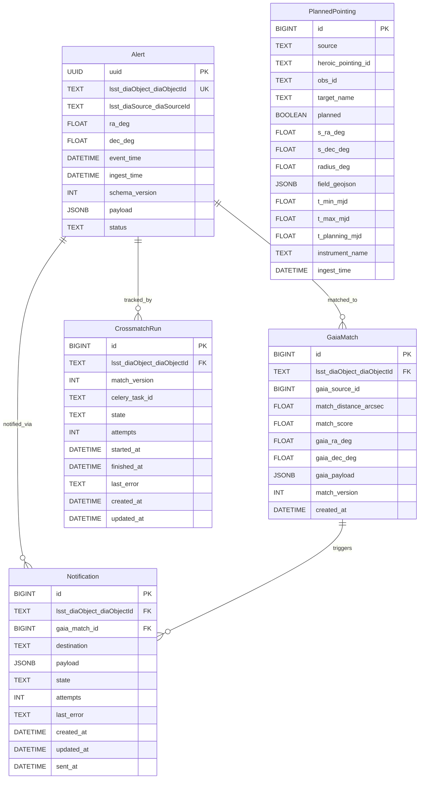

# refactor: Align Skeleton to lsst_lsdb_design.md

## Overview

The current codebase is a skeleton copied from another project. This plan brings it into alignment with the authoritative architecture in `lsst_lsdb_design.md`. The work is pure refactoring and scaffolding — no production behavior changes — and is organized into four sequential phases so each phase leaves the codebase in a runnable state.

---

## Problem Statement

The skeleton diverges from the design in five key areas:

1. **Wrong broker**: Uses RabbitMQ instead of Redis (adds operational complexity, contradicts design §6.2).
2. **Missing models**: Only `alerts` table exists; four others (`gaia_matches`, `planned_pointings`, `crossmatch_runs`, `notifications`) are absent.
3. **Wrong package layout**: The design's `crossmatch/antares/heroic/matching/notifier/tasks/` structure is not implemented.
4. **Wrong task signature**: `crossmatch(alert_id: UUID)` instead of `crossmatch_alert(lsst_diaObject_diaObjectId: str, match_version: int)`.
5. **Missing libraries**: `lsdb`, `psycopg` v3, `httpx`, `astropy`, `structlog`, `prometheus-client` are all absent.

---

## Technical Approach

All changes are in the Python source root (`crossmatch/`) and its supporting config files. The container image, Helm chart structure, and Docker Compose service names remain stable — only internal paths and env vars change.

```
Before:  crossmatch/ (source root)
           manage.py
           project/           ← Django settings + Celery app
           core/              ← Alert model
           alerts/            ← consumer.py (mock), publisher.py (empty)
           tasks/             ← tasks.py (stubs)
           entrypoints/

After:   crossmatch/ (source root — no rename)
           manage.py
           crossmatch_project/ ← Django settings + Celery app
           core/               ← all Django models (Alert + 4 new)
           antares/            ← ingest.py, normalize.py
           heroic/             ← client.py, schedule_sync.py
           matching/           ← gaia.py, constraints.py
           notifier/           ← watch.py, lsst_return.py, impl_http.py
           tasks/              ← crossmatch.py, schedule.py
           entrypoints/        ← updated paths
```

---

## Implementation Phases

### Phase 1: Broker Swap (RabbitMQ → Redis)

**Goal**: Remove RabbitMQ from the stack. Redis already exists; make it the Celery broker too.

#### 1.1 Update `crossmatch/project/celery.py`

Replace the AMQP broker string with a Redis URL:

```python
# crossmatch/project/celery.py

import os
from celery import Celery

redis_service = os.getenv('REDIS_SERVICE', 'redis')
redis_port = os.getenv('REDIS_PORT', '6379')
redis_broker_db = os.getenv('REDIS_BROKER_DB', '0')
redis_result_db = os.getenv('REDIS_RESULT_DB', '1')

BROKER_URL = f'redis://{redis_service}:{redis_port}/{redis_broker_db}'
RESULT_BACKEND = f'redis://{redis_service}:{redis_port}/{redis_result_db}'

app = Celery(
    'crossmatch',
    broker=BROKER_URL,
    backend=RESULT_BACKEND,
    imports=['tasks.crossmatch', 'tasks.schedule'],
    task_default_queue='crossmatch',
    task_acks_late=True,
    worker_prefetch_multiplier=1,
    task_reject_on_worker_lost=True,
    task_soft_time_limit=int(os.getenv('CELERY_TASK_SOFT_TIME_LIMIT', '3600')),
    task_time_limit=int(os.getenv('CELERY_TASK_TIME_LIMIT', '3800')),
    result_expires=3600,
    task_track_started=True,
    timezone='UTC',
    beat_scheduler='django_celery_beat.schedulers:DatabaseScheduler',
)
app.config_from_object('django.conf:settings', namespace='CELERY')
```

Key changes:
- `broker`: `amqp://...` → `redis://redis:6379/0`
- `backend`: already Redis, move to `redis://redis:6379/1` (separate DB index)
- `imports`: updated to new task module paths
- `task_default_queue`: `'jobs'` → `'crossmatch'` (matches design §8.3)
- Add `task_acks_late=True`, `worker_prefetch_multiplier=1`, `task_reject_on_worker_lost=True` (design §6.4)
- Remove all RabbitMQ env vars

#### 1.2 Update `crossmatch/project/settings.py`

Remove RabbitMQ references. Update Redis result backend to use DB index 1:

```python
# Remove these env vars:
#   MESSAGE_BROKER_HOST, MESSAGE_BROKER_PORT, RABBITMQ_DEFAULT_USER, RABBITMQ_DEFAULT_PASS

# Update CELERY_RESULT_BACKEND to use DB index 1
CELERY_RESULT_BACKEND = f"redis://{REDIS_SERVICE}:{REDIS_PORT}/1"

# Remove any dead reference to the 'cutout' app in TEMPLATES DIRS
```

Also remove the dead reference to the non-existent `cutout` app found in `TEMPLATES[0]['DIRS']`.

#### 1.3 Update `docker/docker-compose.yaml`

- **Remove** the `rabbitmq` service block entirely.
- **Remove** `depends_on: rabbitmq` from `alert-consumer`, `celery-worker`, `celery-beat`.
- **Remove** all `MESSAGE_BROKER_*` and `RABBITMQ_*` env vars from all services.
- **Add** `REDIS_BROKER_DB: "0"` and `REDIS_RESULT_DB: "1"` env vars where Redis is configured.
- **Rename** queue from `jobs` to `crossmatch` in the celery-worker command.

#### 1.4 Update `kubernetes/charts/crossmatch-service/values.yaml`

- Remove the `rabbitmq` Helm chart dependency and its values section.
- Add `REDIS_BROKER_DB` and `REDIS_RESULT_DB` env vars.
- Update queue name `jobs` → `crossmatch` in worker args.

#### 1.5 Update `kubernetes/charts/crossmatch-service/Chart.yaml`

Remove the `rabbitmq` chart from `dependencies`.

#### 1.6 Update entrypoint scripts

In `crossmatch/entrypoints/run_celery_worker.sh` and `run_celery_beat.sh`:

```bash
# Change: wait-for-it rabbitmq:5672
# Remove that line entirely (no longer needed)

# Change queue reference in worker command:
# --queues jobs → --queues crossmatch
```

**Acceptance criteria for Phase 1:**
- [ ] `docker compose up` starts without a RabbitMQ container
- [ ] Celery worker connects to Redis broker successfully
- [ ] A mock alert can be consumed and the `crossmatch_alert` task appears in Flower
- [ ] No RabbitMQ references remain in any config or entrypoint file

---

### Phase 2: Package Layout Refactor

**Goal**: Rename and reorganize the source tree to match the design's `crossmatch/` layout.

#### 2.1 Rename settings package

The source root (`crossmatch/`) keeps its name — no directory rename needed. Only the Django settings package is renamed:

```
crossmatch/project/   → crossmatch/crossmatch_project/
```

The container `WORKDIR` (`/opt/crossmatch`) and Docker Compose volume mounts (`../crossmatch:/opt/crossmatch`) are already correct and require no changes.

#### 2.2 Update `manage.py`

```python
# crossmatch/manage.py
os.environ.setdefault('DJANGO_SETTINGS_MODULE', 'crossmatch_project.settings')
```

#### 2.3 Update `crossmatch_project/settings.py`

```python
# All internal references to 'project' package → 'crossmatch_project'
ROOT_URLCONF = 'crossmatch_project.urls'
WSGI_APPLICATION = 'crossmatch_project.wsgi.application'
```

Update `INSTALLED_APPS` to reflect new app names:
```python
INSTALLED_APPS = [
    'django.contrib.admin',
    'django.contrib.auth',
    'django.contrib.contenttypes',
    'django.contrib.sessions',
    'django.contrib.messages',
    'django.contrib.staticfiles',
    'django_celery_results',
    'django_celery_beat',
    'crossmatch_project',
    'core',
    'tasks',
]
```

#### 2.4 Rename `alerts/` → `antares/`

```
crossmatch/alerts/consumer.py   → crossmatch/antares/ingest.py
crossmatch/alerts/publisher.py  → crossmatch/antares/normalize.py (content added later)
crossmatch/alerts/__init__.py   → crossmatch/antares/__init__.py
```

Rename the function inside `ingest.py`: `consume_alerts` stays; the management command reference updates.

#### 2.5 Split `tasks/tasks.py` → `tasks/crossmatch.py` + `tasks/schedule.py`

```
crossmatch/tasks/tasks.py  →  crossmatch/tasks/crossmatch.py  (crossmatch_alert task)
                           →  crossmatch/tasks/schedule.py    (QueryHEROIC periodic task)
```

#### 2.6 Add new stub packages

Create these packages with `__init__.py` and stub module files:

```
crossmatch/heroic/__init__.py
crossmatch/heroic/client.py       # HEROICClient stub
crossmatch/heroic/schedule_sync.py # sync logic stub

crossmatch/matching/__init__.py
crossmatch/matching/gaia.py        # LSDB crossmatch stub
crossmatch/matching/constraints.py # HEROIC spatial constraint helpers

crossmatch/notifier/__init__.py
crossmatch/notifier/watch.py       # DB polling loop stub
crossmatch/notifier/lsst_return.py # LsstReturnClient Protocol stub
crossmatch/notifier/impl_http.py   # HTTP implementation stub
```

#### 2.7 Update management commands

Move/rename management commands:

```
crossmatch_project/management/commands/run_alert_consumer.py
    → calls antares.ingest.consume_alerts()
    → rename command to: run_antares_ingest

crossmatch_project/management/commands/initialize_periodic_tasks.py
    → stays, imports from tasks.schedule

crossmatch_project/management/commands/run_notifier.py       (new stub)
crossmatch_project/management/commands/sync_pointings.py     (new stub)
```

#### 2.8 Update entrypoints

```bash
# run_alert_consumer.sh → run_antares_ingest.sh
python manage.py run_antares_ingest

# All entrypoints: update -A project → -A crossmatch_project
celery -A crossmatch_project worker --queues crossmatch ...
celery -A crossmatch_project beat ...
```

Also update `makemigrations` scope if the entrypoint calls it explicitly:
```bash
python manage.py makemigrations --no-input core
```

**Acceptance criteria for Phase 2:**
- [ ] `python manage.py check` passes with no errors
- [ ] All imports resolve (no `ModuleNotFoundError`)
- [ ] `python manage.py run_antares_ingest` starts successfully
- [ ] Celery worker starts with `-A crossmatch_project`
- [ ] No references to old package names (`project.`, `alerts.`) remain

---

### Phase 3: New Django Models and Migration

**Goal**: Add the four missing models from design §5.2.2–5.2.5 to `core/models.py` and create a migration.

> **Migration note**: Per the project convention, migrations are created manually by developers and committed with source. The `MAKE_MIGRATIONS=true` flag at startup is for dev convenience only. Run `python manage.py makemigrations core` locally after adding models and commit the result.

#### 3.1 `PlannedPointing` model (design §5.2.2)

```python
# crossmatch/core/models.py

class PlannedPointing(models.Model):
    source = models.TextField(default='heroic')
    heroic_pointing_id = models.TextField(null=True)
    obs_id = models.TextField(null=True)
    target_name = models.TextField(null=True)
    planned = models.BooleanField(default=True)
    s_ra_deg = models.FloatField()
    s_dec_deg = models.FloatField()
    radius_deg = models.FloatField()
    field_geojson = models.JSONField(null=True)
    t_min_mjd = models.FloatField()
    t_max_mjd = models.FloatField()
    t_planning_mjd = models.FloatField(null=True)
    instrument_name = models.TextField(null=True)
    ingest_time = models.DateTimeField(auto_now_add=True)

    class Meta:
        constraints = [
            models.UniqueConstraint(
                fields=['source', 'heroic_pointing_id'],
                condition=models.Q(heroic_pointing_id__isnull=False),
                name='unique_source_heroic_pointing_id',
            ),
        ]
        indexes = [
            models.Index(fields=['ingest_time']),
            models.Index(fields=['t_min_mjd', 't_max_mjd']),
        ]
```

#### 3.2 `GaiaMatch` model (design §5.2.3)

```python
class GaiaMatch(models.Model):
    alert = models.ForeignKey(
        'Alert',
        to_field='lsst_diaObject_diaObjectId',
        on_delete=models.CASCADE,
        db_column='lsst_diaObject_diaObjectId',
    )
    gaia_source_id = models.BigIntegerField()
    match_distance_arcsec = models.FloatField()
    match_score = models.FloatField(null=True)
    gaia_ra_deg = models.FloatField(null=True)
    gaia_dec_deg = models.FloatField(null=True)
    gaia_payload = models.JSONField(null=True)
    match_version = models.IntegerField(default=1)
    created_at = models.DateTimeField(auto_now_add=True)

    class Meta:
        constraints = [
            models.UniqueConstraint(
                fields=['alert_id', 'gaia_source_id', 'match_version'],
                name='unique_alert_gaia_source_version',
            ),
        ]
        indexes = [
            models.Index(fields=['gaia_source_id']),
        ]
```

#### 3.3 `CrossmatchRun` model (design §5.2.4)

```python
class CrossmatchRun(models.Model):
    class State(models.TextChoices):
        QUEUED = 'queued'
        RUNNING = 'running'
        SUCCEEDED = 'succeeded'
        FAILED = 'failed'

    alert = models.ForeignKey(
        'Alert',
        to_field='lsst_diaObject_diaObjectId',
        on_delete=models.CASCADE,
        db_column='lsst_diaObject_diaObjectId',
    )
    match_version = models.IntegerField(default=1)
    celery_task_id = models.TextField(null=True)
    state = models.TextField(choices=State.choices, default=State.QUEUED)
    attempts = models.IntegerField(default=0)
    started_at = models.DateTimeField(null=True)
    finished_at = models.DateTimeField(null=True)
    last_error = models.TextField(null=True)
    created_at = models.DateTimeField(auto_now_add=True)
    updated_at = models.DateTimeField(auto_now=True)

    class Meta:
        constraints = [
            models.UniqueConstraint(
                fields=['alert_id', 'match_version'],
                name='unique_alert_match_version',
            ),
        ]
```

#### 3.4 `Notification` model (design §5.2.5)

```python
class Notification(models.Model):
    class State(models.TextChoices):
        PENDING = 'pending'
        SENT = 'sent'
        FAILED = 'failed'

    alert = models.ForeignKey(
        'Alert',
        to_field='lsst_diaObject_diaObjectId',
        on_delete=models.CASCADE,
        db_column='lsst_diaObject_diaObjectId',
    )
    gaia_match = models.ForeignKey(GaiaMatch, null=True, on_delete=models.SET_NULL)
    destination = models.TextField()
    payload = models.JSONField()
    state = models.TextField(choices=State.choices, default=State.PENDING)
    attempts = models.IntegerField(default=0)
    last_error = models.TextField(null=True)
    created_at = models.DateTimeField(auto_now_add=True)
    updated_at = models.DateTimeField(auto_now=True)
    sent_at = models.DateTimeField(null=True)

    class Meta:
        indexes = [
            models.Index(fields=['state']),
        ]
```

#### 3.5 Update `Alert` model

Fix two minor divergences from design §5.2.1:

1. Add explicit index on `event_time` and `status`:
```python
class Meta:
    indexes = [
        models.Index(fields=['event_time']),
        models.Index(fields=['status']),
    ]
```

2. Note: The existing `Alert` model uses `uuid` as PK (Django `UUIDField`) rather than the design's `BIGSERIAL`. This is acceptable — the design's `id BIGSERIAL` is a "surrogate PK" note, and UUID PKs are valid. **Do not change this** to avoid disrupting the existing migration.

#### 3.6 Schema ERD



**Acceptance criteria for Phase 3:**
- [ ] `python manage.py migrate` applies cleanly with no errors
- [ ] All five tables exist in PostgreSQL with correct columns and constraints
- [ ] Migration file committed to `core/migrations/`
- [ ] `python manage.py check` passes

---

### Phase 4: Task Signature Fix + Dependencies + Logging

**Goal**: Correct the Celery task API, update the ingest path, upgrade dependencies, and switch to `structlog`.

#### 4.1 Fix `tasks/crossmatch.py` task signature

```python
# crossmatch/tasks/crossmatch.py

from celery import shared_task
from django.utils import timezone
from core.models import Alert, CrossmatchRun

@shared_task(
    name='crossmatch.crossmatch_alert',
    autoretry_for=(Exception,),
    retry_backoff=True,
    max_retries=3,
)
def crossmatch_alert(lsst_diaObject_diaObjectId: str, match_version: int = 1):
    run, _ = CrossmatchRun.objects.update_or_create(
        alert_id=lsst_diaObject_diaObjectId,
        match_version=match_version,
        defaults={'state': CrossmatchRun.State.RUNNING,
                  'started_at': timezone.now(),
                  'celery_task_id': crossmatch_alert.request.id},
    )
    run.attempts = models.F('attempts') + 1
    run.save(update_fields=['attempts'])
    try:
        # TODO Phase 5: call matching.gaia.run_crossmatch(lsst_diaObject_diaObjectId)
        pass
    except Exception as exc:
        run.state = CrossmatchRun.State.FAILED
        run.last_error = str(exc)
        run.finished_at = timezone.now()
        run.save(update_fields=['state', 'last_error', 'finished_at'])
        raise
    run.state = CrossmatchRun.State.SUCCEEDED
    run.finished_at = timezone.now()
    run.save(update_fields=['state', 'finished_at'])
```

#### 4.2 Update `antares/ingest.py` (was `alerts/consumer.py`)

Change the `crossmatch.delay(alert_id=...)` call:

```python
# Before:
from tasks.tasks import crossmatch
crossmatch.delay(alert_id=alert_obj.uuid)

# After:
from tasks.crossmatch import crossmatch_alert
CrossmatchRun.objects.update_or_create(
    alert_id=alert_obj.lsst_diaObject_diaObjectId,
    match_version=1,
    defaults={'state': CrossmatchRun.State.QUEUED},
)
crossmatch_alert.delay(
    lsst_diaObject_diaObjectId=alert_obj.lsst_diaObject_diaObjectId,
    match_version=1,
)
```

#### 4.3 Update `requirements.base.txt`

```
# Web/ORM
django
django_celery_results
django-celery-beat
django-tables2

# Queue
celery
redis

# Database
psycopg[binary]          # replaces psycopg2-binary (v3)

# HTTP
httpx

# Catalog / time
lsdb
astropy

# Observability
structlog
prometheus-client

# Dev/monitoring
flower
watchdog
```

Remove `psycopg2-binary`. Add explicit `celery` pin.

> **Note**: `lsdb` requires `dask`, `numpy`, and `pyarrow` as transitive dependencies. These will be pulled in automatically but may increase image build time significantly. Consider whether to pin versions once the first working version is confirmed.

#### 4.4 Update `core/log.py` → `structlog`

```python
# crossmatch/core/log.py

import structlog

def get_logger(name: str):
    return structlog.get_logger(name)
```

Update `crossmatch_project/settings.py` to configure structlog:

```python
import structlog

LOGGING = {
    'version': 1,
    'disable_existing_loggers': False,
    'handlers': {
        'console': {
            'class': 'logging.StreamHandler',
        },
    },
    'root': {
        'handlers': ['console'],
        'level': os.getenv('LOG_LEVEL', 'DEBUG'),
    },
}

structlog.configure(
    processors=[
        structlog.stdlib.filter_by_level,
        structlog.stdlib.add_logger_name,
        structlog.stdlib.add_log_level,
        structlog.stdlib.PositionalArgumentsFormatter(),
        structlog.processors.TimeStamper(fmt='iso'),
        structlog.processors.StackInfoRenderer(),
        structlog.processors.format_exc_info,
        structlog.dev.ConsoleRenderer() if DEBUG else structlog.processors.JSONRenderer(),
    ],
    wrapper_class=structlog.stdlib.BoundLogger,
    context_class=dict,
    logger_factory=structlog.stdlib.LoggerFactory(),
    cache_logger_on_first_use=True,
)
```

#### 4.5 Update Django database backend to use `psycopg` v3

In `settings.py`, change the `ENGINE`:

```python
DATABASES = {
    'default': {
        'ENGINE': 'django.db.backends.postgresql',  # stays the same
        # psycopg v3 is auto-detected by Django 4.2+ when psycopg (not psycopg2) is installed
        ...
    }
}
```

> Django 4.2+ auto-selects `psycopg` v3 when it is installed and `psycopg2` is not. Since we remove `psycopg2-binary` and install `psycopg[binary]`, the ENGINE string stays the same.

**Acceptance criteria for Phase 4:**
- [ ] `pip install -r requirements.base.txt` succeeds (in a fresh venv)
- [ ] `python manage.py check` passes with `psycopg` v3 driver
- [ ] `crossmatch_alert.delay(lsst_diaObject_diaObjectId='...', match_version=1)` successfully creates a `CrossmatchRun` record
- [ ] Logs are structured JSON in production mode, human-readable in dev mode
- [ ] No `psycopg2` import remains anywhere

---

### Phase 5: Scaffold New Module Stubs

**Goal**: Create all module files expected by the design with minimal stub implementations, so the codebase matches the intended structure and imports are testable.

#### 5.1 `crossmatch/heroic/client.py`

```python
# crossmatch/heroic/client.py

import httpx
from core.log import get_logger

logger = get_logger(__name__)

class HEROICClient:
    """Client for the HEROIC planned pointings API."""

    def __init__(self, base_url: str, timeout: float = 30.0):
        self.base_url = base_url
        self.timeout = timeout

    def get_planned_pointings(self) -> list[dict]:
        """Fetch current planned pointings from HEROIC. Returns raw records."""
        raise NotImplementedError("HEROIC API details TBD — see design §10 open questions")
```

#### 5.2 `crossmatch/heroic/schedule_sync.py`

```python
# crossmatch/heroic/schedule_sync.py

from django.db import transaction
from core.log import get_logger
from core.models import PlannedPointing

logger = get_logger(__name__)

def sync_planned_pointings(client) -> int:
    """Fetch from HEROIC and replace planned_pointings table. Returns count inserted."""
    raise NotImplementedError("Implement after HEROIC API is confirmed")
```

#### 5.3 `crossmatch/matching/gaia.py`

```python
# crossmatch/matching/gaia.py

import os
from core.log import get_logger

logger = get_logger(__name__)

GAIA_HATS_URL = os.getenv('GAIA_HATS_URL', '')
MATCH_RADIUS_ARCSEC = float(os.getenv('MATCH_RADIUS_ARCSEC', '2.0'))

def run_crossmatch(lsst_diaObject_diaObjectId: str, match_version: int = 1) -> list[dict]:
    """
    Crossmatch alert against Gaia DR3 using LSDB.

    Steps (to implement):
      1. Load alert ra_deg, dec_deg from DB.
      2. Optionally load relevant PlannedPointing rows by time window.
      3. Open Gaia HATS catalog with ConeSearch(ra, dec, MATCH_RADIUS_ARCSEC).
      4. Run LSDB crossmatch and call .compute().
      5. UPSERT results into GaiaMatch.
      6. Return list of match dicts.
    """
    raise NotImplementedError("LSDB integration — deferred to future work")
```

#### 5.4 `crossmatch/matching/constraints.py`

```python
# crossmatch/matching/constraints.py

import math

def alert_in_planned_footprint(
    alert_ra: float,
    alert_dec: float,
    planned_pointings,
) -> bool:
    """Return True if alert position falls within any planned pointing cone."""
    raise NotImplementedError("Implement angular distance check")
```

#### 5.5 `crossmatch/notifier/lsst_return.py`

```python
# crossmatch/notifier/lsst_return.py

from typing import Protocol, runtime_checkable

@runtime_checkable
class LsstReturnClient(Protocol):
    def send_match_update(self, lsst_diaObject_diaObjectId: str, payload: dict) -> dict:
        ...
```

#### 5.6 `crossmatch/notifier/impl_http.py`

```python
# crossmatch/notifier/impl_http.py  (stub)

class HttpLsstReturnClient:
    def send_match_update(self, lsst_diaObject_diaObjectId: str, payload: dict) -> dict:
        raise NotImplementedError("LSST return channel TBD — see design §10 open questions")
```

#### 5.7 `crossmatch/notifier/watch.py`

```python
# crossmatch/notifier/watch.py

import time
from core.log import get_logger
from core.models import GaiaMatch, Notification

logger = get_logger(__name__)

def watch_and_notify(client, poll_interval: float = 10.0):
    """Poll for new GaiaMatch rows and dispatch notifications."""
    logger.info("notifier.starting", poll_interval=poll_interval)
    while True:
        # TODO: query GaiaMatch rows not yet notified; create Notification records; call client
        time.sleep(poll_interval)
```

#### 5.8 Management command stubs

**`crossmatch_project/management/commands/run_notifier.py`**

```python
from django.core.management.base import BaseCommand
from notifier.watch import watch_and_notify
from notifier.impl_http import HttpLsstReturnClient

class Command(BaseCommand):
    help = 'Run the match notifier service'

    def handle(self, *args, **options):
        client = HttpLsstReturnClient()
        watch_and_notify(client)
```

**`crossmatch_project/management/commands/sync_pointings.py`**

```python
import os, time
from django.core.management.base import BaseCommand
from heroic.client import HEROICClient
from heroic.schedule_sync import sync_planned_pointings

class Command(BaseCommand):
    help = 'Sync planned pointings from HEROIC'

    def add_arguments(self, parser):
        parser.add_argument('--loop', action='store_true')

    def handle(self, *args, **options):
        client = HEROICClient(base_url=os.environ['HEROIC_BASE_URL'])
        while True:
            sync_planned_pointings(client)
            if not options['loop']:
                break
            time.sleep(int(os.getenv('HEROIC_SYNC_INTERVAL', '600')))
```

#### 5.9 Add `run_notifier` and `schedule-sync` to Docker Compose

```yaml
# docker/docker-compose.yaml

notifier:
  build: ...
  command: python manage.py run_notifier
  environment:
    # inherit standard env vars
  depends_on:
    - django-db

schedule-sync:
  build: ...
  command: python manage.py sync_pointings --loop
  environment:
    HEROIC_BASE_URL: "${HEROIC_BASE_URL:-}"
    HEROIC_SYNC_INTERVAL: "600"
  depends_on:
    - django-db
```

**Acceptance criteria for Phase 5:**
- [ ] `python -c "from heroic.client import HEROICClient"` imports without error
- [ ] `python -c "from matching.gaia import run_crossmatch"` imports without error
- [ ] `python -c "from notifier.lsst_return import LsstReturnClient"` imports without error
- [ ] `python manage.py run_notifier` starts (even if it raises NotImplementedError, import must work)
- [ ] `python manage.py sync_pointings` starts (same)
- [ ] All five services in Docker Compose start without crashing on import

---

## Alternative Approaches Considered

### Keep RabbitMQ
Rejected: The design explicitly chose Redis-only to reduce operational surface. Adding RabbitMQ requires a separate Helm chart dependency, separate connection credentials, and separate health checks for no additional capability in this use case.

### Incremental module layout (extend skeleton rather than refactor)
Rejected: The user chose full refactor to design layout. A partial layout creates long-term confusion about canonical module names.

### Keep UUID as Celery task key
Rejected: The design's rationale for using `lsst_diaObject_diaObjectId` is that it is a stable, re-enqueueable natural key. A UUID is generated fresh per ingest and cannot be re-enqueued idempotently from an external trigger.

---

## Acceptance Criteria

### Functional Requirements

- [ ] Docker Compose starts all services with no RabbitMQ container
- [ ] Mock alerts are ingested, stored in `alerts` table, and `crossmatch_runs` record created
- [ ] Celery worker dequeues task, marks run `running` → `succeeded`, no errors
- [ ] All five DB tables exist with correct schema
- [ ] `python manage.py migrate` applies with no errors on clean DB
- [ ] Celery beat schedules `QueryHEROIC` periodic task

### Non-Functional Requirements

- [ ] All Python imports resolve (`python manage.py check` passes)
- [ ] No references to `rabbitmq`, `amqp://`, `MESSAGE_BROKER_HOST` in any file
- [ ] No references to old package names (`project.`, `alerts.`, `tasks.tasks`) remain
- [ ] Structured JSON logs emitted in production mode (`DEBUG=False`)

### Quality Gates

- [ ] Migration committed to version control
- [ ] `CHANGELOG.md` updated under `[Unreleased]`
- [ ] `docs/developer.md` updated with new service names and env vars

---

## Dependencies & Prerequisites

- Python 3.11+ (Dockerfile uses 3.13 — no change needed)
- Docker Compose available locally for integration testing
- Access to PyPI to install new packages (`lsdb`, `psycopg`, etc.)
- `lsdb` may require specific `dask`/`pyarrow` versions — check `lsdb` release notes before pinning

---

## Risk Analysis & Mitigation

| Risk | Likelihood | Impact | Mitigation |
|---|---|---|---|
| `lsdb` / `dask` dependencies conflict with existing packages | Medium | High | Install in isolated venv first; check for version pins before committing |
| Django 5.x + `psycopg` v3 compatibility issue | Low | Medium | Django 4.2+ supports psycopg v3 natively; Django 5.x inherits this |
| `makemigrations` scope change causes missed migrations | Low | Medium | Run `python manage.py makemigrations` (all apps) before committing Phase 3 |
| Celery queue rename (`jobs` → `crossmatch`) leaves stale tasks | Low | Low | Only affects dev environments; production not yet deployed |
| Package rename breaks existing K8s Helm values | Low | Medium | Update all `command:` references in values.yaml in Phase 2 |

---

## Documentation Plan

- `docs/developer.md`: Update all env var references, new service names (`run_antares_ingest` → replaces `run_alert_consumer`), add new env vars (`HEROIC_BASE_URL`, `GAIA_HATS_URL`, `MATCH_RADIUS_ARCSEC`, `REDIS_BROKER_DB`, `REDIS_RESULT_DB`)
- `CHANGELOG.md`: Add entry under `[Unreleased]` with all structural changes
- `README.md`: Update package layout diagram if one exists

---

## Open Questions (from design §10)

These are **not** blockers for Phases 1–5 but must be resolved before core implementation work begins:

1. **LSST return channel**: HTTP endpoint? Kafka? Rubin-specific API? (affects `notifier/impl_http.py` and `impl_*.py`)
2. **ANTARES topic + auth**: Exact `StreamingClient` config fields for `antares/ingest.py`
3. **Match radius + Gaia columns**: Initial `MATCH_RADIUS_ARCSEC` value and which columns go in `gaia_payload`
4. **HEROIC footprint gating**: Skip crossmatch entirely if outside planned pointing, or run and annotate?
5. **HEROIC API**: Endpoint paths, pagination, auth, and query params

---

## References

### Internal

- `lsst_lsdb_design.md` — authoritative architecture specification
- `docs/brainstorms/2026-03-02-skeleton-alignment-brainstorm.md` — gap analysis and key decisions
- `crossmatch/core/models.py` — existing `Alert` model (reference for FK field names)
- `crossmatch/project/celery.py` — current Celery app (replace in Phase 1)
- `crossmatch/project/settings.py` — Django settings (update in Phases 1–4)
- `docker/docker-compose.yaml` — service topology (update in Phases 1, 5)
- `crossmatch/entrypoints/` — shell scripts (update paths in Phase 2)

### External

- [LSDB documentation](https://lsdb.readthedocs.io) — cone search and crossmatch API
- [Celery Redis broker docs](https://docs.celeryq.dev/en/stable/getting-started/backends-and-brokers/redis.html)
- [psycopg v3 Django integration](https://www.psycopg.org/psycopg3/docs/basic/from_pg2.html)
- [structlog Django integration](https://www.structlog.org/en/stable/frameworks.html#django)
