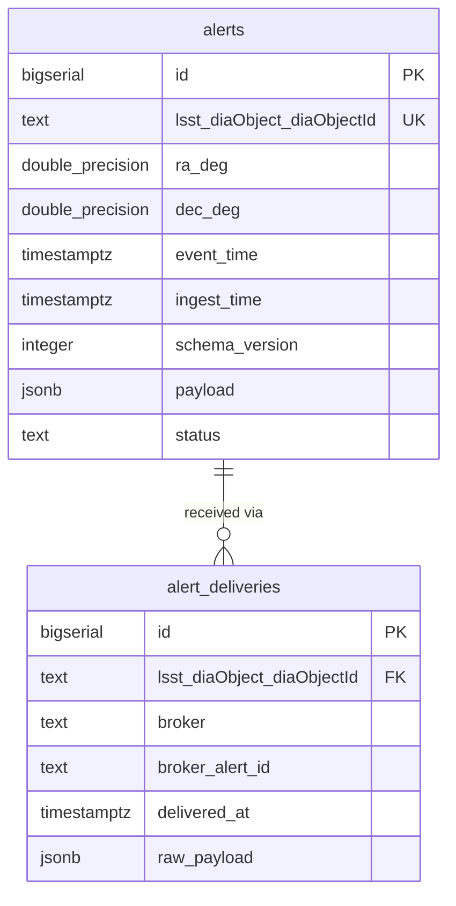

# feat: Add Lasair Broker to Design Document

## Overview

Update `scimma_crossmatch_service_design.md` to incorporate **Lasair** as a second LSST
alert broker running alongside ANTARES. The document is currently entirely ANTARES-centric;
this plan adds every section needed to make Lasair a first-class citizen of the architecture.

Code changes implied by this design update (package rename, new Django model, Lasair
module stubs, dependency additions) are tracked separately and should follow once the
design is approved.

## Problem Statement

The current design document (`scimma_crossmatch_service_design.md`):
- Titles itself "LSST Alert Matching Service Architecture (ANTARES + Gaia)"
- Describes a single ingest path (ANTARES only)
- Has no broker provenance tracking in the `alerts` table
- Has no `alert_deliveries` table
- Has no Lasair filter criteria, client library, topic, or auth details
- Shows `antares/` in the package layout with no `lasair/` sibling

Lasair is a UK LSST community broker that independently receives and filters the LSST
alert stream. Running both brokers simultaneously gives us resilience (failover if one
broker is unavailable) and richer science filtering (each broker offers different
classification tools and annotation layers).

## Proposed Changes

### 1. Title and header

Change the document title from:
> "LSST Alert Matching Service Architecture (ANTARES + Gaia)"

to:
> "LSST Alert Matching Service Architecture (ANTARES + Lasair + Gaia)"

Update the opening paragraph to mention both brokers.

---

### 2. §1 Goals — add multi-broker goal

Add to the **Goals** bullet list:
> - Multi-broker ingest (ANTARES + Lasair) for alert-stream resilience and richer filtering.

---

### 3. §2.1 Components — split component B and add Lasair filter criteria

**Rename component B** from "ANTARES Client / Ingest Service" to:
> **B. Alert Ingest Services (ANTARES + Lasair)**

Restructure as two sub-components:

**B1. ANTARES Ingest Service** (content from existing component B — no change to the
ANTARES text).

**B2. Lasair Ingest Service** (new):
- Subscribes to a Lasair Kafka topic produced by a Lasair user-defined filter.
- Validates/normalizes alert payload against the shared LSST field schema.
- Upserts alert records into PostgreSQL (UPSERT is idempotent across both ingest paths).
- Records the delivery in `alert_deliveries`.
- Enqueues a `crossmatch_alert` Celery task **only if the UPSERT created a new row**
  (i.e., the alert was not already delivered by ANTARES).

**Add a new sub-section: Lasair Filter Selection Criteria** (analogous to the existing
ANTARES filter criteria block). Content: *open question — to be defined once we create
a Lasair filter account and select a topic.* Note that Lasair filters are configured on
the Lasair web UI and produce a named Kafka topic; we do not apply local filter logic.

---

### 4. §3 Data Flow — add Lasair path

Update step 3 to read:
> 3. **Either** ingest service (ANTARES or Lasair) receives alert:
>    - UPSERT into `alerts` keyed by `lsst_diaObject_diaObjectId`.
>    - INSERT into `alert_deliveries` (broker name, broker alert id, raw envelope).
>    - If UPSERT created a new `alerts` row → submit Celery task `crossmatch_alert(...)`.
>    - If UPSERT hit a conflict (alert already received from the other broker) → skip enqueue.

---

### 5. §3.1 Sequence Diagram — add Lasair lane

Add a `LAS as Lasair Broker` participant and a parallel `LING as Lasair Ingest Service`
participant. Show the Lasair path in an `alt` block analogous to the ANTARES block,
both writing to the same `PG` and `CEL` participants.

Replace the single ANTARES lane with:

```mermaid
  participant ANT as ANTARES Broker
  participant AING as ANTARES Ingest
  participant LAS as Lasair Broker
  participant LING as Lasair Ingest
  participant PG as PostgreSQL
  ...

  par ANTARES delivery
    ANT-->>AING: Stream alert on topic
    AING->>PG: UPSERT alerts + INSERT alert_deliveries
    AING->>CEL: Enqueue crossmatch task (if new alert)
  and Lasair delivery
    LAS-->>LING: Stream alert on Kafka topic
    LING->>PG: UPSERT alerts + INSERT alert_deliveries
    LING->>CEL: Enqueue crossmatch task (if new alert)
  end
```

---

### 6. §4 Interfaces — add §4.5 Lasair → Ingest

Add a new section **4.5 Lasair → Ingest** (analogous to §4.1 ANTARES → Ingest):

**Python client**: `lasair` PyPI package (wraps `confluent_kafka`).

**Connection**:
```
Kafka server: kafka.lsst.ac.uk:9092
```

**Topic naming**: `lasair_{user_id}_{sanitised_filter_name}`. Topics are created via the
Lasair web UI when a streaming filter is saved.

**Consuming alerts**:
```python
# brokers/lasair/ingest.py
from lasair import lasair_consumer

consumer = lasair_consumer(
    kafka_server=settings.LASAIR_KAFKA_SERVER,
    group_id=settings.LASAIR_GROUP_ID,
    topic=settings.LASAIR_TOPIC,
)
while True:
    msg = consumer.poll(timeout=20)
    if msg:
        alert = json.loads(msg.value())
        handle_alert(alert)
```

**GroupID semantics**: Keep constant in production so Kafka resumes from the last
delivered offset. Use a throwaway GroupID in development/testing to replay cached alerts
(last ~7 days retained by the Kafka server).

**Authentication**: Mechanism TBD — `lasair_consumer` does not appear to require
explicit credentials for Kafka consumption, but this must be confirmed.

**Ingest requirements**:
- Reconnect/resume semantics via the Kafka GroupID.
- Backpressure (limit concurrent DB writes; retry if DB is down).
- Deduplication keyed by `lsst_diaObject_diaObjectId` (UPSERT handles this).

**Environment variables** (new):
| Variable | Example | Notes |
|---|---|---|
| `LASAIR_KAFKA_SERVER` | `kafka.lsst.ac.uk:9092` | |
| `LASAIR_TOPIC` | `lasair_42_high-snr-transients` | from Lasair UI |
| `LASAIR_GROUP_ID` | `scimma-crossmatch-prod` | stable in production |
| `LASAIR_TOKEN` | `<api-token>` | REST API token (if needed) |

---

### 7. §5.2 Database — add alert_deliveries table

Add a new **§5.2.1b `alert_deliveries`** table immediately after §5.2.1 `alerts`:

> Records each broker delivery separately. Allows tracking which broker(s) delivered a
> given alert, with per-broker metadata.

| column | type | notes |
|---|---|---|
| id | BIGSERIAL PK | |
| lsst_diaObject_diaObjectId | TEXT NOT NULL REFERENCES alerts(lsst_diaObject_diaObjectId) | |
| broker | TEXT NOT NULL | `'antares'` or `'lasair'` |
| broker_alert_id | TEXT NULL | broker-specific alert/event id if available |
| delivered_at | TIMESTAMPTZ NOT NULL DEFAULT now() | first delivery time |
| raw_payload | JSONB NULL | broker-specific envelope/annotations (not the LSST payload, which lives in `alerts.payload`) |

Constraints:
- `UNIQUE(lsst_diaObject_diaObjectId, broker)` — one record per broker per alert; re-deliveries are discarded with `ON CONFLICT DO NOTHING`.

Indexes:
- `INDEX(broker)`
- `INDEX(delivered_at)`

**Atomic ingest pattern** (add to §5.3 Transaction Boundaries):

With two ingest processes running concurrently, the following two-step pattern is safe
and race-condition-free:

```sql
-- Step 1: attempt to create the canonical alert row
INSERT INTO alerts (lsst_diaObject_diaObjectId, ra_deg, dec_deg, ...)
VALUES (...)
ON CONFLICT (lsst_diaObject_diaObjectId) DO NOTHING
RETURNING id;
-- Row returned → new alert → enqueue crossmatch task
-- Nothing returned → alert already ingested → skip enqueue

-- Step 2: record broker delivery (always; idempotent)
INSERT INTO alert_deliveries (lsst_diaObject_diaObjectId, broker, broker_alert_id, raw_payload)
VALUES (...)
ON CONFLICT (lsst_diaObject_diaObjectId, broker) DO NOTHING;
```

---

### 8. §8.2 Package layout — add brokers/ namespace

Rename `antares/` → `brokers/antares/` and add `brokers/lasair/`. A shared
`brokers/normalize.py` extracts common LSST fields from whichever broker's envelope
is being processed.

```
alertmatch/
  ...
  brokers/
    __init__.py
    normalize.py          # shared LSST field extraction (ra, dec, diaObjectId, ...)
    antares/
      __init__.py
      ingest.py           # ANTARES StreamingClient runner
      normalize.py        # ANTARES-specific annotation handling
    lasair/
      __init__.py
      ingest.py           # lasair_consumer runner
      normalize.py        # Lasair-specific annotation handling
  core/
    ...
  ...
  management/
    commands/
      run_antares_ingest.py
      run_lasair_ingest.py   # new
      run_notifier.py
      sync_pointings.py
```

Remove the old `antares/` top-level directory from the layout diagram.

---

### 9. §8.3 Key processes — add Lasair ingest command

Add:
> - **Lasair ingest service**: `python manage.py run_lasair_ingest`

---

### 10. §9.1 Deployments — add Lasair ingest Deployment

Add `lasair-ingest` to the Deployments list alongside `ingest` (ANTARES):
> - `lasair-ingest` Deployment (1 replica; Lasair Kafka consumer)

Update §9.1.3 Configuration to include the `LASAIR_*` environment variables.

---

### 11. §10 Open Questions — update

Add:
5. **Lasair Kafka auth**: does `lasair_consumer` require SASL credentials? If so,
   what format?
6. **Lasair filter/topic**: what filter criteria should the Lasair filter mirror? Should
   it replicate the ANTARES criteria (SNR > 10, no dipole, no artifacts)?
7. **Lasair alert schema**: what is the full JSON schema of a Lasair alert? Which
   field maps to `lsst_diaObject_diaObjectId`? (Lasair uses `objectId` as the top-level
   key — confirm this is always identical to `lsst_diaObject_diaObjectId`.)
8. **Lasair annotations to store**: which Lasair-side fields (Sherlock cross-matches,
   classification scores, etc.) should be preserved in `alert_deliveries.raw_payload`?

---

## Schema ERD (additions)



## Acceptance Criteria

- [x] Document title updated to reflect ANTARES + Lasair + Gaia
- [x] §1 Goals includes multi-broker ingest goal
- [x] §2.1 Component B restructured as B1 (ANTARES) and B2 (Lasair)
- [x] Lasair filter criteria section added (or clearly marked as open question)
- [x] §3 Data Flow updated with dual-broker UPSERT + alert_deliveries step
- [x] §3.1 Sequence diagram shows both ANTARES and Lasair ingest lanes
- [x] §4.5 Lasair → Ingest added (client, topic, GroupID, env vars)
- [x] §5.2 includes `alert_deliveries` table with correct schema and constraints
- [x] §5.3 Transaction Boundaries includes the atomic two-step ingest pattern
- [x] §8.2 Package layout shows `brokers/antares/`, `brokers/lasair/`, `brokers/normalize.py`
- [x] §8.3 includes `run_lasair_ingest` management command
- [x] §9.1 Deployments includes `lasair-ingest` Deployment
- [x] §9.1.3 Config includes `LASAIR_*` environment variables
- [x] §10 Open Questions updated with Lasair-specific questions

## Dependencies & Risks

- **Open questions remain**: Lasair Kafka auth and alert schema are not fully confirmed.
  Mark these sections as TBD in the document so implementers know to resolve them first.
- **Lasair filter creation**: subscribing to a Lasair topic requires creating a filter
  on the Lasair web UI with a valid Lasair account. This is a prerequisite for
  implementation but not for the design document update.
- **`objectId` mapping**: Lasair uses `objectId` as the alert key. This must be the
  same value as `lsst_diaObject_diaObjectId`. If it is not, the deduplication UPSERT
  will create duplicate alert rows — a significant correctness risk.

## References & Research

- Brainstorm: `docs/brainstorms/2026-03-06-add-lasair-broker-brainstorm.md`
- Design document: `scimma_crossmatch_service_design.md`
- Lasair alert streams docs: https://lasair.readthedocs.io/en/main/core_functions/alert-streams.html
- Lasair API reference: https://lasair.readthedocs.io/en/develop/core_functions/rest-api.html
- Existing ANTARES consumer: `crossmatch/antares/consumer.py`
- Existing models: `crossmatch/core/models.py`
