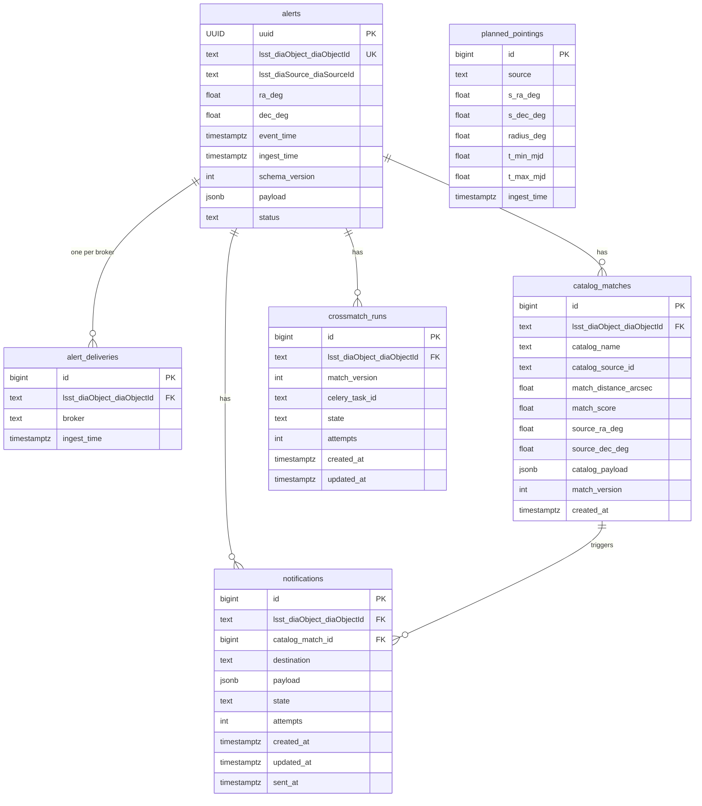

# refactor: Align Skeleton Code to Design Document

## Overview

Five coordinated changes to close the gap between the current skeleton code on
`refactor/align-skeleton-to-design-2` and `scimma_crossmatch_service_design.md`:

1. **Settings cleanup** — remove duplicate VALKEY/CACHES block, remove dead `cutout` references.
2. **Requirements** — `psycopg2-binary` → `psycopg[binary]` (v3); `redis` → `valkey`; add `lsdb`, `httpx`, `astropy`, `prometheus-client`.
3. **Models & squashed migration** — `GaiaMatch` → `CatalogMatch`; add `AlertDelivery`; update `Notification` FK; squash migrations into single `0001_initial`.
4. **`brokers/` refactor + Lasair stub** — move `antares/` → `brokers/antares/`; add `brokers/lasair/` stub; add management command, entrypoint script, Docker Compose service, Kubernetes StatefulSet.
5. **Atomic ingest pattern** — update `brokers/antares/consumer.py` to write `AlertDelivery` rows for idempotency per §5.3.

---

## Database Schema (Target)



---

## Phase 1: Settings Cleanup

**File:** `crossmatch/project/settings.py`

### 1a. Remove duplicate VALKEY + CACHES block

Lines 98–109 are an exact duplicate of lines 55–66 (VALKEY_SERVICE, VALKEY_PORT,
VALKEY_MASTER_GROUP_NAME, VALKEY_OR_SENTINEL, CACHES). Delete lines 98–109 entirely.

### 1b. Fix TEMPLATES block

- `DIRS`: change `[os.path.join(APP_ROOT_DIR, 'cutout/templates')]` → `[]`
- `context_processors`: remove `"cutout.context_processors.user_profile"`

### Acceptance Criteria — Phase 1

- [x] `settings.py` has exactly one VALKEY/CACHES block (lines 55–66); lines 98–109 removed
- [x] `TEMPLATES[0]['DIRS']` is an empty list `[]`
- [x] `"cutout.context_processors.user_profile"` removed from context_processors
- [x] `python manage.py check` passes with no errors

---

## Phase 2: Requirements Upgrade

**File:** `crossmatch/requirements.base.txt`

### Changes

| Action | Old | New | Notes |
|---|---|---|---|
| Replace | `psycopg2-binary` | `psycopg[binary]` | v3; Django 4.2+ compatible |
| Replace | `redis` | `valkey` | drop-in replacement; resolves existing TODO |
| Add | — | `lsdb` | HATS catalog crossmatching |
| Add | — | `httpx` | async HTTP for HEROIC API |
| Add | — | `astropy` | MJD/coordinate helpers |
| Add | — | `prometheus-client` | observability metrics |

No changes to `settings.py` are required for psycopg v3 or valkey — Django's
`django.db.backends.postgresql` supports psycopg v3 transparently, and `valkey`
accepts `redis://` broker URLs from Celery.

### Acceptance Criteria — Phase 2

- [x] `psycopg2-binary` removed from `requirements.base.txt`
- [x] `psycopg[binary]` present
- [x] `redis` removed; `valkey` present
- [x] `lsdb`, `httpx`, `astropy`, `prometheus-client` present
- [x] `pip install -r requirements.base.txt` succeeds (or `docker compose build` passes)

---

## Phase 3: Models & Squashed Migration

### 3a. Update `core/models.py`

**Rename `GaiaMatch` → `CatalogMatch`** with these field changes:

| Old | New | Type change |
|---|---|---|
| `gaia_source_id` | `catalog_source_id` | `BigIntegerField` → `TextField` |
| `gaia_ra_deg` | `source_ra_deg` | — |
| `gaia_dec_deg` | `source_dec_deg` | — |
| `gaia_payload` | `catalog_payload` | — |
| *(new)* | `catalog_name` | `TextField(null=False)` |

Updated `Meta`:
```python
class Meta:
    db_table = 'catalog_matches'
    indexes = [
        models.Index(fields=['alert'], name='core_cm_alert_idx'),
        models.Index(fields=['catalog_name'], name='core_cm_catalog_name_idx'),
        models.Index(fields=['catalog_source_id'], name='core_cm_catalog_source_id_idx'),
    ]
    constraints = [
        models.UniqueConstraint(
            fields=['alert', 'catalog_name', 'catalog_source_id', 'match_version'],
            name='unique_catalog_match',
        )
    ]
```

**Add `AlertDelivery` model** (new — per §5.2.1b):
```python
class AlertDelivery(models.Model):
    id = models.BigAutoField(primary_key=True)
    alert = models.ForeignKey(
        Alert,
        to_field='lsst_diaObject_diaObjectId',
        on_delete=models.CASCADE,
        db_column='lsst_diaObject_diaObjectId',
    )
    broker = models.TextField(null=False)         # 'antares' | 'lasair'
    ingest_time = models.DateTimeField(null=False, auto_now_add=True)

    class Meta:
        db_table = 'alert_deliveries'
        indexes = [
            models.Index(fields=['alert'], name='core_ad_alert_idx'),
        ]
        constraints = [
            models.UniqueConstraint(
                fields=['alert', 'broker'],
                name='unique_alert_delivery',
            )
        ]
```

**Update `Notification.gaia_match` FK**:
```python
# Before
gaia_match = models.ForeignKey(GaiaMatch, on_delete=models.SET_NULL, null=True)

# After
catalog_match = models.ForeignKey(
    CatalogMatch,
    on_delete=models.SET_NULL,
    null=True,
    db_column='catalog_match_id',
)
```

### 3b. Squash migrations

**Delete** both existing migration files:
- `crossmatch/core/migrations/0001_initial.py`
- `crossmatch/core/migrations/0002_add_crossmatch_models.py`

**Create** `crossmatch/core/migrations/0001_initial.py` that creates all six tables
in one operation, with `initial = True` and `dependencies = []`. Declare tables in
dependency order: `alerts`, `alert_deliveries`, `planned_pointings`, `catalog_matches`,
`crossmatch_runs`, `notifications`.

Index naming convention (match existing pattern `core_<abbrev>_<field>_idx`):
- Alert: `core_alert_status_idx`
- AlertDelivery: `core_ad_alert_idx`
- PlannedPointing: `core_pp_ingest_time_idx`, `core_pp_time_window_idx`
- CatalogMatch: `core_cm_alert_idx`, `core_cm_catalog_name_idx`, `core_cm_catalog_source_id_idx`
- CrossmatchRun: `core_cmr_alert_idx`, `core_cmr_state_idx`
- Notification: `core_notif_state_idx`, `core_notif_alert_idx`

Note: `DEFAULT_AUTO_FIELD = 'django.db.models.AutoField'` in settings.py is a regular
int field. All models must explicitly declare `id = models.BigAutoField(primary_key=True)`
to get BIGSERIAL PKs as specified in the design.

### 3c. Update `notifier/lsst_return.py`

Update the stub import:
```python
# Before
from core.models import GaiaMatch, Notification
# After
from core.models import CatalogMatch, Notification
```

Update the stub function signature to reference `CatalogMatch`.

### 3d. Update `tasks/crossmatch.py`

No change needed — the task uses `Alert.objects.get(...)` which is unaffected.
Any future reference to `GaiaMatch` in this file should be updated to `CatalogMatch`.

### Acceptance Criteria — Phase 3

- [x] `core/models.py` has `CatalogMatch` (not `GaiaMatch`); all renamed fields present
- [x] `CatalogMatch.catalog_name` is `TextField(null=False)` (free text, no enum)
- [x] `AlertDelivery` model present with `UNIQUE(alert, broker)` constraint
- [x] `Notification.catalog_match` FK references `CatalogMatch` (not `GaiaMatch`)
- [x] Only one migration file: `core/migrations/0001_initial.py`
- [x] `python manage.py migrate` succeeds on a fresh database
- [x] `python manage.py showmigrations` shows `core` with `[X] 0001_initial` only
- [x] No reference to `GaiaMatch`, `gaia_source_id`, `gaia_payload`, `gaia_ra_deg`, `gaia_dec_deg` remains in `core/`

---

## Phase 4: `brokers/` Refactor + Lasair Stub

### 4a. Move `antares/` → `brokers/antares/`

```
crossmatch/antares/         →  crossmatch/brokers/antares/
  __init__.py                    __init__.py
  consumer.py                    consumer.py   (also updated in Phase 5)
  publisher.py                   publisher.py
```

### 4b. New `brokers/` package files

```
crossmatch/brokers/
  __init__.py               (empty)
  normalize.py              (stub — alert normalization placeholder)
  lasair/
    __init__.py             (empty)
    consumer.py             (stub — see below)
```

**`brokers/lasair/consumer.py` stub:**
```python
from core.log import get_logger
logger = get_logger(__name__)


def consume_alerts():
    """Consume alerts from the Lasair Kafka broker.

    Lasair broker: kafka.lsst.ac.uk:9092
    Topic: lasair_366SCiMMA_reliability_moderate
    Auth: no credentials required
    """
    raise NotImplementedError("Lasair consumer not yet implemented")
```

### 4c. Update import in `run_antares_ingest.py`

```python
# Before
from antares.consumer import consume_alerts
# After
from brokers.antares.consumer import consume_alerts
```

### 4d. Add `run_lasair_ingest.py` management command

**File:** `crossmatch/project/management/commands/run_lasair_ingest.py`

```python
from django.core.management.base import BaseCommand
from brokers.lasair.consumer import consume_alerts


class Command(BaseCommand):
    help = "Run Lasair alert ingest"

    def handle(self, *args, **options):
        self.stdout.write(self.style.SUCCESS('Starting Lasair alert ingest...'))
        consume_alerts()
```

### 4e. Add `run_lasair_ingest.sh` entrypoint script

**File:** `crossmatch/entrypoints/run_lasair_ingest.sh`

Follow the exact pattern of `run_antares_ingest.sh`:
```bash
#!/bin/bash

set -euo pipefail

cd "${APP_ROOT_DIR:-/opt}/crossmatch"
bash entrypoints/wait-for-it.sh ${DATABASE_HOST}:${DATABASE_PORT} --timeout=0
bash entrypoints/wait-for-it.sh ${VALKEY_SERVICE:-redis}:${VALKEY_PORT:-6379} --timeout=0

echo "Running initialization script..."
bash entrypoints/django_init.sh
echo "Django database initialization complete."

cd "${APP_ROOT_DIR:-/opt}/crossmatch"
python manage.py run_lasair_ingest
```

### 4f. Add `lasair-consumer` service to `docker/docker-compose.yaml`

Add after the `alert-consumer` service block, following the same pattern:

```yaml
lasair-consumer:
  image: hub.ncsa.illinois.edu/crossmatch-service/alert-consumer:dev
  platform: linux/x86_64
  networks:
    - internal
  build:
    context: ../crossmatch
    dockerfile: ../docker/Dockerfile
    args:
      UID: "${USERID:-1000}"
  command: bash entrypoints/run_lasair_ingest.sh
  environment:
    DJANGO_DEBUG: "${DJANGO_DEBUG:-true}"
    LOG_LEVEL: ${LOG_LEVEL:-DEBUG}
    DEV_MODE: "${DEV_MODE:-true}"
    DATABASE_HOST: "${DATABASE_HOST:-django-db}"
    DATABASE_PORT: "${DATABASE_PORT:-5432}"
    DATABASE_DB: "${DATABASE_DB:-django}"
    DATABASE_USER: "${DATABASE_USER:-django}"
    DATABASE_PASSWORD: "${DATABASE_PASSWORD:-password}"
    VALKEY_SERVICE: "${VALKEY_SERVICE:-redis}"
    VALKEY_PORT: "${VALKEY_PORT:-6379}"
    APP_ROOT_DIR: "${APP_ROOT_DIR:-/opt}"
    # Lasair broker configuration (stub — not yet active)
    # LASAIR_KAFKA_HOST: "${LASAIR_KAFKA_HOST:-kafka.lsst.ac.uk}"
    # LASAIR_KAFKA_PORT: "${LASAIR_KAFKA_PORT:-9092}"
    # LASAIR_TOPIC: "${LASAIR_TOPIC:-lasair_366SCiMMA_reliability_moderate}"
  volumes:
    - ../crossmatch:/opt/crossmatch
```

### 4g. Add `lasair-consumer` StatefulSet to Kubernetes Helm chart

**File:** `kubernetes/charts/crossmatch-service/templates/statefulset.yaml`

Add a fourth `---` section after the `celery-beat` block (before `{{- end }}`):

```yaml
{{- if .Values.lasair_consumer.enabled }}
---
apiVersion: apps/v1
kind: StatefulSet
metadata:
  name: {{ .Values.lasair_consumer.service.host | quote }}
  {{- with .Values.common.annotations }}
  annotations:
    {{- toYaml . | nindent 4 }}
  {{- end }}
spec:
  replicas: {{ .Values.lasair_consumer.replicaCount }}
  serviceName: {{ .Values.lasair_consumer.service.host | quote }}
  selector:
    matchLabels:
      app: {{ .Values.lasair_consumer.service.host | quote }}
  template:
    metadata:
      labels:
        app: {{ .Values.lasair_consumer.service.host | quote }}
        app.kubernetes.io/component: lasair-consumer
    spec:
      containers:
      - name: lasair-consumer
        image: {{ .Values.common.image.repo }}:{{ .Values.common.image.tag }}
        imagePullPolicy: {{ .Values.common.image.imagePullPolicy }}
        command:
        - /bin/bash
        - -c
        - bash entrypoints/run_lasair_ingest.sh
        env:
          {{- include "common.env" . | nindent 10 }}
          {{- include "django.env" . | nindent 10 }}
          {{- include "db.env" . | nindent 10 }}
          {{- include "valkey.env" . | nindent 10 }}
          {{- include "celery.env" . | nindent 10 }}
        {{- with .Values.lasair_consumer.resources }}
        resources:
          {{- toYaml . | nindent 10 }}
        {{- end }}
{{- end }}
```

**Note:** The `{{- end }}` from `alert_consumer.enabled` at line 176 of the current
file guards all three existing StatefulSets. The new `lasair_consumer` block uses its
own independent flag.

### 4h. Add `lasair_consumer` to `values.yaml`

**File:** `kubernetes/charts/crossmatch-service/values.yaml`

Add after the `alert_consumer` block:

```yaml
lasair_consumer:
  enabled: false            # disabled until real Lasair integration is implemented
  replicaCount: 1
  service:
    host: "lasair-consumer"
  resources:
    requests:
      cpu: '500m'
      memory: 100Mi
    limits:
      cpu: '2'
      memory: 2Gi
```

**Also fix** the missing `service.host` key under `alert_consumer` (bug discovered during
research — `statefulset.yaml` line 6 references `.Values.alert_consumer.service.host`
but the key is absent from `values.yaml`):

```yaml
alert_consumer:
  enabled: true
  replicaCount: 3
  service:
    host: "alert-consumer"    # ADD THIS
  ...
```

### Acceptance Criteria — Phase 4

- [x] `crossmatch/antares/` directory no longer exists; `crossmatch/brokers/antares/` exists
- [x] `brokers/lasair/consumer.py` exists and raises `NotImplementedError`
- [x] `run_antares_ingest.py` imports from `brokers.antares.consumer`
- [x] `run_lasair_ingest.py` management command exists
- [x] `entrypoints/run_lasair_ingest.sh` exists
- [x] `docker-compose.yaml` has `lasair-consumer` service with placeholder Lasair env vars (commented out)
- [x] `statefulset.yaml` has `lasair-consumer` StatefulSet gated by `lasair_consumer.enabled`
- [x] `values.yaml` has `lasair_consumer` block with `enabled: false`
- [x] `values.yaml` has `alert_consumer.service.host: "alert-consumer"` (bug fix)
- [x] `python manage.py run_antares_ingest --help` works (import path resolves)
- [x] `python manage.py run_lasair_ingest --help` works

---

## Phase 5: Atomic Ingest Pattern in ANTARES Consumer

**File:** `crossmatch/brokers/antares/consumer.py`

Update `consume_alerts()` to write an `AlertDelivery` row before dispatching the
Celery task, using Django ORM's `get_or_create` on the `UNIQUE(alert, broker)` constraint
to achieve idempotency per §5.3.

**Ingest logic change (pseudocode):**

```python
# Step 1: Create or find Alert (existing logic)
alert_obj, _ = Alert.objects.get_or_create(
    lsst_diaObject_diaObjectId=alert_id,
    defaults={...fields...}
)

# Step 2: Attempt AlertDelivery INSERT (idempotency gate per §5.3)
delivery, created = AlertDelivery.objects.get_or_create(
    alert=alert_obj,
    broker='antares',
)
if not created:
    logger.info("alert already delivered by antares, skipping", alert_id=alert_id)
    continue

# Step 3: Dispatch Celery task (existing logic — only reached if delivery is new)
crossmatch_alert.delay(alert_obj.lsst_diaObject_diaObjectId)
```

### Acceptance Criteria — Phase 5

- [x] `AlertDelivery` is imported in `brokers/antares/consumer.py`
- [x] Each iteration of the mock consumer loop calls `AlertDelivery.objects.get_or_create`
- [x] If `created=False`, the loop iteration is skipped (no duplicate Celery task dispatch)
- [x] Logs an info message when skipping a duplicate
- [x] End-to-end: starting the alert-consumer service with Docker Compose creates rows in both `alerts` and `alert_deliveries`

---

## Files Affected (Complete List)

| File | Action |
|---|---|
| `crossmatch/project/settings.py` | Remove duplicate VALKEY block; remove cutout refs |
| `crossmatch/requirements.base.txt` | Upgrade psycopg, redis → valkey; add lsdb, httpx, astropy, prometheus-client |
| `crossmatch/core/models.py` | GaiaMatch → CatalogMatch; add AlertDelivery; update Notification FK |
| `crossmatch/core/migrations/0001_initial.py` | Squashed — replace entirely |
| `crossmatch/core/migrations/0002_add_crossmatch_models.py` | Delete |
| `crossmatch/notifier/lsst_return.py` | Update GaiaMatch → CatalogMatch import/usage |
| `crossmatch/antares/` | **Move** to `crossmatch/brokers/antares/` |
| `crossmatch/brokers/__init__.py` | New (empty) |
| `crossmatch/brokers/normalize.py` | New (stub) |
| `crossmatch/brokers/antares/__init__.py` | Moved from `antares/` |
| `crossmatch/brokers/antares/consumer.py` | Moved + atomic ingest pattern added |
| `crossmatch/brokers/antares/publisher.py` | Moved from `antares/` |
| `crossmatch/brokers/lasair/__init__.py` | New (empty) |
| `crossmatch/brokers/lasair/consumer.py` | New (stub) |
| `crossmatch/project/management/commands/run_antares_ingest.py` | Update import path |
| `crossmatch/project/management/commands/run_lasair_ingest.py` | New |
| `crossmatch/entrypoints/run_lasair_ingest.sh` | New |
| `docker/docker-compose.yaml` | Add `lasair-consumer` service |
| `kubernetes/charts/crossmatch-service/templates/statefulset.yaml` | Add lasair-consumer StatefulSet |
| `kubernetes/charts/crossmatch-service/values.yaml` | Add `lasair_consumer` block; fix `alert_consumer.service.host` |

---

## Acceptance Criteria (Overall)

- [x] All Phase 1–5 acceptance criteria pass
- [x] `python manage.py check` produces no errors
- [x] `python manage.py migrate` on a fresh DB creates 6 tables: `alerts`, `alert_deliveries`, `planned_pointings`, `catalog_matches`, `crossmatch_runs`, `notifications`
- [x] `python manage.py showmigrations` shows only `[X] 0001_initial` under `core`
- [x] `docker compose build` succeeds
- [x] `docker compose up` starts successfully; alert-consumer produces rows in `alerts` + `alert_deliveries`
- [x] No references to `GaiaMatch`, `gaia_matches`, `gaia_source_id`, `gaia_payload`, `gaia_ra_deg`, `gaia_dec_deg`, `gaia_match_id`, `run_alert_consumer` anywhere in tracked files
- [x] No references to `psycopg2`, `psycopg2-binary` anywhere in tracked files

---

## References

- Brainstorm: `docs/brainstorms/2026-03-06-align-skeleton-to-design-brainstorm.md`
- Design document: `scimma_crossmatch_service_design.md` — §5.2.1b, §5.2.3, §5.2.5, §5.3, §8.1, §8.2, §9.1
- `crossmatch/core/models.py:79` — current GaiaMatch model
- `crossmatch/core/models.py:157` — current Notification.gaia_match FK
- `crossmatch/core/migrations/0002_add_crossmatch_models.py` — index naming pattern
- `crossmatch/project/settings.py:55–109` — duplicate VALKEY blocks
- `crossmatch/project/settings.py:68–84` — dead cutout references
- `crossmatch/antares/consumer.py` — mock consumer to update
- `crossmatch/project/management/commands/run_antares_ingest.py:2` — import to update
- `docker/docker-compose.yaml:13` — alert-consumer service pattern
- `kubernetes/charts/crossmatch-service/templates/statefulset.yaml:1–41` — StatefulSet pattern
- `kubernetes/charts/crossmatch-service/values.yaml` — alert_consumer block pattern
