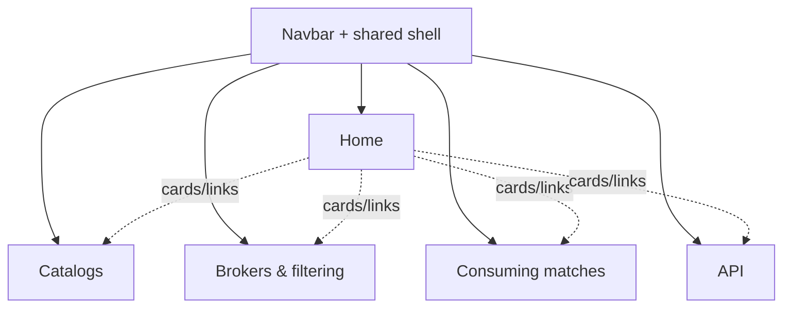
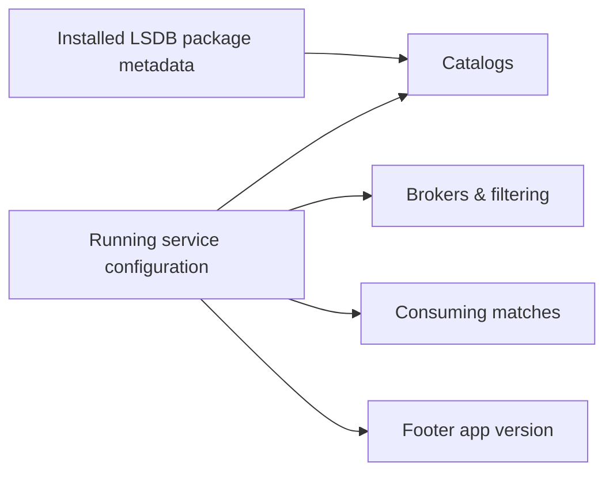
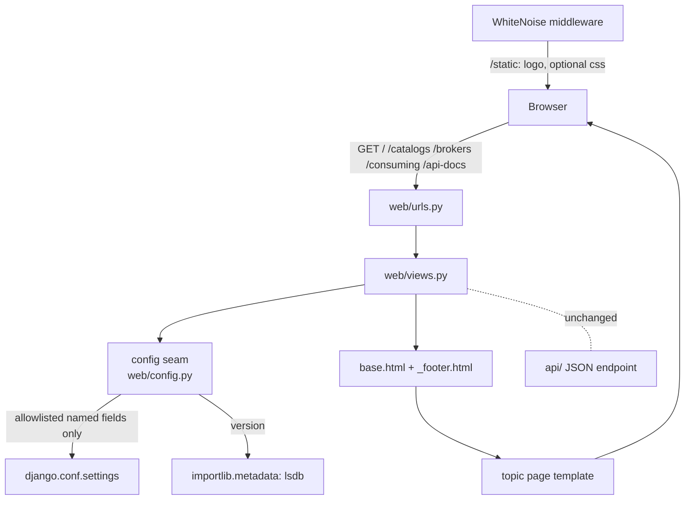

# Rubin Crossmatch Service Web Frontend - Plan

## Goal Capsule

- **Objective:** Build the first web frontend for the crossmatch service: an informational, Django + Bootstrap 4 site in the shared SCiMMA/Astrodash style that surfaces the deployed service's configuration live and documents how the public astro community can consume published matches. Deployed to DEV and PROD.
- **Product authority:** The maintainer (Scott Koranda). Scope is the initial informational frontend only; live match data, service dashboards, and authentication are explicitly out of scope for this plan.
- **Open blockers:** None blocking planning. Minor content confirmations (footer institution credits, support email / issues URL) are deferred to planning with sensible defaults.

## Product Contract

### Summary

Build the first web frontend for the crossmatch service: a Django server-rendered site (Bootstrap 4, matching the Astrodash/Blast SCiMMA pattern) with topic pages -- Home, Catalogs, Brokers & filtering, Consuming matches, API -- whose service facts are read live from the running deployment's configuration. The site documents where matches are published and how to subscribe, and it ships wired into docker-compose and the Helm chart so DEV and PROD serve it.

### Problem Frame

The crossmatch service has no human-facing web presence today. The deployed `web` workload serves only a JSON read-model API (`/api/recent-crossmatches`) and a health check -- there are no templates, static assets, or pages. The service publishes matches to the public astro community over Hopskotch, but that community has nowhere to learn what the service does, which catalogs it matches against, how upstream alerts are filtered, where matches are published, or how to consume them (Hopskotch subscription or the REST API). Operators likewise have no at-a-glance view of what configuration a given deployment is actually running. The service already runs a Django/gunicorn web process, so the surface to host these pages exists; only the frontend itself is missing.

### Key Decisions

- KD1. **Match the SCiMMA/Astrodash stack: Django server-rendered templates + Bootstrap 4, no SPA.** The two reference frontends (Astrodash, Blast) are both pure Django + Bootstrap 4 with no JS build tooling, and the service already runs a Django/gunicorn web process; following the Astrodash pattern means adopting that stack rather than introducing a separate JavaScript framework. Governs R1, R2, R13.
- KD2. **Informational scope only for the initial release.** (session-settled: user-directed -- chosen over adding live match data or service status/stats: keep the first surface small and content-focused.) Governs R6, R7, R8, R9, R10; see Scope Boundaries.
- KD3. **Config-derived facts are read live from the running service.** (session-settled: user-directed -- chosen over fully-static curated content and over maximal runtime catalog introspection: the deployed instance is the source of truth, so pages never drift from what is actually configured.) Governs R11, R12, R15.
- KD4. **Topic-page information architecture.** (session-settled: user-directed -- chosen over a single long overview page and over a Home + Configuration + API split: one page per subject, five nav items.) Governs R5, R6, R7, R8, R9, R10.
- KD5. **Footer NSF acknowledgment as an inline Astrodash-style line.** (session-settled: user-directed -- chosen over a dedicated Acknowledgements page: follow Astrodash's footer exactly, reusing its award IDs and wording.) Governs R2, R3.
- KD6. **Deploy the frontend now, not just run it locally.** (session-settled: user-directed -- chosen over local-dev-only: wire the web workload into docker-compose and the Helm chart + values so DEV and PROD serve it.) Governs R13, R14.
- KD7. **Hand-write the API reference.** The API is plain Django (not DRF), has no OpenAPI/schema, and exposes a single scientist-facing endpoint, so the API page is authored by hand rather than generated from a schema. Governs R10.
- KD8. **Anticipate future OIDC without foreclosing it, and render no auth UI now.** Do not render any authentication affordance in this release (no login button or link) and do not build gating structure; simply keep the shell and page structure such that OIDC login and protected views can be added later without rework. Governs R16.

### Requirements

**Site shell and shared layout**

- R1. The frontend renders every page through a shared base template matching the SCiMMA/Astrodash shell: a dark fixed-top navbar carrying the crossmatch branding, a centered light content container, and the shared footer. No login button or other authentication affordance is rendered in this release.
- R2. The footer follows the Astrodash footer pattern: an inline row of links (contact, report issues, participating institutions ending in SCiMMA, and an app-version link) above a small-print NSF acknowledgment line.
- R3. The footer NSF acknowledgment reuses Astrodash's award IDs and wording verbatim -- awards OAC-1841625, OAC-1934752, OAC-2311355, AST-2432428, each linked to its NSF award-search page, followed by the standard "Any opinions, findings, conclusions or recommendations..." disclaimer sentence.
- R4. The site uses a placeholder text wordmark in place of the not-yet-existing logo, positioned in a clearly swappable slot so a future logo asset can replace it without layout rework.

**Content pages (topic IA)**

- R5. Navigation exposes five pages: Home, Catalogs, Brokers & filtering, Consuming matches, and API.
- R6. Home presents a plain-language overview of what the crossmatch service does, with entry points (cards or links) into the four topic pages.
- R7. The Catalogs page lists each crossmatched catalog (Gaia DR3, DES Y6 Gold, DELVE DR3 Gold, SkyMapper DR4) with its published per-match metadata columns -- shown as the lowercased key names actually published over Hopskotch (matching the payload builder's normalization), not the upstream-native case stored in settings -- and states the crossmatch radius and the LSDB version installed on this deployment (the client-side pin, which is what package metadata guarantees; the crossmatch itself runs on the remote Dask cluster). These config-driven reference tables (catalogs here, and the broker/topic listings on the Brokers & filtering page) use semantic table markup -- scoped header cells and a per-catalog caption -- so screen-reader users can navigate content whose rows vary by deployment and cannot be accessibility-checked by inspection.
- R8. The Brokers & filtering page lists the upstream brokers (ANTARES, Lasair, Pitt-Google) and explains how alerts are filtered: the in-service reliability threshold together with the upstream quality topics each broker subscribes to.
- R9. The Consuming matches page states where matches are published (the Hopskotch broker and topic) and how to subscribe, including a copy-paste `hop-client` subscribe example.
- R10. The API page documents the REST API by hand: the recent-crossmatches endpoint, its query parameters, its detail levels, and its response envelope, with at least one example request and successful response, plus at least one error-response example (the 400 body shape for an invalid request, and the 405 returned for non-GET methods).

**Live configuration sourcing**

- R11. Config-derived facts -- the catalog list and per-catalog published columns, crossmatch radius, reliability threshold, per-broker topics, Hopskotch broker and topic, LSDB version, and app version -- are read at render time from the running service's configuration and installed package metadata, not hardcoded in templates. The render is restricted to this enumerated allowlist and must not expose secret settings (for example `SECRET_KEY`, the database password, or the Hopskotch/ANTARES credentials, which live in the same settings module); the view maps these explicit named fields into the template context and never passes or iterates the settings module wholesale. This matters because the pages are publicly viewable with no authentication (R14).
- R12. When a config value is unset on a deployment (for example an empty Hopskotch topic injected only at runtime), the page renders a clear "not configured" state rather than a blank or malformed value. The correctness of the other displayed facts depends on the web deployment carrying the real configuration (R15), since settings with non-empty fallback defaults cannot be distinguished from explicitly configured values at render time; the page must not present a compiled-in default as a confirmed live value. If a whole config read fails at render time (an exception reading a catalog block, or the package-metadata lookup throwing), the affected section renders a graceful "temporarily unavailable" message and the rest of the page still renders -- a page-level failure state distinct from the per-field "not configured" case, and never a stack trace or blank page.

**Deployment**

- R13. The frontend is served by the existing gunicorn web entrypoint and is wired into local dev (docker-compose) and the Helm chart + values, so DEV and PROD both serve it.
- R14. The frontend is publicly viewable with no authentication required (access control, if any, stays at the ingress/gateway layer, consistent with how the API path is already handled).
- R15. The web deployment receives the same broker, Hopskotch, and reliability configuration environment as the ingest consumers and workers, so the pages reflect the configuration the running pipeline actually uses rather than compiled-in defaults.

**Future-auth accommodation**

- R16. No authentication UI is rendered in this release -- no login button, link, or other auth affordance -- and no view-gating structure is built. The design only avoids choices that would preclude adding OIDC login and protected views later. No authentication or authorization is implemented in this plan.

### Key Flows

- F1. Consume published matches.
  - **Trigger:** A community member arrives at the site wanting to receive or query matches.
  - **Steps:** Home orients them; the Consuming matches page shows the live Hopskotch broker/topic and a `hop-client` subscribe example; the API page shows the endpoint reference for programmatic access.
  - **Outcome:** They can subscribe to the stream or call the API without reading the source.
  - **Covers:** R6, R9, R10.
- F2. Render a config-derived page.
  - **Trigger:** Any topic page is requested.
  - **Steps:** The view reads the relevant configuration values and the LSDB version at render time, then renders them -- or a "not configured" state when a value is unset.
  - **Outcome:** The page always reflects the configuration of the deployed instance.
  - **Covers:** R11, R12.

### Visualizations

Site map (topic-page IA, KD4 / R5):



Live-config fan-out (KD3 / R11 -- one authority feeding many surfaces):



### Acceptance Examples

- AE1. **Covers R12.** Given the Hopskotch topic is unset on the deployed instance, When the Consuming matches page is rendered, Then it shows a clear "publishing topic not configured" state instead of a blank value or a broker URL with a dangling separator.
- AE2. **Covers R11.** Given the deployed configuration lists four catalogs each with their published columns, When the Catalogs page is rendered, Then each catalog appears with exactly its published columns rendered as the lowercased keys published over Hopskotch (not the upstream-native case stored in settings), with no hardcoded catalog list in the template.
- AE3. **Covers R11.** Given the service runs a specific LSDB version, When the Catalogs page is rendered, Then it reports that same version read at runtime, not a value copied into a template.
- AE4. **Covers R3.** Given any page is rendered, When the footer displays, Then it shows awards OAC-1841625, OAC-1934752, OAC-2311355, and AST-2432428 each linked to its NSF award page, followed by the standard NSF disclaimer sentence.
- AE5. **Covers R12.** Given reading a catalog block or the LSDB package metadata throws at render time, When the affected page is rendered, Then that section shows a graceful "temporarily unavailable" message and the rest of the page still renders, rather than returning a stack trace or a blank page.

### Scope Boundaries

- Live match data, recent-matches browsing, and any runtime status/stats dashboard -- deferred; the initial site is informational only.
- OIDC authentication/authorization, any access-gated views, and any login UI -- not implemented and not rendered in this release; the design only avoids precluding them later (R16).
- A designed logo -- a placeholder text wordmark stands in until an asset exists.
- A machine-readable configuration endpoint (JSON) -- the live facts render as HTML only for now.
- An interactive API explorer / Swagger "try it" UI -- the API page is static hand-written reference (KD7).

### Dependencies / Assumptions

- The UI pattern is copied from two existing SCiMMA frontends -- the Astrodash and Blast Django apps (separate repositories on the maintainer's machine, not part of this repo). Astrodash is the primary reference for the shell, navbar, footer, and NSF line; Blast confirms these are shared SCiMMA conventions.
- The running service's configuration is the single source of truth for the live facts; `crossmatch/project/settings.py` holds them today (catalogs and per-catalog columns, radius, reliability threshold, broker topics, Hopskotch broker/topic). The LSDB version is read from installed package metadata, not settings.
- Bootstrap 4 and Bootstrap Icons are loaded via CDN, matching the reference apps; no JS build tooling is introduced.
- The frontend is hosted by the existing `crossmatch/entrypoints/run_web.sh` gunicorn process and lives as a Django app peer to `crossmatch/api/`, routed from `crossmatch/project/urls.py`.
- There is no OIDC/auth wiring in the codebase today, so anticipating future auth adds no migration or teardown risk.
- Serving the new pages publicly requires a coordinated ingress change in the separate gitops repo, not just this repo's compose/Helm work: the DEV/PROD ingress currently forwards only the `api/` path to this workload, so the new page paths must be added to the ingress there or they will 404 externally. This mirrors how the monitoring-spine work treated ingress as a separate gitops-repo unit. The PROD hostname that ingress routes must also appear in the web pod's `DJANGO_ALLOWED_HOSTS` (KTD3 / U8), or Django rejects those requests with a 400.

### Outstanding Questions

**Deferred to Planning**

- Footer content specifics: which participating institutions to credit (Astrodash lists MIT Kavli / NCSA:CAPS / SCiMMA), the contact/support email, and the report-issues URL. Default to the crossmatch upstream repo and SCiMMA; confirm with the maintainer during planning.
- How the app version is sourced for the footer (settings currently carries a placeholder `APP_VERSION`); planning decides how it is set at build/deploy time.
- Exact navigation labels and wording. (The login-affordance question is resolved: no auth UI is rendered this release -- R16 / KTD1.)
- Exact per-field presentation of the "not configured" and "temporarily unavailable" states (copy and styling); the mechanism is settled (see KTD2).

### Sources / Research

- Existing web surface and routes: `crossmatch/project/urls.py` (mounts only `healthz` and `api/`; admin deliberately unmounted), `crossmatch/entrypoints/run_web.sh` (gunicorn on `:8000`). No templates, static assets, or JS build tooling exist in the repo today.
- REST API to document: `crossmatch/api/urls.py`, `crossmatch/api/views.py`, `crossmatch/api/service.py` (the `recent-crossmatches` endpoint, its params, detail levels, and response envelope; plain Django `JsonResponse`, not DRF; no OpenAPI).
- Config source of truth: `crossmatch/project/settings.py` (`CROSSMATCH_CATALOGS` with per-catalog `payload_columns`, `CROSSMATCH_RADIUS_ARCSEC`, `MIN_DIASOURCE_RELIABILITY`, broker `*_TOPIC` settings, `HOPSKOTCH_BROKER_URL` / `HOPSKOTCH_TOPIC`, `APP_VERSION`). Per-catalog column references: `docs/references/gaia_dr3-columns.md`, `docs/references/des_y6_gold-columns.md`, `docs/references/delve_dr3_gold-columns.md`, `docs/references/skymapper_dr4-columns.md`. Published payload shape: `crossmatch/matching/payload.py`.
- Deployment wiring targets: `docker/docker-compose.yaml` (no web service today) and `kubernetes/charts/crossmatch-service/` (`templates/statefulset.yaml`, `values.yaml`) -- no `web` Deployment/Service exists yet.
- Alert filtering and brokers: `crossmatch/brokers/` (antares/lasair/pittgoogle consumers, `normalize.py`) and the `MIN_DIASOURCE_RELIABILITY` reliability cut in settings.
- UI pattern references (external SCiMMA repos, not in this repo): the Astrodash frontend (base shell, navbar, footer with the NSF grant line; jumbotron + Bootstrap info cards for the landing; sectioned reference styling) and the Blast frontend (confirming the shared Django + Bootstrap 4 convention and the section-heading-plus-table pattern for dense reference content).

---

## Planning Contract

**Product Contract preservation:** unchanged by this enrichment. The `ce-doc-review` round already applied its edits in place (R15 config-env parity and R16 no-auth-UI were added and the future-auth requirement renumbered during that round). Stable R/AE IDs are preserved; this Planning Contract and everything below add the HOW and change no product scope.

### Key Technical Decisions

- KTD1. **New Django app `crossmatch/web/`, server-rendered templates + Bootstrap 4 via CDN, no JS build.** A single app peer to `crossmatch/api/`, routed at root paths from `crossmatch/project/urls.py`, using a two-layer template shell (base + per-page) that mirrors Astrodash. Instantiates KD1. Governs R1; drives U1, U4, U5, U6, U7.
- KTD2. **One allowlisted live-config context seam.** A single module (`crossmatch/web/config.py`) exposes an explicit, named allowlist of display fields read from `django.conf.settings` plus the LSDB version from `importlib.metadata`; it never passes or iterates the settings module, returns a "not configured" marker for empty values, and raises a typed "section unavailable" result the templates render gracefully. Every config page consumes this seam. Instantiates KD3; mechanizes the R11 secret guard and the R12 states. Governs U3.
- KTD3. **Least-privilege web deployment env.** The web workload's environment carries the display config values (broker topics, `CROSSMATCH_RADIUS_ARCSEC`, `MIN_DIASOURCE_RELIABILITY`, `HOPSKOTCH_BROKER_URL`/`HOPSKOTCH_TOPIC`, HATS URLs), `DJANGO_ALLOWED_HOSTS` set to the public hostname (the compiled-in default only covers DEV), `DATABASE_*`, and `SECRET_KEY`, and pins `DJANGO_DEBUG=false` so a public error page can never render Django's settings-dumping debug view, but omits the broker API credentials and Hopskotch publish credentials it never uses (it neither consumes nor publishes). Mechanizes R15 and hardens R11/R14 at the deployment layer. Governs U8.
- KTD4. **Static assets via WhiteNoise + `collectstatic`, with a logo slot.** (session-settled: user-directed -- chosen over a text-only/no-static-pipeline v1: a logo is explicitly wanted and faithfully matching Astrodash uses image assets, so the static pipeline is set up once now rather than retrofitted.) Bootstrap and Bootstrap Icons load from the CDN; the app ships a `static/web/` dir with a logo slot (a placeholder/provisional mark until the real crossmatch logo asset is dropped in); WhiteNoise middleware serves collected static from the gunicorn pod (no nginx). Adding WhiteNoise re-pins both `crossmatch/requirements.base.txt` and `crossmatch/requirements.lock` in the same commit. Governs R4; drives U1, U8.
- KTD5. **Hand-written API reference page.** No DRF/OpenAPI exists, so the API page is authored by hand from the endpoint's actual contract (`crossmatch/api/service.py`): params, detail levels, response envelope, and both a success and an error (400/405) example. Instantiates KD7. Governs R10; drives U7.
- KTD6. **Catalogs page lowercases published column names.** The page renders `payload_columns` lowercased to match the keys the payload builder publishes over Hopskotch (`col.lower()` in `crossmatch/matching/payload.py`), not the upstream-native case stored in settings. Mechanizes R7/AE2. Governs U5.

### High-Level Technical Design

Runtime request and config-read shape (one new app; the existing JSON API is untouched):



The seam is the single trust boundary: templates receive only the mapped context dict, never `settings`, so a secret cannot reach a page even if a later edit is careless.

### Assumptions & Sequencing

- U1 lands first (app importable, shell renders, static served). U2 (footer) and U3 (config seam) depend on U1. U4-U6 (pages) depend on U1 + U2 + U3; U7 (API reference) depends on U1 + U2 only (it does not use the config seam). U8 (deploy) can begin the docker-compose service once U1 imports, but the Helm `web` workload/values land after the pages exist.
- Tests live in `crossmatch/tests/` (the `pytest.ini` `testpaths = tests brokers` collects there); new test modules are `crossmatch/tests/test_web_*.py`.
- Adding WhiteNoise triggers the dependency-pin convention: update `crossmatch/requirements.base.txt` and regenerate `crossmatch/requirements.lock` (pip-compile) in the same commit, or the lock-drift CI check fails. WhiteNoise is web-only and never runs on the Dask cluster, so no cluster version alignment is required.
- The DEV/PROD ingress change that routes the new page paths to this workload is a separate gitops-repo unit (see Dependencies / Assumptions) and is out of this plan's code scope.

---

## Output Structure

```text
crossmatch/web/                     # new Django app, peer to crossmatch/api/
  __init__.py
  apps.py
  urls.py                          # root-level page routes
  views.py                         # one view per page; all pull from config.py
  config.py                        # KTD2 live-config seam (allowlist + version + states)
  templatetags/
    __init__.py
    web_tags.py                    # app_version, support_email (mirror Astrodash tags)
  templates/web/
    base.html                      # shell: navbar (logo slot, no auth UI), container
    _footer.html                   # inline links + NSF acknowledgment line
    home.html
    catalogs.html
    brokers.html
    consuming.html
    api.html
  static/web/
    logo/                          # logo slot (placeholder until real asset)
    css/site.css                   # optional; most styling stays inline per Astrodash
crossmatch/tests/
  test_web_config.py               # seam: allowlist, unset, failure, version
  test_web_pages.py                # rendering, nav, catalog lowercasing, a11y markup
  test_web_footer.py               # NSF awards + links (AE4)
```

---

## Implementation Units

### U1. Frontend app scaffold, base shell, and static pipeline

- **Goal:** A new `crossmatch/web/` app renders a shared Astrodash-style shell (dark navbar with a logo slot and no auth affordance, centered container, footer include) at a root URL, with static served via WhiteNoise.
- **Requirements:** R1, R4; KTD1, KTD4.
- **Dependencies:** none.
- **Files:** `crossmatch/web/__init__.py`, `apps.py`, `urls.py`, `views.py`, `templates/web/base.html`, `templates/404.html`, `templates/500.html`, `static/web/` (create); `crossmatch/project/settings.py` (add `web` to `INSTALLED_APPS`; add WhiteNoise to `MIDDLEWARE`; set static storage); `crossmatch/project/urls.py` (add `path('', include('web.urls'))`); `crossmatch/requirements.base.txt` + `crossmatch/requirements.lock` (pin WhiteNoise); `crossmatch/entrypoints/run_web.sh` (run `collectstatic --no-input` before gunicorn); `crossmatch/tests/test_web_pages.py`.
- **Approach:**
  1. Scaffold the app and route a `home` placeholder at `/` so the shell is viewable.
  2. Build `base.html`: dark fixed-top navbar (brand = logo slot + text wordmark, no login control) using Bootstrap's responsive collapse (a toggler with `aria-expanded`) so the five items stay usable on narrow viewports; `.container` body block; footer include. Keep custom CSS inline in the template per the Astrodash convention; Bootstrap 4 + Bootstrap Icons via CDN.
  3. Add WhiteNoise middleware directly after `SecurityMiddleware`; keep `STATIC_ROOT` as configured; add `collectstatic` to the web entrypoint so the gunicorn pod serves its own static. For tests (which do not run the entrypoint), set `WHITENOISE_USE_FINDERS=True` on the test/dev settings path, or run `collectstatic` in a fixture, so the static-serving test resolves rather than 404ing.
  4. Re-pin WhiteNoise in both requirements files in the same change.
  5. Add branded `404.html` and `500.html` templates that extend the base shell, so a mistyped URL or a routing error renders in the site shell rather than Django's unstyled default page.
- **Patterns to follow:** Astrodash `base_site.html` shell and inline-style convention; the existing `crossmatch/api/` app layout for app structure and URL inclusion.
- **Execution note:** This is mostly scaffolding/config; prefer a rendering smoke check (the shell returns 200 and includes the navbar/footer) over heavy unit coverage, plus one static-serving check.
- **Test scenarios:**
  - `GET /` returns 200 and the response contains the navbar brand and the footer include.
  - The rendered navbar contains no login/auth control (guards R1/R16).
  - The navbar collapses behind a toggler on narrow viewports (Bootstrap collapse markup with `aria-expanded`).
  - A static asset under `/static/web/...` is served, with `WHITENOISE_USE_FINDERS` (or a `collectstatic` fixture) making it resolvable under pytest.
  - An unknown URL renders the branded 404 template in the site shell, not Django's default error page.
- **Verification:** The site shell renders at `/` with the Astrodash look, no auth UI, and static assets load; `web` is in `INSTALLED_APPS` and WhiteNoise is pinned in both requirements files.

### U2. Footer partial, NSF acknowledgment, and template tags

- **Goal:** A shared footer renders the Astrodash-style inline link row and the NSF small-print line with the exact award IDs, driven by `app_version`/`support_email` template tags.
- **Requirements:** R2, R3; KD5; AE4.
- **Dependencies:** U1.
- **Files:** `crossmatch/web/templates/web/_footer.html`, `crossmatch/web/templatetags/__init__.py`, `crossmatch/web/templatetags/web_tags.py` (create); `crossmatch/tests/test_web_footer.py`.
- **Approach:**
  1. `web_tags.py`: a `support_email` tag (footer content, not a seam field), mirroring Astrodash `astrodash_tags.py`. The app version is read from the U3 config seam's per-view context (its allowlist already includes `APP_VERSION`), not a settings-reading template tag -- keeping every settings read behind the single seam (KTD2).
  2. `_footer.html`: inline `//`-separated links (Contact us `mailto` via `support_email`, Report issues -> upstream repo, participating institutions ending in SCiMMA, app-version link) above the NSF line.
  3. NSF line reuses Astrodash's exact wording and award IDs: OAC-1841625, OAC-1934752, OAC-2311355, AST-2432428, each linked to `nsf.gov/awardsearch/showAward?AWD_ID=<id>`.
- **Patterns to follow:** Astrodash `base_site.html` footer block and `astrodash_tags.py`.
- **Test scenarios:**
  - Covers AE4. The footer renders all four award IDs, each as an `nsf.gov/awardsearch` link, followed by the standard disclaimer sentence.
  - The footer's institution link row ends with a SCiMMA link and includes contact + report-issues links.
- **Verification:** Every page shows the footer with the four linked NSF awards, the disclaimer, and the inline institution/contact/version links.

### U3. Live-config context seam

- **Goal:** A single allowlisted seam maps named settings fields + the installed LSDB version into template context, presents "not configured" for empty values and a graceful "temporarily unavailable" for read failures, and never exposes anything outside the allowlist.
- **Requirements:** R11, R12; KTD2; AE1, AE3, AE5.
- **Dependencies:** U1.
- **Files:** `crossmatch/web/config.py` (create); `crossmatch/tests/test_web_config.py`.
- **Approach:**
  1. Define an explicit allowlist mapping display keys to `settings` attributes (catalogs + `payload_columns`, `CROSSMATCH_RADIUS_ARCSEC`, `MIN_DIASOURCE_RELIABILITY`, broker topics, `HOPSKOTCH_BROKER_URL`/`HOPSKOTCH_TOPIC`, `APP_VERSION`) plus a version reader using `importlib.metadata.version('lsdb')`.
  2. Read `settings` at call time (mirrors `api/service.py:120-127` so `@override_settings` works in tests); never return or iterate the module.
  3. Empty/unset value -> a `NotConfigured` marker the templates render as "not configured". A raised read (missing attr, metadata lookup error) -> a `SectionUnavailable` result scoped to that section.
- **Patterns to follow:** `crossmatch/api/service.py` live-settings reads; `crossmatch/matching/payload.py` for which fields are published.
- **Execution note:** Implement the seam test-first -- the security guard (no secret key in the returned context) and the two states are the load-bearing behaviors.
- **Test scenarios:**
  - Covers R11 (secret guard). The returned context contains none of `SECRET_KEY`, `DATABASE_PASSWORD`, `HOPSKOTCH_USERNAME`/`HOPSKOTCH_PASSWORD`, `ANTARES_API_KEY`/`ANTARES_API_SECRET`, even when those settings are populated.
  - Covers AE1. With `HOPSKOTCH_TOPIC` empty (via `@override_settings`), the seam yields the "not configured" marker for the publishing topic, not an empty string.
  - Covers AE3. The LSDB version comes from `importlib.metadata`, not a hardcoded value.
  - Covers AE5. A forced read failure (e.g., metadata lookup raises) yields a `SectionUnavailable` result for that section rather than propagating an exception.
- **Verification:** The seam returns only allowlisted display fields, the live LSDB version, and typed markers for unset/failed reads; secrets never appear in its output.

### U4. Home page and navigation

- **Goal:** The Home page presents a plain-language service overview (jumbotron + info cards) that links into the four topic pages, with nav exposing all five pages.
- **Requirements:** R5, R6; KTD1, KD4.
- **Dependencies:** U1, U2, U3.
- **Files:** `crossmatch/web/templates/web/home.html` (create); `crossmatch/web/urls.py`, `views.py`, `templates/web/base.html` (extend); `crossmatch/tests/test_web_pages.py` (extend).
- **Approach:** Jumbotron (what the service does) + a row of Bootstrap info cards linking to Catalogs / Brokers & filtering / Consuming matches / API; nav in `base.html` lists the five pages and marks the current page with an `active` class.
- **Patterns to follow:** Astrodash `index.html` jumbotron + info-card row.
- **Test scenarios:**
  - Covers R5. Every page's navbar links to all five pages (Home, Catalogs, Brokers & filtering, Consuming matches, API).
  - `GET /` renders the overview and the info cards resolve to the topic-page URLs.
- **Verification:** Home orients a first-time visitor and routes them to each topic page; nav is consistent across pages.

### U5. Catalogs page

- **Goal:** The Catalogs page lists each catalog with its published columns (lowercased to match Hopskotch), the crossmatch radius, and the installed LSDB version, in accessible tables.
- **Requirements:** R7; KTD1, KTD6; AE2.
- **Dependencies:** U1, U2, U3.
- **Files:** `crossmatch/web/templates/web/catalogs.html` (create); `views.py`, `urls.py` (extend); `crossmatch/tests/test_web_pages.py` (extend).
- **Approach:** Consume the U3 seam; render one table per catalog with the lowercased `payload_columns`; state radius and installed LSDB version; use semantic markup (scoped `<th>`, a per-catalog `<caption>`). If no catalogs are configured, render an explicit "no catalogs currently configured" state rather than a blank content area.
- **Patterns to follow:** Blast `acknowledgements.html` sectioned `table table-responsive table-sm` reference tables; `crossmatch/matching/payload.py` for the lowercasing rule.
- **Test scenarios:**
  - Covers AE2. Each configured catalog renders with exactly its published columns as lowercased keys (not the upstream-native case), with no hardcoded catalog list.
  - Covers R7 (a11y). Each catalog table has scoped header cells and a caption.
  - The page shows the radius and the installed LSDB version from the seam.
  - With `CROSSMATCH_CATALOGS` empty, the page renders a "no catalogs configured" state rather than a blank content area.
- **Verification:** The Catalogs page reflects the deployed catalog config with published (lowercased) columns in accessible tables, plus radius and LSDB version.

### U6. Brokers & filtering and Consuming matches pages

- **Goal:** The Brokers page explains the upstream brokers and the reliability filter; the Consuming page shows where matches are published (live) and how to subscribe.
- **Requirements:** R7, R8, R9; KTD1, KTD2.
- **Dependencies:** U1, U2, U3.
- **Files:** `crossmatch/web/templates/web/brokers.html`, `crossmatch/web/templates/web/consuming.html` (create); `views.py`, `urls.py` (extend); `crossmatch/tests/test_web_pages.py` (extend).
- **Approach:** Brokers page lists ANTARES/Lasair/Pitt-Google with their upstream topics (from the seam) and explains filtering (upstream quality topics + the `MIN_DIASOURCE_RELIABILITY` cut). Consuming page shows the Hopskotch broker + topic from the seam (with the "not configured" state when empty) and a copy-paste `hop-client` subscribe example.
- **Patterns to follow:** Blast section-heading-plus-table pattern; the seam's config values.
- **Test scenarios:**
  - Covers R8. The Brokers page lists the three brokers with their topics and states the reliability threshold value from config.
  - Covers R9. The Consuming page renders the live Hopskotch broker/topic and a `hop-client` example; when `HOPSKOTCH_TOPIC` is unset it shows the "not configured" state (AE1 path) rather than a dangling URL.
  - Covers R7. The Brokers page's broker/topic table has scoped header cells and a caption (accessible markup, per R7).
  - The Brokers page shows the "not configured" marker for any broker whose topic is unset, reusing the seam.
- **Verification:** Both pages reflect deployed broker/filter/publishing config and give a working subscribe recipe.

### U7. API reference page

- **Goal:** A hand-written reference for `GET /api/recent-crossmatches` covering params, detail levels, the response envelope, and both a success and an error example.
- **Requirements:** R10; KTD1, KD7, KTD5.
- **Dependencies:** U1, U2.
- **Files:** `crossmatch/web/templates/web/api.html` (create); `views.py`, `urls.py` (extend); `crossmatch/tests/test_web_pages.py` (extend).
- **Approach:** Author the page from the endpoint's real contract in `crossmatch/api/service.py` / `views.py`: query params (`start`, `end`, `time_field`, `detail`, `page_size`, `cursor`), detail levels, the JSON envelope, one success example, and one error example (the 400 body shape and the 405 on non-GET). Route the page at a path distinct from the `api/` JSON prefix (e.g., `/api-docs`).
- **Patterns to follow:** Blast `acknowledgements.html` reference-table layout; `crossmatch/api/service.py` for authoritative param/envelope shapes.
- **Test scenarios:**
  - Covers R10. The page documents every query param and both a success and an error response (400 + 405).
  - The API-docs page URL does not collide with the `api/` JSON prefix.
- **Verification:** An integrator can call the endpoint (happy and error paths) from the page without reading the source.

### U8. Deployment wiring (compose + Helm)

- **Goal:** The web workload runs in local dev (docker-compose) and deploys via the Helm chart with a Service, using a least-privilege config env.
- **Requirements:** R13, R14, R15; KTD3, KTD4.
- **Dependencies:** U1 (importable app) for compose; U4-U7 for the full Helm rollout.
- **Files:** `docker/docker-compose.yaml` (add `web` service); `kubernetes/charts/crossmatch-service/templates/web.yaml` (create: Deployment + Service), `kubernetes/charts/crossmatch-service/values.yaml` (add `web` block), `kubernetes/charts/crossmatch-service/templates/_helpers.yaml` (optional `web.env` include).
- **Approach:**
  1. Compose: a `web` service running `bash entrypoints/run_web.sh`, port 8000, `django-static` volume, env carrying the display config values (broker topics, radius, reliability, Hopskotch broker/topic, HATS URLs) + DB, omitting broker/Hopskotch credentials.
  2. Helm: a `web` Deployment (stateless; Deployment, not StatefulSet) + a `Service`, env composed from `common.env` + `django.env` (SECRET_KEY) + `db.env` + a dedicated least-privilege `web.env` include carrying the display config values and `DJANGO_ALLOWED_HOSTS` (backed by a new `values.yaml` field, e.g. `web.allowed_hosts`, with a real PROD hostname -- no `ingress.host` value exists in the chart today). Prefer this dedicated include over reusing `hopskotch.env`/`antares.env` so the pod does not receive publish/consume credentials it never uses.
  3. Leave ingress routing to the gitops repo (Dependencies).
- **Patterns to follow:** existing `docker-compose.yaml` service blocks and `kubernetes/charts/crossmatch-service/templates/statefulset.yaml` + `_helpers.yaml` env-include structure.
- **Execution note:** Mostly config/packaging; prefer a compose-up smoke check (the web service serves the shell) plus a `helm template` render check over unit tests.
- **Test scenarios:**
  - Test expectation: none (packaging/deploy) -- verify by `helm template` rendering a `web` Deployment + Service and a `docker compose` smoke check that the web service serves `/`.
  - Confirm the rendered web env includes the display config values, `DJANGO_ALLOWED_HOSTS` (a non-DEV hostname), and DB/SECRET_KEY, pins `DJANGO_DEBUG=false`, but excludes the broker API or Hopskotch publish credentials (guards KTD3).
- **Verification:** `docker compose up` serves the frontend locally; `helm template` produces a `web` Deployment + Service with a least-privilege env; the ingress dependency is recorded for the gitops change.

---

## Verification Contract

| Gate | How | Applies to |
|------|-----|------------|
| Unit tests | `docker exec crossmatch-celery-worker-1 sh -c 'cd /opt/crossmatch && python -m pytest tests/test_web_config.py tests/test_web_pages.py tests/test_web_footer.py'` (or the run-with-deps one-off per `docs/developer.md`) | U1-U7 |
| Full suite green | `python -m pytest` in-container (no regressions) | all |
| Lock drift | `crossmatch/requirements.lock` regenerated with the WhiteNoise pin in the same commit | U1 |
| Local smoke | `docker compose -f docker/docker-compose.yaml up` -> web service serves `/` with the shell, footer, and a topic page | U1, U8 |
| Chart render | `helm template kubernetes/charts/crossmatch-service` produces a `web` Deployment + Service with a least-privilege env | U8 |
| Secret-exposure check | a test asserts the config seam's output excludes all secret settings | U3 |

## Definition of Done

- All five pages render in the Astrodash/Bootstrap-4 shell with the shared footer and NSF acknowledgment (four linked awards + disclaimer), and no auth UI anywhere.
- Config-derived facts (catalogs + lowercased published columns, radius, reliability threshold, broker topics, Hopskotch broker/topic, LSDB version, app version) render live from the deployed configuration through the allowlisted seam; secrets never appear; unset values show "not configured" and section read failures degrade gracefully.
- The API page documents the single endpoint with params, detail levels, envelope, and a success + error example, at a URL distinct from the `api/` JSON prefix.
- WhiteNoise serves a `static/web/` logo slot; the pipeline is in place and pinned in both requirements files.
- The web workload runs under docker-compose and renders a `web` Deployment + Service via Helm with a least-privilege env that sets `DJANGO_ALLOWED_HOSTS` to the public hostname; the gitops ingress-routing change is recorded as the remaining out-of-repo step.
- Routing and error edges stay in the site shell: branded 404 and 500 pages extend the base template rather than falling through to Django's unstyled default.
- The full in-container pytest suite is green.
