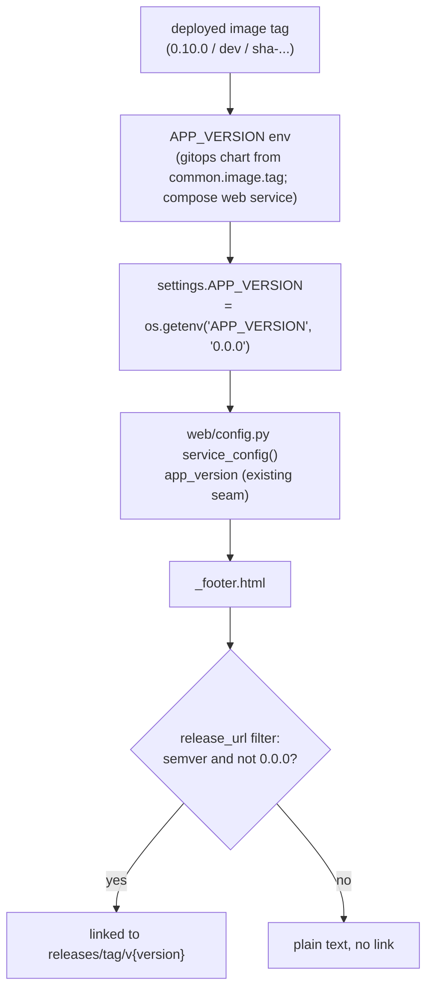

# Footer Deploy Version - Plan

## Goal Capsule

- **Objective:** Make the web frontend footer show the version of the actually-deployed image instead of the hardcoded `0.0.0` placeholder, sourced live from the deployment so it tracks every rollout with no manual bump.
- **Product authority:** The maintainer (Scott Koranda).
- **Open blockers:** None. The render behavior is settled and the implementation approach is decided; one verification item (whether GitHub Releases resolve for shipped tags) is confirmed during implementation.

---

## Product Contract

**Product Contract preservation:** unchanged in scope. R4 was firmed (local compose is now in this change, not a deferred fork) and the corresponding Outstanding Question resolved, per the confirmed planning decision; stable R/AE IDs are preserved.

### Summary

Wire the footer's version to the running deployment's image tag, read live through the existing config seam. On a tagged release the version links to that release on GitHub; on local, CI, or unset builds it shows the build string as plain text.

### Problem Frame

`crossmatch/project/settings.py` sets `APP_VERSION = '0.0.0'` as a literal constant, never sourced from the deployment. The footer renders that value and links it to `github.com/scimma/crossmatch-service/releases/tag/{version}`. So on every environment the footer reads `0.0.0` and links to a release tag that does not exist. The value was shipped intentionally unwired (the web frontend plan deferred version sourcing to build/deploy time); this plan closes that gap. The mismatch has a second edge: the published image tags are `X.Y.Z` (`0.10.0`), while the GitHub release tags carry a `v` (`v0.10.0`), so even a correctly-sourced value would 404 without prefix handling.

### Key Decisions

- KD1. **Link to the GitHub release only for a semantic-version tag; plain text otherwise.** (session-settled: user-directed -- chosen over always-plain-text and over linking to the commit: a real link for releases without a broken link on `dev`/`sha`/unset builds.) When the version is semver, the link resolves the `v` prefix so it points at the real release tag. Governs R2, R3.
- KD2. **The displayed version is the running image's tag, supplied to the app at deploy time.** It tracks rollouts with no manual edit, and reflects whatever tag each surface actually runs (`0.10.0` on the cluster, `dev` on local compose, `sha-<sha>` on a CI build). Governs R1, R4.

### Requirements

- R1. The footer displays the version of the running deployment's image, read live (through the existing config seam, not a hardcoded constant), and updates on rollout with no manual source edit.
- R2. When the displayed version is a semantic-version release tag, the footer links it to that release on GitHub, resolving the `v` prefix so the link targets the real release tag (image tags omit the `v`; release tags carry it).
- R3. When the displayed version is not a release tag -- a local or `dev` build, a CI commit (`sha-<sha>`) build, or the unset `0.0.0` fallback -- the footer shows the build string as plain text with no link.
- R4. The behavior holds wherever the frontend is served -- the DEV and PROD cluster deployments and local docker-compose -- each surface reflecting its own running image.

### Acceptance Examples

- AE1. **Covers R2.** Given the deployment runs image tag `0.10.0`, when the footer renders, then it shows `0.10.0` linked to `github.com/scimma/crossmatch-service/releases/tag/v0.10.0`.
- AE2. **Covers R3.** Given a local or CI build (image tag `dev` or `sha-<sha>`), or the unset `0.0.0` fallback, when the footer renders, then it shows that string as plain text with no link.

### Scope Boundaries

- Display-only: the version is surfaced in the footer only -- no `/version` route, no API response field, no other placement.
- Not fixing the separate pre-existing chart-wide `SECRET_KEY` vs `DJANGO_SECRET_KEY` env-name mismatch (unrelated deploy-wiring residual).
- Not changing the CI image-tag naming convention; the `v`-prefix mismatch is handled in the app, not by re-tagging images.

---

## Planning Contract

### Key Technical Decisions

- KTD1. **Source `APP_VERSION` from the deployed image tag via env injection, not a build-time bake.** Change `settings.py` to `os.getenv('APP_VERSION', '0.0.0')`, then set that env from the image tag at each deploy surface: the gitops chart injects it from `common.image.tag`, and docker-compose sets it on the `web` service. No `docker/Dockerfile` or `build-image.yml` change -- the tag the chart already pins is the single source of truth, and it auto-tracks rollouts. Instantiates KD2. Governs R1, R4; drives U1, U2, U3.
- KTD2. **Compute the release link in a tested Python template filter, keeping the template dumb.** A `release_url` filter (in `crossmatch/web/templatetags/web_tags.py`) returns the GitHub release URL for a semver tag -- prepending the `v` -- and an empty value for anything else (`dev`, `sha-<sha>`, the `0.0.0` sentinel, or a non-full-semver like `0.10`). The footer branches on the filter's output: link when present, plain text when empty. Semver detection and the `v` prefix live in one unit-testable place rather than in template logic. (session-settled: user-directed -- chosen over always-plain-text and over a commit link.) Instantiates KD1. Governs R2, R3; drives U1.
- KTD3. **`0.0.0` is treated as a non-release sentinel, not a linkable version.** Even though it is semver-shaped, it is the compiled-in "unknown" default; `release_url` returns empty for it so a deployment that never injected `APP_VERSION` degrades to plain text rather than a `releases/tag/v0.0.0` 404. Governs R3; drives U1.

### High-Level Technical Design

One value flows from the image tag to the footer; the only branch is at render time.

### Assumptions & Sequencing

- U1 (app code) is self-contained and testable on its own; the footer already reads `app_version` through the seam, so only the link branch and the env-sourced value change.
- U2 (docker-compose) and U3 (gitops chart) are the two deploy-surface wirings. U3 targets a **separate repository** (`crossmatch-service-k8s-gitops`) and ships through that repo's normal DEV-then-PROD promotion; it takes effect only after a release image carrying U1 is deployed there.
- The version value is an env string, not a Python dependency -- no `requirements.base.txt` / `requirements.lock` re-pin and no Dask version-alignment concern.

---

## Implementation Units

### U1. Env-source APP_VERSION and add the release-link filter

- **Goal:** The footer shows the running image's version (read live) and links it to the GitHub release only for a real semver tag, plain text otherwise.
- **Requirements:** R1, R2, R3; KTD1, KTD2, KTD3; AE1, AE2.
- **Dependencies:** none.
- **Files:** `crossmatch/project/settings.py` (modify: `APP_VERSION` reads env), `crossmatch/web/templatetags/web_tags.py` (add `release_url` filter), `crossmatch/web/templates/web/_footer.html` (branch on the filter), `crossmatch/tests/test_web_footer.py` (extend), `crossmatch/tests/test_web_config.py` (extend if the env read is asserted there).
- **Approach:**
  1. `settings.py`: change the literal `APP_VERSION = '0.0.0'` to `os.getenv('APP_VERSION', '0.0.0')`, keeping `0.0.0` as the fallback. This is the only settings change; the seam (`web/config.py service_config()`) already exposes `app_version` unchanged.
  2. `web_tags.py`: add a `release_url` filter that returns the release URL (`https://github.com/scimma/crossmatch-service/releases/tag/v<version>`) when the value is a full semver (`N.N.N`) and not the `0.0.0` sentinel, else an empty string. Match the existing `is_configured` filter's style.
  3. `_footer.html`: replace the current unconditional `releases/tag/{{ service.app_version }}` link with a branch on `service.app_version|release_url` -- render the linked version when the filter returns a URL, plain text otherwise. Keep the existing `` outer guard.
- **Patterns to follow:** the `is_configured` filter and its footer usage added in the web frontend work (`crossmatch/web/templatetags/web_tags.py`, `_footer.html`); the seam's call-time settings reads in `crossmatch/web/config.py`.
- **Execution note:** Implement the `release_url` filter test-first -- the semver-vs-non-semver split and the `0.0.0` sentinel are the load-bearing behaviors.
- **Test scenarios:**
  - Covers AE1 / R2. `release_url('0.10.0')` returns `https://github.com/scimma/crossmatch-service/releases/tag/v0.10.0` (semver, `v` prepended).
  - Covers AE2 / R3. `release_url('dev')` and `release_url('sha-6489fb8')` each return an empty string (no link).
  - Covers R3 / KTD3. `release_url('0.0.0')` returns an empty string (sentinel, no broken link).
  - Edge. `release_url('0.10')` (major.minor, not full semver) returns an empty string.
  - Covers R1. With `APP_VERSION` set via env (`@override_settings` or an env-read assertion), `service_config()['app_version']` reflects the injected value rather than a hardcoded constant.
  - Covers AE1 / R2. Footer render with `APP_VERSION='0.10.0'` contains an `<a>` to `releases/tag/v0.10.0`.
  - Covers AE2 / R3. Footer render with `APP_VERSION='dev'` shows `dev` as plain text with no `releases/tag` link; same with `APP_VERSION='0.0.0'`.
- **Verification:** The `release_url` filter is unit-covered for semver/dev/sha/0.0.0/major-minor; the footer renders a release link for a semver deploy and plain text otherwise; the full in-container suite is green.

### U2. Set APP_VERSION in the docker-compose web service

- **Goal:** The local dev frontend footer reflects the compose image tag rather than falling back to `0.0.0`.
- **Requirements:** R1, R3, R4; KTD1.
- **Dependencies:** U1 (the app must read `APP_VERSION` from env before setting it has any effect).
- **Files:** `docker/docker-compose.yaml` (the `web` service environment).
- **Approach:** Add `APP_VERSION` to the `web` service env, defaulting to the dev image tag (e.g. `APP_VERSION: "${APP_VERSION:-dev}"`), consistent with how the other display-config values are set on that service. Local runs then show `dev` as plain text (per R3), confirming the end-to-end wiring without a real release.
- **Patterns to follow:** the existing `web` service env block in `docker/docker-compose.yaml`.
- **Test scenarios:** Test expectation: none -- packaging/config. Verify via the compose smoke in the Verification Contract (the footer shows the compose image tag as plain text).
- **Verification:** `docker compose up web` serves a footer whose version reads the compose tag (`dev`), plain text, no `0.0.0`.

### U3. Inject APP_VERSION from the image tag in the gitops chart

- **Target repo:** `crossmatch-service-k8s-gitops` (separate repository; not this repo).
- **Goal:** The DEV and PROD web pods receive `APP_VERSION` equal to the deployed image tag, so their footers show the real released version (linked).
- **Requirements:** R1, R2, R4; KTD1.
- **Dependencies:** U1 (app reads the env). Takes effect on the cluster only after a release image carrying U1 is deployed.
- **Files:** `apps/crossmatch-service/templates/_helpers.yaml` (add `APP_VERSION` to the env block the `web` workload includes -- the `web.env` or `django.env` include used by `templates/deployment-web.yaml`); no `values.yaml` field is required since the value derives from `common.image.tag`.
- **Approach:** Add `- name: APP_VERSION` with `value: {{ .Values.common.image.tag | quote }}` to the env include that the web deployment composes, so each environment's web pod reports the tag it is actually running. Because the chart pins `common.image.tag` per environment (and PROD only via the release tag), the footer version advances exactly when the deployed image does.
- **Patterns to follow:** the existing env-include helpers in `apps/crossmatch-service/templates/_helpers.yaml` (e.g. `web.env`, `crossmatch.env`) and how `common.image.tag` is already referenced in `templates/deployment-web.yaml`.
- **Test scenarios:** Test expectation: none -- chart config. Verify via `helm template` in the Verification Contract.
- **Verification:** `helm template` renders the web Deployment env with `APP_VERSION` equal to `common.image.tag`; after a DEV rollout, `https://crossmatch-dev.scimma.org/` footer shows the deployed version linked to its GitHub release.

---

## Verification Contract

| Gate | How | Applies to |
|------|-----|------------|
| Unit tests | `docker exec crossmatch-celery-worker-1 sh -c 'cd /opt/crossmatch && python -m pytest tests/test_web_footer.py tests/test_web_config.py'` (or the run-with-deps one-off per `docs/developer.md`) | U1 |
| Full suite green | `python -m pytest` in-container (no regressions) | all |
| Chart render | `helm template apps/crossmatch-service` (in the gitops repo) renders `APP_VERSION` in the web Deployment env equal to `common.image.tag` | U3 |
| Local smoke | `docker compose -f docker/docker-compose.yaml up web` -> footer shows the compose image tag (`dev`) as plain text, not `0.0.0` | U1, U2 |
| Release-link resolves | Confirm `github.com/scimma/crossmatch-service/releases/tag/v<version>` resolves for a shipped tag (see Open Questions) before relying on the linked path in PROD | R2 |

## Open Questions

**Deferred to Planning / verify at implementation**

- Do shipped `vX.Y.Z` git tags have resolvable GitHub Release (or tag) pages? The build triggers on the git tag, but a git tag without a published Release can 404 at `/releases/tag/vX.Y.Z` -- reproducing the broken-link class this plan fixes, just with a valid-looking tag. Verify during U1/U3 rollout; if only lightweight tags exist, either publish Releases per tag or point `release_url` at the tag tree (`/releases/tag/` still renders tag pages on GitHub, but confirm) rather than assuming a Release object.

## Definition of Done

- The footer shows the running image's version live: on DEV/PROD a semver tag renders linked to its GitHub release (with the `v` resolved), and on local/CI/unset builds the build string renders as plain text -- the `0.0.0` placeholder no longer appears on a properly-deployed image.
- `APP_VERSION` is env-sourced in `settings.py` and injected from the image tag at both deploy surfaces (docker-compose `web` service and the gitops chart's web env).
- The `release_url` filter is unit-tested for semver, `dev`, `sha-*`, `0.0.0`, and major-minor inputs; the footer render is tested for both the linked and plain-text paths.
- The full in-container pytest suite is green; `helm template` renders `APP_VERSION` in the web env; the compose smoke shows the footer version.
