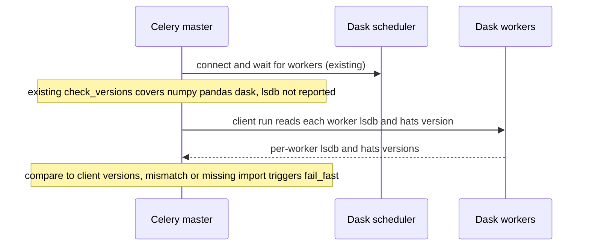

# LSDB 0.10.x Upgrade - Plan

## Goal Capsule

- Objective: Upgrade LSDB from `0.9.0` to `0.10.4` across the app and its Dask cluster as version hygiene, moving the aligned stack (`hats`, `nested-pandas`) with it, and make an lsdb version skew between app and cluster fail fast instead of silently.
- Product authority: This plan. Active scope is the lsdb-aligned dependency upgrade plus the skew-guard hardening; nothing else in the crossmatch path is in scope.
- Open blockers: None. The guard mechanism and tag model are resolved in the Planning Contract; the exact aligned versions are deferred to implementation (pip-resolved), not blockers.

---

## Product Contract

Product Contract preservation: unchanged — scope and all R/KD IDs preserved. The two planning-deferred questions (skew-guard mechanism, app/Dask tag model) are resolved in the Planning Contract (KTD1, KTD2); Outstanding Questions is trimmed to the execution-time items accordingly.

### Summary

Move LSDB `0.9.0 -> 0.10.4` on both the app and its Dask cluster, carrying `hats` (to the `0.10.x` line) and `nested-pandas` along in lockstep, and close the gap that lets an lsdb version skew between the two ship silently. No new `0.10.x` behavior is adopted; the crossmatch path is unchanged.

### Problem Frame

The stack has drifted a full minor version behind LSDB (`0.9.0` while `0.10.4` is current). No single feature or fix forces the move; this is elective hygiene to keep the gap from widening into a painful jump later, the same motivation as the prior `0.9.0` upgrade. Because there is no deadline, doing it safely matters more than doing it fast.

Two facts make this more than a pin bump. First, the crossmatch runs on a Dask cluster that must run the same lsdb version as the app, or distributed (de)serialization corrupts. Second, the runtime version check that guards this alignment covers `numpy`/`pandas`/`dask`/`distributed` but not lsdb itself, and the app and Dask deploy tags have already drifted apart (app on a later tag, cluster on an earlier one) — aligned today only because lsdb has not changed since either was built. This upgrade is the first lsdb change since that gap was noted, so it is the moment the gap would bite.

### Key Decisions

- **Target lsdb 0.10.4, exact-pinned.** Current latest patch of the `0.10` line, pinned exactly per the dependency-pin convention (`docs/solutions/conventions/dependency-pin-upgrade-pattern-2026-05-12.md`), not the `0.10.1` originally recalled. (session-settled: user-approved — chosen over `0.10.1`: same latest-patch, exact-pin convention.) Governs R1.
- **Close the silent lsdb-skew gap in this change.** This is the first lsdb change since the guard gap was flagged, so fix it now rather than bumping alone. (session-settled: user-directed — chosen over upgrade-only.) Governs R3, R4.
- **Lightest validation bar.** Test suite green plus one clean DEV crossmatch batch, with no `0.9.0`-vs-`0.10.4` output-parity check — accepts unverified result-equivalence for lower setup cost. (session-settled: user-directed — chosen over parity validation.) Governs R5.
- **Behavior-preserving hygiene.** No adoption of `0.10.x` features or API changes. Governs R7.

### Requirements

**Version alignment**

- R1. lsdb is upgraded from `0.9.0` to `0.10.4` at every pin site (`crossmatch/requirements.base.txt`, the regenerated `crossmatch/requirements.lock`, and the Dask worker/scheduler package set in `docker/docker-compose.yaml`), and the co-required aligned packages move with it (`hats` to the `0.10.x` line, `nested-pandas` to its lsdb-`0.10.4`-compatible range).
- R2. The app image and the Dask cluster image run the identical lsdb version after the upgrade. The Dask cluster's deploy tag, which currently lags the app, is advanced in the same change so the cluster is never left on `0.9.0`.

**Skew-gap hardening**

- R3. An lsdb version skew between the app (Dask client) and the Dask cluster can no longer reach production silently: it is surfaced the way `numpy`/`pandas`/`dask`/`distributed` skew already is, rather than corrupting distributed (de)serialization undetected. The enforcement mechanism is Deferred to Planning.
- R4. The app and Dask cluster images cannot ship different lsdb versions through normal deploy: their lsdb alignment is enforced rather than left to manual discipline.

**Validation and rollout**

- R5. The upgrade is accepted for PROD when the existing test suite passes and one real crossmatch batch completes successfully on DEV against the upgraded app and cluster. No output-parity check is required.
- R6. PROD cutover follows the established DEV-then-PROD promotion process, with the app and the Dask cluster advanced together so alignment holds through the rollout.

**Behavior**

- R7. The upgrade adopts no new `0.10.x` capabilities or API changes. The existing call sites — `lsdb.open_catalog` (`crossmatch/matching/catalog.py`), `lsdb.from_dataframe` (`crossmatch/tasks/crossmatch.py`), and `.crossmatch(..., suffix_method='overlapping_columns')` (`crossmatch/matching/catalog.py`) — continue to work unchanged.

### Scope Boundaries

- No adoption of new `0.10.x` features or APIs (for example `crossmatch_nested`, the Operations API, catalog views).
- No output-parity harness comparing `0.9.0` and `0.10.4` match results.
- No upgrade of `numpy`/`pandas`/`dask`/`distributed` beyond what lsdb `0.10.4` actually requires; they stay on current pins unless forced.
- No change to crossmatch batch size or matching behavior.

### Dependencies / Assumptions

- The Dask cluster is our own gitops-managed deployment (gitops repo `apps/dask`) running the same image repository as the app, so we control its lsdb version by which image tag we ship. There is no external LSDB-team gate on cluster versions (their involvement is batch sizing, not versioning).
- The Python floor for `0.10.x` (`>=3.11`) is already satisfied — the app image is `python:3.12.12` (`docker/Dockerfile`).
- Assumption: `hats 0.10.x` and `nested-pandas` resolve cleanly against our other pins; the exact compatible versions are confirmed at implementation.
- Assumption: the `0.10.x` internal "Operations" refactor preserves crossmatch results. The chosen validation (suite + DEV smoke, no parity) will not detect a subtle numeric or matching change if one exists — accepted as the lightest-validation trade-off.
- The call sites above are preserved in `0.10.x` per the changelog review (`suffix_method` was even extended in `0.10.1`); a full DeprecationWarning sweep across `0.10.0`-`0.10.4` is confirmed in U2.

### Outstanding Questions

Resolved during planning: the skew-guard mechanism (see KTD1) and the app/Dask tag model (see KTD2). The remaining, genuinely execution-time items live under Planning Contract -> Deferred to Implementation.

### Sources / Research

- LSDB releases (0.10.0-0.10.4): https://github.com/astronomy-commons/lsdb/releases
- lsdb dependency floors (`requires-python >=3.11`, `hats>=0.10.4,<0.11`, `nested-pandas>=0.6.10,<0.7.0`): https://raw.githubusercontent.com/astronomy-commons/lsdb/main/pyproject.toml , https://pypi.org/project/lsdb/
- Current pins: `crossmatch/requirements.base.txt` (`lsdb==0.9.0`, `hats==0.9.0`), `docker/docker-compose.yaml` (Dask `EXTRA_PIP_PACKAGES`).
- Runtime version check (lsdb absent, and why `_VERSION_CHECK_PACKAGES += 'lsdb'` no-ops): `crossmatch/core/dask.py` (`_VERSION_CHECK_PACKAGES`, `_check_versions`).
- Dask cluster image (same repo as app; deploy tag lags the app): gitops repo `apps/dask`.
- Prior upgrade convention: `docs/solutions/conventions/dependency-pin-upgrade-pattern-2026-05-12.md`.
- PROD promotion process: gitops repo `docs/prod-promotion-runbook.md`.

---

## Planning Contract

### Key Technical Decisions

- KTD1. **Guard lsdb skew with a real cluster-side version check, not `_VERSION_CHECK_PACKAGES`.** Adding `'lsdb'` to `_VERSION_CHECK_PACKAGES` is a silent no-op: `_check_versions` compares the package maps from `client.get_versions()` (`crossmatch/core/dask.py`), and `distributed` does not report lsdb, so client, scheduler, and workers all report `None` for it — `None != None` is false and no drift is ever flagged. Instead, at master startup query each worker's real `lsdb.__version__` via `client.run(...)`, compare to the client's, and `_fail_fast()` on any mismatch — same posture as the existing check. Apply the same check to `hats` (also above the Dask serialization boundary, also absent from `get_versions()`). Governs R3; instantiates the "Close the silent lsdb-skew gap" Product Key Decision. Not session-settled — the brainstorm deferred the mechanism; this is the plan's resolution.
- KTD2. **Keep the gitops Dask image aligned with the app, and make divergence loud.** The gitops `apps/dask` workload runs the same image repository as the crossmatch-service app, but they are two independent ArgoCD Applications with separate Helm charts and different key paths (`apps/dask` uses top-level `image.tag`; crossmatch-service uses `common.image.tag`), and there is no app-of-apps to pass a shared global — so a true single-source tag binding would need a gitops-architecture change out of proportion to this upgrade. Instead: advance both tags in the same promotion change (the existing lockstep, made explicit), and add a render/CI check that fails when the rendered `apps/dask` image differs from the rendered `crossmatch-service` image, so a divergent deploy is blocked loudly rather than shipping silently. That check plus the U3 runtime guard (the primary lsdb-skew catch) is how R4's "enforced, not manual" intent is met without a shared source. Governs R4; resolves the R2 tag-model question (keep two per-env pins, gated by the divergence check). Cross-repo (gitops).
- KTD3. **Move the four pin sites atomically and regenerate the lock.** Per `docs/solutions/conventions/dependency-pin-upgrade-pattern-2026-05-12.md`: `requirements.base.txt`, the recompiled `requirements.lock` (`pip-compile --strip-extras`), and both compose `EXTRA_PIP_PACKAGES` strings move in one commit. The runtime image builds from the lock and a lock-drift CI check enforces regeneration. Governs R1.

### High-Level Technical Design

The new guard (KTD1) sidesteps `distributed`'s version report — which omits lsdb — by asking the workers directly:

Image fan-out (KTD2): one image (`...crossmatch-service-k8s-gitops`) is deployed as both the `crossmatch-service` app and the gitops `apps/dask` cluster, under two independent ArgoCD Applications with separate tag keys. They are advanced together per env and a render/CI check fails on divergence, so "app and cluster run the same lsdb" is enforced by detection (backed by the U3 runtime guard), not by a single shared source.

### Deferred to Implementation

- Exact `hats` (within `>=0.10.4,<0.11`) and `nested-pandas` (within `>=0.6.10,<0.7.0`) versions that pip resolves against the held `numpy==2.4.2` / `pandas==2.3.3` / `dask==2026.1.2` — determined by `pip-compile` in U1.
- Whether any of the three call sites needs a code edit at `0.10.4` (expected none) — confirmed in U2.
- Whether the local compose Dask `EXTRA_PIP_PACKAGES` must add `hats`/`nested-pandas` explicitly, or they resolve transitively — determined in U1 against what the image bakes.

---

## Implementation Units

### U1. Bump the aligned dependency pins and regenerate the lock

- **Goal:** Move lsdb `0.9.0 -> 0.10.4` and the aligned stack across all four pin sites atomically, with the lock regenerated.
- **Requirements:** R1 (per KTD3).
- **Dependencies:** none.
- **Files:** `crossmatch/requirements.base.txt`, `crossmatch/requirements.lock`, `docker/docker-compose.yaml`.
- **Approach:**
  1. In `crossmatch/requirements.base.txt`: `lsdb==0.9.0 -> 0.10.4`; `hats==0.9.0 -> ` the resolved `0.10.x` pin (floor `>=0.10.4,<0.11`); add an explicit `nested-pandas` pin in its lsdb-`0.10.4`-compatible range (floor `>=0.6.10,<0.7.0`). Leave `numpy`/`pandas`/`dask` on current pins unless pip forces a bump (Scope Boundaries).
  2. Regenerate `crossmatch/requirements.lock` with `pip-compile --strip-extras --output-file=requirements.lock requirements.base.txt`, run under Python 3.12, in the same commit.
  3. Update both `EXTRA_PIP_PACKAGES` strings (`dask-scheduler` and `dask-worker` services) to the new lsdb version, mirroring whatever explicit `hats`/`nested-pandas` pins the image now carries so local dev matches the built image.
- **Patterns to follow:** the four-site atomic pin pattern in `docs/solutions/conventions/dependency-pin-upgrade-pattern-2026-05-12.md`.
- **Test scenarios:** Test expectation: none — pin/lock change with no behavioral code. Coverage is the resolver and CI: `pip-compile` resolves with no conflict under Python 3.12; the lock-drift CI check passes on the regenerated lock.
- **Verification:** pip resolves cleanly; `requirements.lock` regenerated in the same commit; lock-drift check green; all four sites name `lsdb==0.10.4`.

### U2. Reconcile call sites with the 0.10.x API

- **Goal:** Confirm the three lsdb call sites work under `0.10.4` and sweep for deprecations; edit only if a signature or behavior changed.
- **Requirements:** R7 (per the "Behavior-preserving hygiene" Key Decision).
- **Dependencies:** U1.
- **Files:** `crossmatch/matching/catalog.py`, `crossmatch/tasks/crossmatch.py` (edit only if the sweep finds a change — expected none).
- **Approach:**
  1. Against lsdb `0.10.4`, verify the signatures/behavior our code uses: `lsdb.open_catalog(url, columns=...)`, `lsdb.from_dataframe(df, ...)`, and `Catalog.crossmatch(other, radius_arcsec=..., n_neighbors=..., suffix_method='overlapping_columns')` (changelog: `suffix_method` preserved and extended in `0.10.1`).
  2. Run the crossmatch path under `0.10.4` and check for `DeprecationWarning`s from lsdb; record and address any that fire.
  3. Edit a call site only if a signature/behavior actually changed; otherwise no code change.
- **Execution note:** Expected to be a no-op verification; if a signature changed, edit the call site and note the scope expansion in the commit message.
- **Test scenarios:**
  - Covers R7. The existing matching/read/payload suites (`crossmatch/tests/test_catalog_read_retry.py`, `test_payload.py`, and the crossmatch task tests) pass unchanged under `0.10.4`.
  - No lsdb `DeprecationWarning` on the crossmatch path (or each one documented and resolved).
  - Add new tests only if U2 turns out to require a code edit.
- **Verification:** suite green under `0.10.4`; deprecation sweep clean or resolved.

### U3. Make lsdb and hats skew fail fast in the Dask version check

- **Goal:** Add a cluster-side lsdb/hats version check that actually detects skew, since adding them to `_VERSION_CHECK_PACKAGES` no-ops.
- **Requirements:** R3 (per KTD1).
- **Dependencies:** U1.
- **Files:** `crossmatch/core/dask.py`; `crossmatch/tests/test_dask_version_check.py` (extend the existing dask-check tests, or add this file if absent).
- **Approach:**
  1. In `verify_dask_versions` (master), after the existing `_check_versions`, run an off-boundary check: read the client's `lsdb.__version__` and `hats.__version__`, and `client.run(...)` each worker to return its lsdb/hats versions. The function passed to `client.run` must catch `ImportError` internally and return `None` for a missing package, so a worker that cannot import lsdb surfaces as that worker's drift record rather than raising and failing the whole `client.run` call.
  2. Compare per package; on any worker mismatch — or a worker that cannot import the package (returns `None` / raises) — append a drift record mirroring the existing `_check_versions` shape and `_fail_fast()` with the same structured logging fields.
  3. Keep it additive: do not modify `_VERSION_CHECK_PACKAGES` (it correctly covers the distributed-reported set); the new check owns the packages `distributed` does not report.
- **Technical design:** see High-Level Technical Design (sequence). Directional, not prescriptive.
- **Patterns to follow:** the existing `_check_versions` drift-record list, `_fail_fast()`, and structured-logging conventions in `crossmatch/core/dask.py`.
- **Test scenarios:**
  - Happy: client and all workers report the same lsdb (and hats) version -> no drift, `_fail_fast` not called. (mock `client.run` and the client-side versions)
  - Skew: a worker reports a different lsdb version -> a drift record is produced and `_fail_fast` is called.
  - Missing import: a worker cannot import lsdb -> treated as drift, `_fail_fast` called.
  - Local mode: no `DASK_SCHEDULER_ADDRESS` -> the whole check (existing and new) is skipped via the existing early return.
  - Covers R3.
- **Verification:** unit tests green; a deliberately mismatched lsdb version trips the guard in the test (the guard-trip proof lives in the unit test — no live mismatch is staged, per the lightest-validation decision).

### U4. Align the gitops Dask image with the app and gate divergence

- **Goal:** Advance the gitops `apps/dask` workload to the same image as `crossmatch-service` and make a divergent lsdb version fail loudly instead of shipping silently.
- **Requirements:** R2, R4 (per KTD2); R5 (acceptance gate, via the Verification Contract); R6 (promotion process).
- **Dependencies:** U1-U3 landed and a release image built (rollout sequencing).
- **Target repo:** `crossmatch-service-k8s-gitops` (gitops) — paths below are relative to that repo.
- **Files:** `apps/dask/values.yaml`, `apps/dask/values-dev.yaml`, `apps/dask/values-prod.yaml`; a render/CI divergence check (new — e.g. under `ci/` or `.github/workflows/`).
- **Approach:**
  1. Advance `apps/dask` `image.tag` and `crossmatch-service` `common.image.tag` to the new lsdb-`0.10.4` image in the same promotion change, per env. They are two independent ArgoCD Applications with different key paths (`image.tag` vs `common.image.tag`) and no app-of-apps, so they stay two pins moved together, not one shared source.
  2. Add a check that fails when the rendered `apps/dask` image reference differs from the rendered `crossmatch-service` image reference for a given env; run it in CI (and/or as a pre-promotion render) so a divergent pair is blocked before it deploys.
  3. Follow the PROD promotion runbook (gitops `docs/prod-promotion-runbook.md`): DEV auto-syncs `HEAD`; PROD advances via the immutable tag plus `kubectl apply` of the four PROD Applications.
- **Execution note:** Cross-repo. A true single-source tag binding would need a gitops-architecture change (umbrella chart, or ArgoCD multi-source `$values` with a matching key path) out of proportion to this upgrade; the divergence check plus the U3 runtime guard enforce alignment without it. Gitops pushes and `kubectl apply` are the maintainer's per repo rules.
- **Test scenarios:** Test expectation: none for the manifest bump. The divergence check is the coverage: matched tags pass; a deliberately mismatched `apps/dask` vs `crossmatch-service` render fails the check.
- **Verification:** the divergence check passes when the two rendered image refs match and fails when they differ; on DEV the cluster syncs to the new image and the U3 guard reports aligned.

---

## Verification Contract

| Gate | Applies to | Done signal |
|------|-----------|-------------|
| `pip-compile` resolves under Python 3.12 | U1 | No dependency conflict; `requirements.lock` regenerated |
| Lock-drift CI check | U1 | Green (lock matches base) |
| `python -m pytest` in-container | U1, U2, U3 | Suite green under lsdb `0.10.4` |
| New skew-guard unit tests | U3 | A mismatched lsdb version trips `_fail_fast` |
| Deprecation sweep on the crossmatch path | U2 | No lsdb `DeprecationWarning`, or each resolved |
| Render/CI image-divergence check | U4 | Fails when rendered `apps/dask` and `crossmatch-service` image refs differ; passes when they match |
| DEV single-batch end-to-end smoke against hosted HATS catalogs | all units | One crossmatch batch completes and publishes on the upgraded app + cluster |

The DEV smoke is the **load-bearing** gate: the unit suite exercises app logic, not the remote Dask serialization round-trip, so it cannot prove lsdb/hats alignment. Per `docs/solutions/conventions/dependency-pin-upgrade-pattern-2026-05-12.md`, the end-to-end smoke is the only surface that exercises the full round-trip for packages outside the fail-fast set.

## Definition of Done

- All four pin sites name `lsdb==0.10.4` with aligned `hats`/`nested-pandas`; `requirements.lock` regenerated; lock-drift check green.
- Call sites verified under `0.10.4` (edited only if the sweep required it); no unresolved lsdb `DeprecationWarning` on the crossmatch path.
- `crossmatch/core/dask.py` fails fast on lsdb/hats skew; unit tests prove the trip.
- gitops `apps/dask` advanced to the new image alongside `crossmatch-service`, and a divergence check blocks a mismatched pair from deploying.
- Test suite green and one DEV crossmatch batch completes end-to-end on the upgraded app + cluster (load-bearing smoke).
- No new `0.10.x` features adopted; crossmatch matching behavior unchanged.
