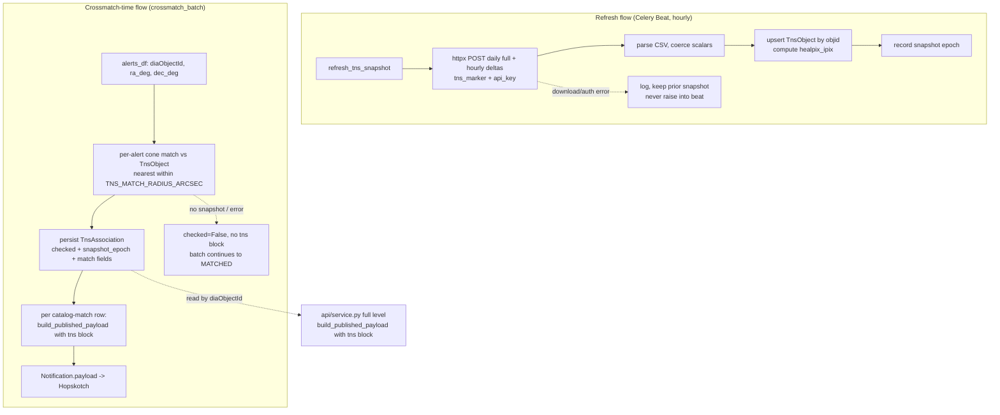

# TNS Cross-Link for Matches - Plan

## Goal Capsule

- **Objective:** Enrich every published match with a TNS cross-link. When a Rubin alert's transient position coincides with a known TNS object, add the TNS name, object-page link, and key metadata to the match payload.
- **Product authority:** This plan owns the TNS enrichment of the match payload only. A browsable web/UI surface, a live TNS API integration, and any TNS submission path are explicitly not active scope.
- **Open blockers:** A registered TNS bot account plus API key must be provisioned (as a managed secret, alongside existing credentials) before implementation can download the TNS object list. Design/planning can proceed without it; implementation cannot.

---

## Product Contract

### Summary

Add a best-effort `tns` block to the published match payload. A locally-held snapshot of TNS's public object list is refreshed on a tighter-than-daily timer and positionally associated against each alert at ~1 arcsec; on a hit, the match payload gains the TNS name, object-page link, classification, redshift, angular separation, and TNS objid, flowing through the shared payload builder so it reaches both the Hopskotch stream and the API `full` detail level.

### Problem Frame

The service is positional-only: it crossmatches Rubin alerts against static source catalogs and publishes the matches, but it carries no light curves, no forced photometry, and no link to the wider transient ecosystem. A consumer who receives a match and wants to know "is this transient already a named, classified supernova?" has to leave the stream and go ask TNS themselves, by position, one object at a time.

TNS (the Transient Name Service) is the IAU-sanctioned registry of named transients, keyed on sky position. The cheapest high-value connection between this service and that ecosystem is a link-out: for an alert whose position lands on a known TNS object, carry that object's name and page link in the match. The framing (from `docs/ideation/2026-07-08-scientist-facing-data-products-ideation.md:109-116`, idea #7) is deliberately "link out, don't rebuild" — surface what TNS already knows, do not reproduce it.

### Key Decisions

- KD1. **Enrich the payload, not a web surface** (session-settled: user-directed — chosen over a browsable per-match web page: the link is for machine consumers of the stream/API, and no per-match web view exists today). Governs R5, R6, R7.
- KD2. **Local, fresher-than-daily snapshot over the live TNS API** (session-settled: user-directed — chosen over a daily snapshot and over a live per-alert API cone search: accepts up to ~refresh-interval staleness to stay off TNS's per-request rate limits and scale to 100k-alert batches). A credential-free positional TNS cone-search URL (a link the consumer resolves live) was also considered and set aside: it needs no snapshot, refresh, or bot key, but cannot supply the resolved name, classification, or redshift inline. It remains a candidate degraded fallback for the R8 snapshot-unavailable path, so a failed enrichment can still ship a usable positional TNS link. Governs R1, R2.
- KD3. **Tight ~1 arcsec association radius on a dedicated knob** (session-settled: user-directed — chosen over ~2 arcsec and over reusing `CROSSMATCH_RADIUS_ARCSEC`: minimize false associations, since the catalog radius is tuned for catalog sources, not transient identity). Governs R3.
- KD4. **Carry name + link + classification + redshift + separation + objid** (session-settled: user-directed — chose all three optional add-ons over the name-plus-link baseline: the extra fields come free in the same snapshot rows and are high science value). Governs R5.
- KD5. **Best-effort, absence-as-signal** (session-settled: user-approved — agent proposed that enrichment never blocks a publish and that "no counterpart" is expressed by omitting the block; user affirmed). Governs R7, R8.

### Requirements

**Snapshot and refresh**

- R1. The service maintains a locally-held snapshot of TNS's public object list — at minimum RA, Dec, name, classification, redshift, and TNS objid per object — refreshed on a timer more frequent than daily (hourly as the starting cadence, configurable).
- R2. The snapshot is populated from TNS's authenticated bulk exports: seeded from the daily full object-list file and kept current between seeds by merging TNS's hourly delta files. (TNS regenerates the full file only daily, so re-downloading it each hour would add no freshness — sub-daily freshness comes from the deltas.) The service makes no TNS request per alert.

**Association**

- R3. Each alert is positionally associated against the snapshot on the alert's transient position (`ra_deg`/`dec_deg`) at an association radius governed by a dedicated config knob (e.g. `TNS_MATCH_RADIUS_ARCSEC`, ~1 arcsec), independent of `CROSSMATCH_RADIUS_ARCSEC`.
- R4. When more than one TNS object falls within the radius, the nearest is chosen.

**Payload contract**

- R5. When an alert associates with a TNS object, the published match payload carries a `tns` block with: name, object-page link, classification, redshift, angular separation (arcsec), and TNS objid. Name, link, separation, and objid are always present in the block; classification and redshift are populated when the snapshot has them and may otherwise be absent or null.
- R6. The `tns` block is added through the single shared payload builder (`crossmatch/matching/payload.py` `build_published_payload`) so it appears identically in the Hopskotch stream and the read-model API `full` detail level.
- R7. When an alert has no TNS association, no `tns` key appears in the payload — it is omitted, not emitted as null. Presence of the `tns` block always means "has a TNS counterpart." Because a best-effort enrichment failure (R8) also omits the block, the payload additionally carries a lightweight enrichment indicator — whether the alert was checked against a snapshot, and that snapshot's age — so consumers can distinguish a genuine non-match from an unchecked or failed enrichment. Absence of the block means "no counterpart" only when the indicator shows the alert was checked against a current snapshot.

**Resilience and timing**

- R8. TNS enrichment is best-effort: a missing, stale, unavailable, or partially-loaded snapshot, or any enrichment error, causes the match to publish without the `tns` block, exactly as a no-association match does. Enrichment never blocks or fails a match publish.
- R9. Enrichment is applied at match-build time, through the shared payload builder (R6); a match's `tns` block reflects the snapshot as of build. Publishing is pass-through, so the build-to-dispatch interval (on the order of seconds) does not change the block.

### Acceptance Examples

- AE1. **Covers R5, R6.** Given an alert whose position lands within ~1 arcsec of TNS object `SN 2024xyz`; When the match publishes; Then both the Hopskotch message and the API `full` payload carry a `tns` block with that name, its object-page link, classification, redshift, separation in arcsec, and objid.
- AE2. **Covers R7.** Given an alert with no TNS object within the radius; When the match publishes; Then the payload contains no `tns` key at all.
- AE3. **Covers R4.** Given two TNS objects within the radius of one alert; When associated; Then the nearer object's values populate the `tns` block.
- AE4. **Covers R8.** Given the TNS snapshot is unavailable or stale when a batch publishes; When the matches publish; Then they publish normally with no `tns` block and no failure or retry storm.
- AE5. **Covers R5.** Given a matched TNS object that has a name but no classification or redshift in the snapshot; When the match publishes; Then the `tns` block carries name, link, separation, and objid, with classification and redshift absent or null.

### Scope Boundaries

- No browsable web or per-match UI surface — payload and read-model API only.
- No live/real-time TNS API cone search per match.
- No backfill or re-publishing of matches published before their TNS entry existed — enrichment is forward-only and one-shot (a transient named after its match ships never gains a name; the tighter refresh shrinks that window but cannot close it).
- No TNS auto-submission or discovery-claiming (a separate, deliberately rejected idea — see `docs/ideation/2026-07-08-scientist-facing-data-products-ideation.md:139`).

### Dependencies / Assumptions

- Downloading the TNS public object list requires a registered TNS bot account and API key (used once per refresh via the `tns_marker` User-Agent header + `api_key` form field, not per match), provisioned as a per-cluster sealed secret. This is the Goal Capsule's open blocker: planning and code proceed, but a working refresh needs the credential.
- The TNS bulk export is confirmed (see Sources): the full file `tns_public_objects.csv.zip` at `https://www.wis-tns.org/system/files/tns_public_objects/` regenerates daily; hourly deltas are `tns_public_objects_HH.csv.zip`. Columns include `objid, name_prefix, name, ra, declination, redshift, typeid, type` — every field R1/R5 needs. The object-page URL is `https://www.wis-tns.org/object/<name>` (bare designation, no `AT`/`SN` prefix — keyed on `name`, not objid).
- TNS is ~160k objects — small enough for an in-process spatial association (KTD1), not the HATS/Dask path.
- **Open item (not a planning blocker):** TNS publishes no explicit terms for redistributing/republishing derived fields (name, classification) to a public stream. Confirm with TNS admins before PROD publish, and include a TNS acknowledgement/attribution. Do not assume unrestricted redistribution.
- The realized value depends on the fraction of published matches whose position already has a *named* TNS object at build time. TNS naming lags discovery by days to weeks and Rubin will far outpace TNS naming, so the publish-time hit-rate is expected to be low and well below the eventual association rate. A periodic reconciliation that re-publishes late-named matches is explicitly out of scope (forward-only, per Scope Boundaries); the forgone fraction is accepted for v1.

### Outstanding Questions

The association mechanism, refresh cadence/placement, TNS endpoints/auth, and snapshot storage — all previously deferred — are now resolved in the Planning Contract (KTD1-KTD6). The `tns` block is a nested object under a `tns` key (KTD6). Remaining items are execution-time tuning:

**Deferred to Implementation**

- Delta gap-repair: whether to also consume TNS daily-delta files (`tns_public_objects_YYYYMMDD.csv.zip`, retained ~14 days) to backfill hours the hourly-delta merge missed after downtime, or accept that a full-file re-seed on the next daily cycle self-heals gaps.
- Snapshot access within a batch: load the ~160k-row `TnsObject` table into an in-process spatial index once per batch vs. a per-alert SQL cone-prefilter on the `healpix_ipix` index — tune against measured batch timing.
- TNS API rate-limit handling in the client: exact backoff on `X-Rate-Limit-*` response headers (numeric quotas are undocumented; start conservative).

---

## Planning Contract

**Product Contract preservation:** unchanged — R1-R9 and KD1-KD5 preserved verbatim. R6's "appears identically in the Hopskotch stream and the read-model API `full` detail level" is honored by persisting the association (KTD2); that is an implementation decision, not a scope change.

### Key Technical Decisions

- KTD1. **In-process healpix association, not the Dask path** (session-settled: user-approved — chosen over reusing the LSDB/HATS + Dask crossmatch path). At ~160k rows the association is a millisecond in-process cone match; it reuses the existing `crossmatch/core/healpix.py` toolkit (`cone_ipix_ranges`, `angular_separation_arcsec`) and needs no new dependency. Routing TNS through Dask would pull it under the fail-fast version-skew guard (`crossmatch/core/dask.py`) and the four-site pin discipline for no benefit. Governs R3, R4.
- KTD2. **Persist the per-alert TNS association in a dedicated table, separate from the payload JSON** (session-settled: user-approved — chosen over payload-only). The read-model API rebuilds the `full` payload from stored columns in `crossmatch/api/service.py`, not from the live task, so payload-only would leave the API `full` level blank. A dedicated table also survives the retention sweep, which nulls `Alert.payload`. Governs R6.
- KTD3. **Snapshot held as a Postgres table with an order-16 healpix column** (`TnsObject`), refreshed by seed-daily-full + merge-hourly-deltas, upserted by `objid`. Mirrors the Postgres-centric design and the read-model's `healpix_ipix` cone-search precedent (`crossmatch/core/models.py`). Governs R1, R2.
- KTD4. **Reuse the already-available `httpx` for the download; hand-rolled client, fail-soft** — `httpx` is already a direct dependency in `crossmatch/requirements.base.txt` (unpinned there; resolved to `0.28.1` in `crossmatch/requirements.lock`), so no new dependency and the four-site dependency-pin discipline does not apply. The client wraps only the HTTP call in a narrow transient-retry (never a catch-all that would swallow Celery control-flow exceptions), and never logs the `api_key` or `tns_marker`. Governs R2, R8.
- KTD5. **TNS bot credentials as a per-cluster sealed secret, celery-worker/beat only** — a new `tns.env` Helm include (mirroring `antares.env`/`hopskotch.env` in `kubernetes/charts/crossmatch-service/templates/_helpers.yaml`) injected into the celery-worker/beat containers, never the credential-free web pod. The sealed secret itself is created per-cluster in the gitops repo (maintainer). Governs the Goal Capsule blocker.
- KTD6. **Persist an enrichment status per alert (checked flag + snapshot epoch); the `tns` block is a nested object** — the persisted `TnsAssociation` carries whether the alert was checked and the snapshot's timestamp, which powers R7's indicator distinguishing "no counterpart" from "not checked / outage." The payload key is a single nested `tns` object (present-or-absent as a unit) plus top-level indicator fields. Governs R7.

### High-Level Technical Design

Two flows: a periodic refresh that maintains the snapshot table, and the crossmatch-time association that reads it, persists a result, and enriches the payload. The read-model API reconstructs the `full` payload from the persisted association.

*Directional guidance, not implementation specification — the prose and units are authoritative.*

### Assumptions

- The `TnsObject` upsert can key on `objid` as a stable unique identifier across daily full and hourly delta files (delta rows are new-or-updated objects, upserted by `objid`).
- Loading the full snapshot once per batch (or a healpix-prefiltered subset) is cheap relative to the measured 3-4 min 100k-alert batch runtime; confirmed cheap by row-count, tuned in implementation (Deferred to Implementation).

---

## Implementation Units

### U1. TNS data models and migration

- **Goal:** Add the snapshot table and the per-alert association/status table.
- **Requirements:** R1, R6 (persistence), R7; KTD2, KTD3, KTD6.
- **Dependencies:** none.
- **Files:** `crossmatch/core/models.py`; a new migration under `crossmatch/core/migrations/`; `crossmatch/tests/test_models.py` (or a new `test_tns_models.py`).
- **Approach:**
  1. `TnsObject`: `objid` (BigInteger, unique), `name`, `name_prefix`, `ra_deg`, `dec_deg`, `type` (nullable), `redshift` (nullable float), `healpix_ipix` (order-16 NESTED, indexed like `Alert.healpix_ipix`), `updated_at`.
  2. `TnsAssociation`: keyed to the alert by `lsst_diaObject_diaObjectId` (unique), `checked` (bool), `snapshot_epoch` (datetime, the snapshot timestamp used), and nullable match fields (`objid`, `name`, `name_prefix`, `type`, `redshift`, `separation_arcsec`). Lives outside `Alert.payload` so the retention sweep does not null it.
  3. A single-row snapshot-metadata record holding the last successful refresh epoch, read by the association step to decide snapshot currency (U7). It is authoritative for "snapshot as of" — do not derive currency from `max(TnsObject.updated_at)`, which reflects only the last delta's subset of objects, not a whole-snapshot timestamp.
- **Patterns to follow:** `Alert.healpix_ipix` order-16 index; the migration-renumber-on-rebase gotcha (`makemigrations --check`).
- **Test scenarios:**
  - `TnsObject` uniqueness on `objid`; healpix column persists and indexes.
  - `TnsAssociation` unique per `diaObjectId`; nullable match fields allow a checked-but-no-match row.
- **Verification:** migration applies cleanly on the compose Postgres; `makemigrations --check` reports no missing migrations.

### U2. Config knobs and credential plumbing

- **Goal:** Add the TNS settings and wire the bot credentials into the worker/beat env (not the web pod).
- **Requirements:** R3; KTD5.
- **Dependencies:** none.
- **Files:** `crossmatch/project/settings.py`; `kubernetes/charts/crossmatch-service/templates/_helpers.yaml` and `statefulset.yaml`; `docker/docker-compose.yaml`.
- **Approach:**
  1. Settings: `TNS_MATCH_RADIUS_ARCSEC = float(os.getenv('TNS_MATCH_RADIUS_ARCSEC', '1.0'))`; `TNS_SNAPSHOT_REFRESH_INTERVAL_SECONDS = int(os.getenv(..., '3600'))`; `TNS_SNAPSHOT_MAX_AGE_SECONDS = int(os.getenv(..., '7200'))` (the staleness bound — a snapshot older than this counts as stale/not-current; default ~2x the refresh interval); `TNS_BOT_ID`, `TNS_BOT_NAME`, `TNS_BOT_API_KEY` from env (default empty). Validate `TNS_MATCH_RADIUS_ARCSEC > 0` with `ImproperlyConfigured` (mirror the existing bounds checks).
  2. A new `tns.env` Helm define mirroring `antares.env`/`hopskotch.env`, included in the celery-worker (and celery-beat) container only — never `web.env`.
  3. Mirror the env vars on the `celery-worker`/`celery-beat` service blocks in docker-compose.
- **Patterns to follow:** `CROSSMATCH_RADIUS_ARCSEC` (settings.py) and the `antares.env` secret include.
- **Test scenarios:** `Test expectation: none -- config and deploy wiring; exercised via the smoke path in the Verification Contract.` Optionally a settings-import test asserting the radius default and the `ImproperlyConfigured` on a non-positive radius.
- **Verification:** the compose stack starts with the new env present; the sealed secret is a per-cluster gitops step (maintainer, out of this repo).

### U3. TNS bulk-export client

- **Goal:** A dependency-light client that downloads and parses the TNS full file and hourly deltas.
- **Requirements:** R2, R8; KTD4.
- **Dependencies:** U2.
- **Files:** new `crossmatch/core/tns.py`; `crossmatch/tests/test_tns_client.py`.
- **Approach:**
  1. `httpx` POST to the full/delta URLs with header `user-agent: tns_marker{"tns_id":<id>,"type":"bot","name":"<name>"}` and `api_key` as form data; explicit timeout.
  2. Unzip and parse the CSV into records with the researched columns; coerce scalars (route numeric fields as the payload boundary does).
  3. Narrow transient-retry around only the HTTP call; do not catch-all (leave `SoftTimeLimitExceeded`, auth 4xx, and control-flow exceptions to propagate/typed-fail). Never log `api_key` or the `tns_marker` header.
- **Patterns to follow:** the transient-retry posture in `crossmatch/matching/catalog.py` `_read_with_retry` (scoped narrowly); the numpy/pandas coercion boundary.
- **Test scenarios:**
  - Auth header and form field are constructed in the required `tns_marker` shape.
  - A fixture CSV parses into records with the expected fields; malformed rows are skipped, not fatal.
  - A transient network error retries; a 4xx (bad key) does not retry and surfaces a typed error.
  - The `api_key`/`tns_marker` never appear in logged output on error.
- **Verification:** unit tests pass against a fixture CSV; no secret in captured logs.

### U4. Snapshot refresh Celery Beat task

- **Goal:** A periodic task that refreshes `TnsObject` from the client, fail-soft.
- **Requirements:** R1, R2, R8; KTD3.
- **Dependencies:** U1, U2, U3.
- **Files:** new `crossmatch/tasks/tns.py`; `crossmatch/tasks/schedule.py`; `crossmatch/project/settings.py` (`CELERY_IMPORTS`); `crossmatch/tests/test_refresh_tns_snapshot.py`.
- **Approach:**
  1. `@shared_task def refresh_tns_snapshot()`: seed from the daily full file when the snapshot is empty or stale, else merge the current hour's delta; upsert `TnsObject` by `objid`; compute `healpix_ipix`; record the snapshot epoch. Wrap the upsert-plus-epoch write in a transaction so a mid-refresh failure never leaves a partially-loaded snapshot stamped with a fresh epoch (the association step keys currency off that epoch).
  2. Register a `RefreshTnsSnapshot` class in `periodic_tasks` (mirror `RetentionSweep`, `task_frequency_seconds = settings.TNS_SNAPSHOT_REFRESH_INTERVAL_SECONDS`); add `tasks.tns` to `CELERY_IMPORTS`.
  3. Fail-soft: a download/auth/parse failure logs and returns, leaving the prior snapshot intact — it never raises into beat and never touches the crossmatch batch.
- **Execution note:** the download path is best verified by a runtime/smoke check (live TNS or a served fixture), not unit coverage alone.
- **Patterns to follow:** `RetentionSweep` registration and `initialize_periodic_tasks`; the "no-overlap is normal / fail-soft" resilience convention.
- **Test scenarios:**
  - Task registers with the configured interval (mirror `test_dispatch_crossmatch_batch`).
  - A fixture full-file seed upserts N rows with `healpix_ipix`; a subsequent delta upserts-by-`objid` (update existing, insert new).
  - A client failure leaves the prior `TnsObject` rows untouched and does not raise.
- **Verification:** tests pass; in the compose smoke, the task populates `TnsObject` and records an epoch.

### U5. Payload builder — `tns` block and enrichment indicator

- **Goal:** Teach the shared builder to emit the `tns` block and the indicator, JSON-safely.
- **Requirements:** R5, R6, R7; KTD6.
- **Dependencies:** none (can land before U7).
- **Files:** `crossmatch/matching/payload.py`; `scripts/check_payload.py`; `crossmatch/tests/test_payload.py`.
- **Approach:**
  1. `build_published_payload(...)` gains a `tns=None` argument and enrichment-indicator arguments (checked flag, snapshot epoch); emit a nested `'tns'` object only when a match is present, and always emit the indicator fields. Emit the snapshot epoch as an ISO-8601 string (`epoch.isoformat()`), not a raw datetime — `_to_json_scalar` has no datetime branch and `scripts/check_payload.py` uses plain `json.dumps` (no `DjangoJSONEncoder`), so a raw datetime would fail the very check U5 relies on.
  2. Route `redshift` and `separation_arcsec` through `_to_json_scalar`; coerce `objid` via `int(...)` (never through float, per the diaObjectId convention). Build the object-page link by URL-encoding the bare `name` into the fixed `wis-tns.org/object/<name>` template.
- **Patterns to follow:** the `catalogs_skipped`/`partial` keyword-plus-default shape; `_to_json_scalar`.
- **Test scenarios:**
  - `tns` block present with all fields for a full match; absent when no match; indicator fields always present.
  - NaN redshift serializes to JSON `null`; `int64` objid stays an int; the whole payload is `json.dumps`-able.
  - Classification/redshift absent → block still carries name/link/separation/objid.
- **Verification:** `python scripts/check_payload.py` passes with a TNS case; `test_payload.py` green.

### U6. In-process association matcher

- **Goal:** Given an alert position and the snapshot, return the nearest TNS object within the radius.
- **Requirements:** R3, R4; KTD1.
- **Dependencies:** U1, U2.
- **Files:** new `crossmatch/matching/tns_match.py`; `crossmatch/tests/test_tns_match.py`.
- **Approach:** cone-search `TnsObject` for an alert's `ra_deg`/`dec_deg` using `crossmatch/core/healpix.py` (`cone_ipix_ranges` to prefilter candidates, `angular_separation_arcsec` for the exact filter at `TNS_MATCH_RADIUS_ARCSEC`); return the nearest match and its separation, or none.
- **Patterns to follow:** `crossmatch/core/healpix.py` and `test_healpix.py`; the read-model cone-search.
- **Test scenarios:**
  - A single object within the radius matches with the correct separation.
  - Two objects within the radius → the nearer is returned (Covers AE3).
  - An object just outside the radius → no match (Covers AE2 boundary).
  - Invalid/degenerate coordinates handled without raising.
- **Verification:** `test_tns_match.py` green.

### U7. Wire association into the crossmatch task and persist

- **Goal:** Compute the per-alert association once, persist it, and fan the `tns` block across the alert's match notifications — fail-soft.
- **Requirements:** R3, R4, R5, R7, R8, R9; KTD1, KTD2, KTD6.
- **Dependencies:** U1, U5, U6.
- **Files:** `crossmatch/tasks/crossmatch.py`; `crossmatch/tests/test_crossmatch_tns.py` (new).
- **Approach:**
  1. After `alerts_df`/`clean_df` is materialized and before the catalog loop, read the snapshot epoch from the metadata record and decide currency: the snapshot is *current* when `now - snapshot_epoch <= TNS_SNAPSHOT_MAX_AGE_SECONDS`, else *stale*. When current, load the snapshot (or a healpix-prefiltered subset) and compute a per-alert association keyed by `lsst_diaObject_diaObjectId` (U6), recording `checked=True`, the snapshot epoch, and the match fields. When stale or absent, record `checked=False` with no match — no `tns` block for any alert this batch (R8).
  2. Persist `TnsAssociation` rows (bulk upsert by `diaObjectId`, mirroring the existing `bulk_create` idiom). This table keeps one row per alert and is *not* nulled by the retention sweep, so it grows with alert volume — give it a retention/TTL or an `Alert` foreign-key `on_delete` cascade aligned with the existing sweep so it does not accumulate unbounded (an operator sizing item).
  3. In the per-row build loop, look up the row's alert association and pass the `tns` block + indicator into `build_published_payload` — the same association fans across every catalog-match notification for that alert.
  4. Fail-soft: no snapshot → `checked=False`, no `tns` block, batch continues; per-row `try/except` so a lookup error never aborts the row; never re-raise into the batch (which transitions to MATCHED unconditionally). Preserve the `SoftTimeLimitExceeded` re-raise.
- **Execution note:** mirror the catalog-skip resilience tests — prove a TNS outage cannot fail the batch.
- **Patterns to follow:** per-row defensive build and `catalogs_skipped` post-stamp in `crossmatch/tasks/crossmatch.py`; `test_crossmatch_catalog_skip.py`, `test_crossmatch_fail_loud.py`.
- **Test scenarios:**
  - An alert within the radius → every notification for that alert (across multiple catalog matches) carries the same `tns` block (Covers AE1).
  - An alert with no TNS object within the radius → notifications carry no `tns` block, indicator shows checked (Covers AE2).
  - Snapshot missing/empty at batch time → all notifications omit the `tns` block, `checked=False`, and the batch still completes to MATCHED with no failure (Covers AE4).
  - A raised error inside the lookup for one alert does not discard other alerts' matches.
- **Verification:** `test_crossmatch_tns.py` green; catalog-skip/fail-loud tests still pass.

### U8. Read-model API `full` level carries TNS

- **Goal:** Reconstruct the `tns` block on the API `full` detail level from the persisted association.
- **Requirements:** R6; KTD2.
- **Dependencies:** U1, U5, U7.
- **Files:** `crossmatch/api/service.py`; `crossmatch/tests/test_recent_crossmatch_service.py`.
- **Approach:** in the `full`-level reconstruction, load the `TnsAssociation` for each alert (by `diaObjectId`) and pass its `tns` block + indicator into `build_published_payload`, so the API `full` payload matches what Hopskotch published.
- **Patterns to follow:** the existing `full`-level `build_published_payload` call in `crossmatch/api/service.py`.
- **Test scenarios:**
  - `full` level includes the `tns` block for a matched alert, matching the published shape (Covers AE1, API side).
  - `full` level omits the `tns` block but carries the indicator for an unmatched-but-checked alert.
- **Verification:** `test_recent_crossmatch_service.py` green.

---

## Verification Contract

| Gate | Command / surface | Covers |
|---|---|---|
| Unit + integration suite | `python -m pytest` (in-container, per `docs/developer.md`) | U1, U3-U8 |
| Payload coercion (no app) | `python scripts/check_payload.py` | U5 |
| Migration integrity | `python manage.py makemigrations --check` | U1 |
| Config/env wiring | compose stack starts with the TNS env present on celery-worker/beat | U2 |
| Refresh smoke | compose stack: `refresh_tns_snapshot` populates `TnsObject` + epoch (served fixture or live TNS) | U4 |
| End-to-end enrichment | a synthetic alert on a known TNS position yields a `tns` block on the Hopskotch payload and the API `full` level | R5, R6, U7, U8 |
| Fail-soft | with `TnsObject` empty/stale, a batch publishes with no `tns` block and completes to MATCHED | R8, AE4, U7 |

## Definition of Done

- R1-R9 satisfied; AE1-AE5 demonstrated by tests or the smoke path.
- A matched alert carries the `tns` block (name, link, classification, redshift, separation, objid) on **both** the Hopskotch payload and the API `full` level; an unmatched-but-checked alert carries the enrichment indicator and no block.
- A missing/stale/failed snapshot never blocks or fails a crossmatch batch; a TNS download failure never raises into beat.
- The snapshot refreshes on the configured Beat interval via seed-daily-full + merge-hourly-deltas, upserting by `objid`.
- TNS credentials are read from env on celery-worker/beat only and never logged; the per-cluster sealed secret is created in gitops (maintainer).
- `pytest`, `scripts/check_payload.py`, and `makemigrations --check` are green; no new dependency added (uses the pinned `httpx`).

---

## Sources / Research

- `crossmatch/matching/payload.py:71-122` — `build_published_payload`, the single shared payload builder; docstring notes it is called by both the Hopskotch publish path and the API `full` detail level so the two cannot drift. Where the `tns` block is added.
- `crossmatch/tasks/crossmatch.py:154-198` — per-row match-build loop; `:181-187` builds the payload; `:228-231` is a post-loop payload-mutation precedent (sets `catalogs_skipped`/`partial` across all notifications after the build loop).
- `crossmatch/notifier/impl_hopskotch.py:14-69` — publishing is pure pass-through of the stored payload; the only enrichment seam is at build time.
- `crossmatch/core/models.py:8-64` — `Alert` carries `ra_deg`, `dec_deg`, and `lsst_diaObject_diaObjectId`, the identifiers association keys on.
- `crossmatch/tasks/schedule.py` — existing Celery Beat periodic-task pattern (`dispatch_crossmatch_batch`, `dispatch_notifications`, `retention_sweep`) a refresh task would follow.
- `docs/ideation/2026-07-08-scientist-facing-data-products-ideation.md:109-116` — idea #7 "Link out, don't rebuild — a resolver to broker light curves and TNS" (Complexity Low, Unexplored); `:110` notes the service is positional-only; `:139` records the rejected TNS auto-submission idea.
- `crossmatch/core/healpix.py` — existing in-process spatial toolkit (`cone_ipix_ranges`, `angular_separation_arcsec`, order-16 NESTED indexing); the association reuses it (KTD1). `crossmatch/core/models.py` `Alert.healpix_ipix` is the cone-search index precedent (KTD3).
- `crossmatch/api/service.py` (`full`-level reconstruction) — rebuilds the published payload from stored `CatalogMatch` columns, not the live task; the reason R6 needs a persisted association (KTD2, U8).
- `crossmatch/requirements.base.txt` — `httpx` is already a direct dependency (unpinned there; pinned to `0.28.1` in `crossmatch/requirements.lock`), so the TNS client adds no new dependency (KTD4). `kubernetes/charts/crossmatch-service/templates/_helpers.yaml` `antares.env`/`hopskotch.env` — the secret-include pattern `tns.env` mirrors (KTD5).
- TNS bulk-export mechanics — full file `tns_public_objects.csv.zip` (daily) + hourly deltas `tns_public_objects_HH.csv.zip` at `https://www.wis-tns.org/system/files/tns_public_objects/`; `tns_marker` User-Agent + `api_key` POST auth; columns `objid,name_prefix,name,ra,declination,redshift,typeid,type,...`; object URL `https://www.wis-tns.org/object/<name>`. Sources: TNS Getting Started (`https://www.wis-tns.org/content/tns-getting-started`), TNS2.0 APIs manual, TNS FAQ; seed+delta pattern reference `github.com/sarhatabaot/tns-mirror`. Redistribution terms for republishing derived fields are not documented — open item (Dependencies).
- `docs/solutions/design-patterns/coerce-numpy-pandas-scalars-to-json.md`, `docs/solutions/conventions/catalog-specific-payload-columns.md`, `docs/solutions/conventions/dependency-pin-upgrade-pattern-2026-05-12.md` — the coercion boundary, the declarative payload contract, and the pin discipline the plan follows.
