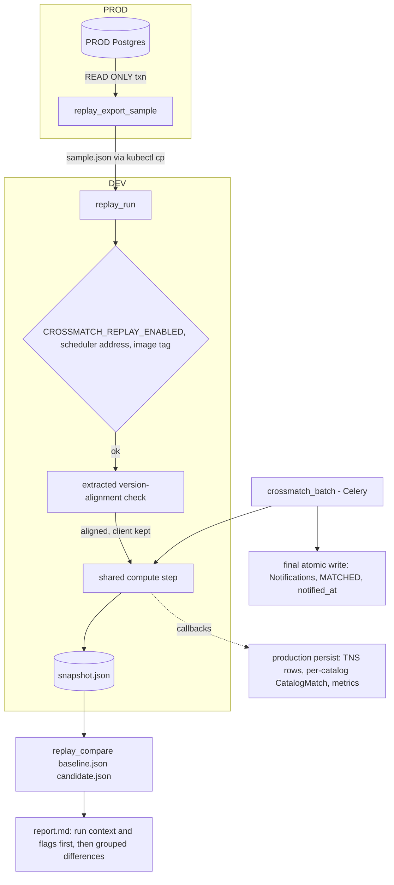

# Crossmatch Replay Tool - Plan

## Goal Capsule

- Objective: A maintainer can validate a dependency upgrade (lsdb, hats, nested-pandas, pandas) before PROD without live alerts, by replaying a fixed sample of historical alerts through the real crossmatch path and reviewing a report of every difference between the old and new stack's output.
- Product authority: This plan. Active scope is the replay tool only; the lsdb 0.11.0 upgrade that will be its first user is separate work, planned afterward, and is not active scope here.
- Means: operator-run management commands backed by a crossmatch compute step shared with production (Key Decision "Production and replay share one compute step"; KTD1-KTD4).
- Open blockers: None.
- Stop conditions: stop and report if keeping production `crossmatch_batch` behavior unchanged (R7) turns out to need test changes beyond moving patch targets, or if the version-alignment check cannot be shared without changing the production guard's behavior.
- Execution profile: code change in this repo only; the gitops follow-ups (KTD7, KTD9) are recorded, not performed.
- Who finishes: implemented, reviewed, and opened as a pull request on `origin` by the autonomous pipeline; merge and any gitops change stay with the maintainer.

---

## Product Contract

Product Contract preservation: unchanged in scope; R/A/F/AE IDs preserved. Planning resolved the five deferred Outstanding Questions (see Planning Contract), added two dependencies found in research (DEV TNS provisioning, image tag in the worker pod), and attached a planning conflict call-out to the TNS Key Decision.

### Summary

Build a reusable replay tool that runs a fixed, portable sample of historical PROD alerts through the real crossmatch path on DEV, captures the resulting matches and published payloads as a snapshot, and compares two snapshots in a report that lists and groups every difference. It becomes the standard pre-PROD validation step for dependency upgrades, starting with the lsdb 0.11.0 upgrade.

### Problem Frame

Dependency upgrades that touch the crossmatch stack have been validated by a test suite plus one clean crossmatch batch on DEV, fed by live alerts. The test suite mocks lsdb and `crossmatch_alerts`, so it never exercises the real crossmatch or the real catalog values that flow through payload coercion.

Two things make that bar insufficient now. Rubin alerts are not flowing and may not resume for up to six weeks, so there is no live batch to observe. And the next upgrade, lsdb 0.11.0, forces a move from pandas 2.3.3 to pandas 3 (hats 0.11 and nested-pandas 0.7 require `pandas>=3`; the current nested-pandas 0.6.10 caps `pandas<2.4`), which changes copy-on-write, default string dtype, and missing-value semantics. The code most exposed is the numpy/pandas-to-JSON coercion in `crossmatch/matching/payload.py`, whose output is what the public receives. A clean batch shows nothing crashed; it does not show that published values are unchanged.

The historical record needed to replay already exists. Payload retention nulls only `Alert.payload` and `Notification.payload`; each Alert's `lsst_diaObject_diaObjectId`, `ra_deg`, and `dec_deg` survive, and `CatalogMatch` rows are never touched.

### Key Decisions

- **A reusable, maintained tool rather than a one-off script.** Every future lsdb/pandas upgrade faces the same no-live-traffic validation gap. (session-settled: user-directed - chosen over a throwaway script for this upgrade only: the tool should become part of the upgrade convention.) Governs R14.
- **Pass means every difference is listed and explained, not zero differences.** The tool reports and groups; a human judges and records the explanation. (session-settled: user-directed - chosen over requiring identical output: pandas 3 may legitimately change representation.) Governs R10, R11, R12.
- **Sample from PROD history, replay only on DEV.** PROD holds the largest, most representative history; its only role is a read-only export. (session-settled: user-approved - chosen over DEV-only history and over replaying in either environment: richer input without running replays against the PROD Dask cluster.) Governs R1, R2, R8.
- **Include TNS enrichment and label snapshot drift.** The TNS association code is pandas-touching and worth covering; differences caused by a newer TNS snapshot are labeled rather than hand-explained. (session-settled: user-approved - chosen over excluding TNS and over strict TNS comparison: coverage without noise.) Governs R5, R11. Conflict call-out (planning): DEV's TNS refresh is likely disabled pending bot credentials (see Dependencies), so this decision stands but covers nothing until DEV TNS is provisioned.
- **Production and replay share one compute step.** `crossmatch_batch` is split into an in-memory compute step (alert-frame construction, lsdb crossmatch, TNS association, payload build) and a persist step; production runs both, replay runs only compute, so the replay cannot drift from what production executes. (session-settled: user-approved - chosen over running the unmodified batch inside an always-rolled-back transaction: replay safety should not depend on isolation holding.) Governs R4, R4a, R6, R7.
- **Both snapshots are freshly computed.** Stored `CatalogMatch` rows may predate 0.10.4 (produced under 0.9.0), so they are not used as a baseline. Governs R9.

<!-- ce-section: work-relationships -->
### How This Work Fits Together

This plan covers the replay tool. The broader breakdown below is the current understanding, not a committed roadmap.

- lsdb 0.11.0 upgrade (pins, pandas 3 audit, lockstep rollout) - Depends on this tool as its pre-PROD validation gate. Its baseline snapshot must be taken on DEV at lsdb 0.10.4 before the upgrade lands on DEV. Still to decide in its own brainstorm: timing relative to 0.11.x patch releases and the Rubin restart.
  - Later dependency upgrades - Enabled by this tool through the updated upgrade conventions (R14).

### Actors

- A1. Maintainer - exports the sample, runs replays, reviews the report, writes explanations in the upgrade PR.
- A2. PROD environment - source of the historical sample; read-only.
- A3. DEV environment - runs every replay against its Dask cluster and the hosted HATS catalogs.

### Key Flows

- F1. Build a sample
  - **Trigger:** A maintainer prepares for an upgrade, or the existing sample no longer meets coverage (R2).
  - **Actors:** A1, A2
  - **Steps:** Maintainer exports a coverage-selected set of alert identifiers and coordinates from PROD into a portable sample; the sample is carried to DEV.
  - **Covered by:** R1, R2, R3
- F2. Take a snapshot
  - **Trigger:** Before a stack change (baseline) and after it (candidate).
  - **Actors:** A1, A3
  - **Steps:** Maintainer runs the replay on DEV with the sample; the tool computes matches and payloads through the shared compute step and writes a snapshot with its run context; nothing is persisted to app tables or published.
  - **Covered by:** R4, R4a, R5, R6, R7, R8, R9
- F3. Compare and explain
  - **Trigger:** Baseline and candidate snapshots exist.
  - **Actors:** A1
  - **Steps:** Maintainer runs the comparison; the tool reports context differences and grouped output differences; maintainer explains each group in the upgrade PR, and the upgrade proceeds to PROD only when every group is explained.
  - **Covered by:** R10, R11, R12, R13

### Requirements

**Sample**

- R1. A sample of historical alerts (each alert's uuid, diaObjectId, and coordinates, with diaObjectId kept as an exact 64-bit integer that never passes through a float) can be exported from the PROD database by a read-only operation into a portable form that a DEV replay consumes unchanged.
- R2. The sample is selected for coverage rather than at random: it includes alerts that matched in each of the four configured catalogs (Gaia DR3, DES Y6 Gold, DELVE DR3 Gold, SkyMapper DR4), alerts with no match, alerts outside the DES Y6 Gold footprint, and matches whose catalog rows contain null values; the export reports any category it could not fill.
- R3. A sample is reusable across replays and across upgrades, so baseline and candidate snapshots replay identical input.

**Replay**

- R4. A replay runs the sample through the same compute step production uses, starting from alert rows in the shape production loads them: building the alert frame (including its type conversions and invalid-coordinate handling), the real lsdb crossmatch against the configured HATS catalogs, TNS association, and published-payload construction including catalog-value coercion.
- R4a. A replay computes on DEV's Dask cluster only after passing the same client/cluster version-alignment check the Celery worker runs at startup, and refuses to run if that check fails.
- R5. TNS association runs in the replay against DEV's current TNS snapshot.
- R6. A replay has no side effects on app state: it writes no Alert, CatalogMatch, Notification, or TnsAssociation rows, changes no alert status or `notified_at`, publishes nothing, and can run while production batches are running.
- R7. Splitting `crossmatch_batch` into compute and persist steps leaves production behavior unchanged: the same match rows, notifications, TNS associations, status transitions, and per-row fail-soft handling as today.
- R8. Replays run on DEV; PROD's only replay-related operation is the read-only sample export.

**Snapshot**

- R9. A snapshot records the per-alert, per-catalog matches and the full published payload for each match, plus the run context needed to judge comparability: the sample's identity, dependency versions (lsdb, hats, nested-pandas, pandas, numpy, dask) from both the client and the Dask workers, the deployed image tag, each catalog's outcome (read, no overlap, or skipped after a read failure), whether the TNS snapshot was current at run time, the crossmatch configuration (radius, catalogs, payload columns), the TNS snapshot epoch, and an identity for the TNS snapshot's content that changes only when the TNS data the association reads changes.

**Comparison report**

- R10. Comparing two snapshots lists every difference in their output; none are suppressed or auto-accepted.
- R11. The report groups differences by kind (a match present in only one snapshot; a matched source changed; a value changed; a value's type or null representation changed; a TNS block changed) and by catalog and field, with counts and representative examples, so one explanation can cover a group. When the two snapshots' TNS content identities differ, TNS differences are labeled as TNS snapshot drift; the per-payload TNS epoch value is compared as run context, not as an output difference.
- R12. The report shows run-context differences first and flags any that break comparability (a different sample, crossmatch radius, catalog list, or payload columns; a catalog skipped after a read failure in either snapshot; or a TNS snapshot that was not current in either snapshot).
- R13. Replaying the same sample twice on an unchanged stack with unchanged TNS snapshot content yields a report with zero output differences.

**Conventions**

- R14. `docs/solutions/conventions/dependency-pin-upgrade-pattern-2026-05-12.md` and `docs/solutions/conventions/lockstep-dask-cluster-aligned-upgrade-rollout.md` name the replay (baseline before the DEV rollout, candidate after, every difference explained in the upgrade PR) as the pre-PROD validation step for cluster-aligned dependency upgrades.

### Acceptance Examples

- AE1. **Covers R13.** Given a sample and DEV unchanged between two replays and TNS snapshot content unchanged (its epoch may have advanced), when the two snapshots are compared, then the report shows no output differences.
- AE2. **Covers R11.** Given a baseline and candidate whose TNS snapshot content differs, when a TNS block differs for some alert, then that difference appears in the report labeled as TNS snapshot drift, alongside any other differences for the same alert. When only the epoch advanced and the content is unchanged, a TNS block difference is reported unlabeled, as an ordinary output difference.
- AE3. **Covers R12.** Given two snapshots taken with different crossmatch radii, when they are compared, then the report flags the radius difference as breaking comparability before listing output differences.
- AE4. **Covers R6.** Given a replay running on DEV while a production batch is running, when the replay completes, then Alert statuses, CatalogMatch, Notification, and TnsAssociation rows are exactly as the production batch alone would leave them, and nothing reached Hopskotch from the replay.
- AE5. **Covers R4.** Given a catalog whose footprint misses every alert in part of the sample ("Catalogs do not overlap"), when the replay runs, then it continues with the remaining catalogs as production does, and the snapshot records no matches for that catalog and those alerts, not an error.

### Success Criteria

- The lsdb 0.11.0 upgrade's own brainstorm can adopt this tool as its PROD gate without defining any new validation behavior.
- A maintainer can take a baseline snapshot, change the stack, take a candidate snapshot, and read a report whose grouping lets them explain differences per group rather than per row.

### Scope Boundaries

- The lsdb 0.11.0 upgrade itself (pins, pandas 3 code audit, rollout) is separate work.
- Comparison against stored historical `CatalogMatch` rows.
- Running replays on PROD, in CI, or on a schedule; the tool is operator-run on DEV.
- Deciding whether an upgrade passes; the tool reports, the maintainer judges.
- Adopting new lsdb or pandas features.

### Dependencies / Assumptions

- DEV's Dask cluster reaches the same hosted HATS catalogs PROD uses, so a DEV replay of PROD alerts is representative.
- PROD's alert history contains enough examples to meet R2's coverage in every category.
- Copying PROD alert identifiers and coordinates to DEV raises no data-handling concern; both environments are this project's own clusters, and the data derives from the public Rubin alert stream.
- Match output from Dask is not ordered; comparison keys on alert, catalog, and catalog source identifier rather than row position.
- DEV has a current TNS snapshot. As of v0.12.0 the TNS refresh stays disabled until the TNS bot credentials are provisioned per cluster, and the gitops chart carries no TNS wiring. Until DEV TNS is provisioned, every replay records TNS as not current and every report carries the R12 flag, so the TNS half of R5 exercises nothing.
- The replay's run context gets the deployed image tag from the operator or from `APP_VERSION`; gitops injects `APP_VERSION` only into the web pod, not the celery-worker pod the replay runs in (see KTD9).

### Outstanding Questions

**Deferred to Planning**

All five questions deferred here were resolved in the Planning Contract: sample size and selection (KTD5), sample/snapshot storage and transport (KTD6), float comparison (KTD8), R8 enforcement (KTD7), and the operator interface and report format (KTD6, KTD8).

### Sources / Research

- `crossmatch/tasks/crossmatch.py` - `crossmatch_batch` and `_build_tns_associations`; the persist-side effects R6 excludes (`CatalogMatch`/`Notification` bulk creates, MATCHED transition, `notified_at` for no-match alerts, `TnsAssociation` upserts).
- `crossmatch/tasks/schedule.py` - `dispatch_notifications` publishes PENDING notifications; `crossmatch_batch` does not publish directly.
- `crossmatch/matching/payload.py` - `build_published_payload` and `_to_json_scalar` coercion, the code most exposed to pandas 3.
- `crossmatch/matching/catalog.py` - `crossmatch_alerts`, `lsdb.open_catalog`.
- `crossmatch/tasks/retention.py` - retention nulls only `Alert.payload` and `Notification.payload`.
- `crossmatch/tests/test_crossmatch_tns.py` - existing tests mock `lsdb.from_dataframe` and `crossmatch_alerts`, the gap this tool fills.
- `docs/plans/2026-08-11-001-chore-lsdb-0-10-upgrade-plan.md` - prior upgrade's validation bar (tests plus one clean DEV batch).
- `docs/solutions/conventions/dependency-pin-upgrade-pattern-2026-05-12.md`, `docs/solutions/conventions/lockstep-dask-cluster-aligned-upgrade-rollout.md` - pin-site and rollout conventions R14 updates.
- PyPI metadata (checked 2026-09-24): lsdb 0.11.0 (released 2026-09-21) requires hats `>=0.11.0,<0.12.0` and nested-pandas `>=0.7.0,<0.8.0`; hats 0.11.0 and nested-pandas 0.7.2 require `pandas>=3`; nested-pandas 0.6.10 requires `pandas>=2.2.3,<2.4`.

---

## Planning Contract

### Key Technical Decisions

- KTD1. **Compute runs in `tasks/crossmatch.py` and hands each stage's results to caller-supplied callbacks; production persists inside those callbacks.** Production writes `TnsAssociation` rows before the catalog loop and each catalog's `CatalogMatch` rows as that catalog finishes, before the at-least-one-success guard. `test_soft_limit_after_first_catalog_wrote_reverts` and `test_revert_then_rerun_is_idempotent` pin that order. A compute-all-then-persist split would change what survives a mid-batch revert. The callbacks keep R7 literally true, and the replay passes none. Keeping the compute function in the same module keeps about 17 test monkeypatches (`crossmatch_mod.crossmatch_alerts`, `crossmatch_mod.build_published_payload`) valid. Instantiates the Key Decision "Production and replay share one compute step" (session-settled: user-approved - chosen over running the unmodified batch inside an always-rolled-back transaction: replay safety should not depend on isolation holding). Governs R4, R6, R7.
- KTD2. **Compute returns plain data, not ORM instances.** Each match record carries diaObjectId, catalog name, source id, separation, source ra/dec, catalog payload, and the published payload. Compute also returns the catalog outcomes (matched, empty, no overlap, skipped), the TNS state (current, epoch), and the TNS association specs. Production's persist callbacks build `CatalogMatch`, `Notification`, and `TnsAssociation` from them. Compute records "no overlap" as its own outcome (R9), and production still counts it as a success. The `catalogs_skipped`/`partial` stamping stays in compute, so snapshots match what production publishes. Production-only metrics (`CATALOG_SKIPS`, `CROSSMATCH_MATCHES`, `CROSSMATCH_BATCHES`) move into the production callbacks and wrapper, so a replay run inside the celery-worker pod does not inflate them through `PROMETHEUS_MULTIPROC_DIR`. Governs R6, R7, R9.
- KTD3. **Compute takes alert rows shaped like production's `values_list` tuples (uuid, diaObjectId, ra, dec).** It owns the frame build, the uuid-to-string conversion, and the invalid-coordinate drop, so production and replay share the pandas-sensitive frame construction (R4). The all-coordinates-invalid early exit returns an empty result; production's wrapper then runs its existing MATCHED/`notified_at` update. Every broad `except Exception` in the new call tree keeps its preceding `except SoftTimeLimitExceeded: raise` (`docs/solutions/integration-issues/soft-time-limit-swallowed-by-exception-classifier.md`). Governs R4, R7.
- KTD4. **The version-alignment check is extracted into a function that returns drift records; the worker keeps its fail-fast.** `verify_dask_versions` ends in `_fail_fast` (SIGTERM to the parent process), which would hit the operator's shell under `kubectl exec`. An extracted check (connect, wait for workers, `_check_versions` plus `_check_off_boundary_versions`) returns the client and the drift list. The worker path calls it and fail-fasts on drift exactly as today. The replay raises a command error on drift and keeps the client open for compute. The replay refuses to run when `DASK_SCHEDULER_ADDRESS` is unset (R4a). Recording nested-pandas versions for R9 uses a separate run-context probe in `core/dask.py`, registered for by-value pickling like the existing probe; the production guard's package set does not change. Governs R4a, R9.
- KTD5. **The sample export selects per category with a deterministic pseudo-random order under a per-category cap.** Categories: matched in each of the four catalogs, terminal alerts with no match, alerts outside the DES footprint (approximated as `dec_deg > 10`, since DES Y6 ends near +5), and matches whose stored `catalog_payload` has a null value. Default cap is 250 alerts per category, deduplicated, so a sample stays under about 2,000 alerts, far below the 100k batch whose measured runtime is 3 to 4.3 minutes. Ordering hashes diaObjectId with a recorded seed, so re-exporting with the same seed and data reproduces the sample. The export runs inside a Postgres `READ ONLY` transaction so the database enforces R1's read-only promise, and it reports any category it could not fill (R2). Governs R1, R2, R3.
- KTD6. **Three management commands with file arguments, and versioned JSON files.** `replay_export_sample` (PROD), `replay_run` (DEV), and `replay_compare` (anywhere) live in `crossmatch/project/management/commands/`. They are thin wrappers over a new `crossmatch/replay/` package. The sample and snapshot are JSON files with a `format_version`, written to a path argument and moved with `kubectl cp`. Stdout is not clean: structlog prints to stdout, so nothing is piped. diaObjectId is stored as a JSON integer and parsed back with an explicit `int(...)`; the loader rejects floats. The comparison logic has no Django dependency, so it is unit-testable as plain functions. These are the first commands in the repo to take arguments; they use standard Django argparse. Governs R1, R3, R9, R10.
- KTD7. **R8 is enforced by an opt-in setting, not an environment name.** No environment identifier reaches the app. `replay_run` refuses unless `CROSSMATCH_REPLAY_ENABLED` is truthy (default off). The dev compose stack sets it for the celery-worker service. DEV operators pass it on the `kubectl exec` line until a gitops follow-up sets it in the DEV overlay only. The runbook forbids replay on PROD. This prevents an accidental run; with R6 guaranteed by KTD1, the remaining PROD risk is load on the PROD Dask cluster, which is what R8 exists to avoid. Governs R8.
- KTD8. **Exact comparison, with numeric differences grouped and sized.** Values compare exactly and type-aware: `1` versus `1.0`, `null` versus a missing key, and string versus number each land in the "type or null representation changed" group. Numeric value changes group by catalog and field, showing counts, the largest absolute and relative differences, and examples, so a whole group of float noise gets one explanation (R11). The report is a Markdown file ready to paste into the upgrade PR, with run-context differences and comparability flags first (R12), then grouped output differences. The per-payload `tns_snapshot_epoch` is excluded from output comparison and compared as run context (R11). Governs R10, R11, R12, R13.
- KTD9. **The image tag comes from `APP_VERSION` or `--image-tag`; the replay refuses to guess.** Gitops injects `APP_VERSION` only into the web pod, so the celery-worker pod reads the `0.0.0` default. `replay_run` records `--image-tag` when given, otherwise `APP_VERSION`, and refuses when the result is the `0.0.0` default. Wiring `APP_VERSION` into the celery-worker env is a gitops follow-up. Governs R9.
- KTD10. **TNS content identity is computed per alert, over the TNS objects in that alert's match cone.** A whole-table hash changes almost every hour as TNS registers objects, which would label every TNS difference as drift. The replay fingerprints the published-relevant fields (objid, name, type, redshift, ra, dec) of each alert's cone candidates (`matching/tns_match.py`), using the same radius the association uses. The comparison labels an alert's TNS difference as drift only when that alert's fingerprint differs between snapshots. The snapshot also records the aggregate of those fingerprints as its TNS content identity (R9). Governs R9, R11, R13.
- KTD11. **Catalog identity is best-effort run context.** For each catalog the snapshot records its `hats_url` and whatever catalog-level properties LSDB exposes cheaply (for example total rows or creation date). A difference is flagged in the report's run-context section. This addresses the residual concern that a hosted catalog republished at the same URL would look like a stack change. It is not a full content hash. Governs R9, R12.

### High-Level Technical Design

Directional guidance, not implementation specification.



Shape of the shared compute step (directional):

```text
compute(alert_rows, now, on_tns=None, on_catalog=None) -> result
  frame  = build frame from rows; uuid -> str; drop invalid coords
  if frame empty: return result(empty=True)
  tns    = tns_enrichment(frame, now)        ; on_tns(tns) if given
  for catalog in CROSSMATCH_CATALOGS:
      outcome, records = crossmatch + build payload records (per-row guarded)
      on_catalog(catalog, outcome, records) if given
  guard: raise if no catalog succeeded
  stamp catalogs_skipped / partial on published payloads
  return result(records, outcomes, tns state)
```

### Assumptions

- The pipeline skipped the interactive scoping confirmation (hands-off `lfg` run). Inferred planning bets are recorded as KTDs above; a maintainer who disagrees can redirect in PR review.
- A replay of about 2,000 alerts fits in the memory of the celery-worker pod that runs it, since results are collected with `.compute()`, as production does for batches up to 100k.
- The DEV and PROD clusters can both reach the four catalogs' hosted URLs, as they do today for production batches.

### Sequencing

U1 then U2 are independent refactors of production code; U3, U4 and U5 build the tool on them; U6 documents it. U5 depends only on the snapshot format from U4.

---

## Implementation Units

### U1. Split crossmatch compute from persistence

**Goal:** One compute step that production and the replay both run, with production's observable behavior unchanged.

**Requirements:** R4, R6, R7; KTD1, KTD2, KTD3.

**Dependencies:** None.

**Files:**
- `crossmatch/tasks/crossmatch.py` (modify)
- `crossmatch/tests/test_crossmatch_compute.py` (new)
- existing `crossmatch/tests/test_crossmatch_*.py`, `test_retention_anchor.py` (must pass unchanged)

**Approach:**
1. Split `_build_tns_associations` into a compute part (currency check, per-alert matching, association specs, enrichment) and a persist part (upsert). Keep `_build_tns_associations` as the compute-then-persist wrapper so its direct tests still pass.
2. Add the compute function in `tasks/crossmatch.py` per KTD1-KTD3. It takes alert rows and optional `on_tns`/`on_catalog` callbacks and returns plain result data.
3. Rewrite `crossmatch_batch` as: load rows, then call compute with callbacks that persist TNS rows, bulk-create each catalog's `CatalogMatch` rows, and increment metrics. Then run the existing atomic final write, the no-match `notified_at` update, and the revert-on-failure handler.
4. Keep every `SoftTimeLimitExceeded` re-raise ahead of each broad handler, and keep the per-row defensive guard.

**Patterns to follow:** the existing per-row guard and skip/no-overlap classification in `crossmatch_batch`; `docs/solutions/integration-issues/soft-time-limit-swallowed-by-exception-classifier.md`.

**Test scenarios:**
- The whole existing crossmatch test suite passes with no edits (R7).
- Compute with no callbacks on seeded alerts, a current TNS snapshot, and a mocked one-catalog match returns one match record whose published payload equals what `crossmatch_batch` would publish, and leaves `CatalogMatch`, `Notification`, and `TnsAssociation` empty and alert status unchanged (R6).
- Compute where catalog A matches and catalog B raises a transient read error returns outcomes A=matched and B=skipped, and every published payload has `partial: true` and `catalogs_skipped: ["cat_b"]`.
- Compute where the catalog raises "Catalogs do not overlap" records that catalog's outcome as no-overlap and does not trip the all-failed guard. Covers AE5.
- Compute where every catalog read fails raises the all-failed error.
- Compute on rows whose coordinates are all NaN returns an empty result without touching the database.
- With callbacks, `on_tns` is called before any `on_catalog`, and `on_catalog` runs once per catalog in configured order.
- `SoftTimeLimitExceeded` raised mid-row propagates out of compute and is not recorded as a skipped row.
- Metrics counters are not incremented by a compute call without callbacks.

**Verification:** existing tests green without edits; new compute tests green; `crossmatch_batch` diff shows persistence only in callbacks and the final block.

### U2. Shareable Dask version-alignment check and run-context probe

**Goal:** The replay can run the worker's exact alignment check without fail-fast, and can collect client and worker versions for its run context.

**Requirements:** R4a, R9; KTD4.

**Dependencies:** None.

**Files:**
- `crossmatch/core/dask.py` (modify)
- `crossmatch/tests/test_dask_version_check.py` (extend)

**Approach:**
1. Extract connect, wait-for-worker, and both drift checks into one function that returns the client and the drift records and raises on connect or wait timeout.
2. `verify_dask_versions` calls it and keeps its current logging and `_fail_fast` behavior on every failure path.
3. Add a run-context probe that returns client, scheduler, and per-worker versions of python, dask, distributed, numpy, pandas, lsdb, hats, and nested-pandas. It lives in this module so by-value pickling covers it.

**Patterns to follow:** existing `_check_off_boundary_versions` and `_package_versions_local`; the mock-client style in `test_dask_version_check.py`.

**Test scenarios:**
- Existing version-check tests pass unchanged.
- The extracted check with an aligned mock client returns the client and an empty drift list, without calling `_fail_fast`.
- The extracted check with an lsdb-skewed worker returns a drift record naming lsdb and still does not call `_fail_fast`.
- `verify_dask_versions` with a skewed mock client still calls `_fail_fast` (patched).
- The run-context probe with a mock client returns nested-pandas for the client and each worker.

**Verification:** tests green; worker startup path behavior unchanged.

### U3. Sample export command

**Goal:** A read-only PROD command that writes a coverage-selected, portable sample file.

**Requirements:** R1, R2, R3, F1; KTD5, KTD6.

**Dependencies:** None.

**Files:**
- `crossmatch/replay/__init__.py`, `crossmatch/replay/sample.py` (new)
- `crossmatch/project/management/commands/replay_export_sample.py` (new)
- `crossmatch/tests/test_replay_sample.py` (new)

**Approach:**
1. Run category queries inside a transaction set `READ ONLY`, per KTD5.
2. Deduplicate across categories, keeping every category an alert qualifies for in the sample's per-alert metadata.
3. Write JSON: `format_version`, export time, seed, per-category cap, per-category counts, unfilled categories, and alerts (uuid string, diaObjectId integer, ra, dec, categories).
4. Provide a loader that validates the format version and returns production-shaped rows (UUID, int, float, float), rejecting a non-integer diaObjectId.

**Test scenarios:**
- Seeded alerts covering every category produce a sample that includes each and reports no unfilled category.
- No alert with null catalog values produces a sample listing that category as unfilled.
- The same seed and data produce an identical alert list; a different seed may reorder the selection within a category cap.
- An alert qualifying for two categories appears once, tagged with both.
- A diaObjectId above 2^53 round-trips through write and load exactly.
- The loader rejects an unknown `format_version` and a diaObjectId stored as a float.
- An attempted write inside the export transaction fails (read-only enforced).

**Verification:** tests green; command `--help` lists output path, seed, and per-category cap.

### U4. Replay run command and snapshot

**Goal:** A DEV command that replays a sample through the shared compute step on the Dask cluster and writes a snapshot with full run context.

**Requirements:** R4, R4a, R5, R6, R8, R9, F2, AE4; KTD1, KTD4, KTD6, KTD7, KTD9, KTD10, KTD11.

**Dependencies:** U1, U2, U3.

**Files:**
- `crossmatch/replay/snapshot.py` (new)
- `crossmatch/project/management/commands/replay_run.py` (new)
- `crossmatch/project/settings.py` (add `CROSSMATCH_REPLAY_ENABLED`)
- `docker/docker-compose.yaml` (set it on the celery-worker service)
- `crossmatch/tests/test_replay_run.py` (new)

**Approach:**
1. Guards in order: replay enabled (KTD7), scheduler address set, image tag resolvable (KTD9); each refusal is a command error with a clear message.
2. Run the extracted alignment check (U2); on drift, refuse with the drift records.
3. Collect run context: sample identity (its seed, counts, and a hash of its alert list), versions probe, image tag, crossmatch config (radius, catalog list with `hats_url` and payload columns, TNS radius and max age), per-catalog identity (KTD11), TNS currency and epoch, and per-alert TNS fingerprints (KTD10).
4. Call compute with no callbacks on the sample's rows; record per-catalog outcomes and every match record keyed by diaObjectId and catalog.
5. Write the snapshot JSON (`format_version`) to the output path.

**Test scenarios:**
- Disabled replay setting refuses before any Dask connection.
- Empty scheduler address refuses.
- `APP_VERSION` at `0.0.0` and no `--image-tag` refuses; with `--image-tag` the snapshot records it.
- Alignment drift refuses and lists the drifted package.
- With a mocked aligned client and a mocked catalog match, the snapshot holds the match's published payload, per-catalog outcomes, versions, config, and TNS state.
- A replay leaves `CatalogMatch`, `Notification`, `TnsAssociation`, and alert status unchanged, and increments no production metric. Covers AE4.
- A non-current TNS snapshot records `tns_current: false` and payloads with `tns_checked: false`.
- Per-alert TNS fingerprints are equal across two runs with unchanged TNS objects and differ when a cone object's redshift changes.

**Verification:** tests green; a local compose run with the `dask-scheduler` profile produces a snapshot file.

### U5. Snapshot comparison and report

**Goal:** A command that compares two snapshots and writes the grouped Markdown report.

**Requirements:** R10, R11, R12, R13, F3, AE1, AE2, AE3; KTD8, KTD10, KTD11.

**Dependencies:** U4 (snapshot format).

**Files:**
- `crossmatch/replay/compare.py` (new)
- `crossmatch/project/management/commands/replay_compare.py` (new)
- `crossmatch/tests/test_replay_compare.py` (new)

**Approach:**
1. Compare run context first and flag comparability breaks: different sample, radius, catalog list or URLs, payload columns, a catalog skipped in either snapshot, or TNS not current in either snapshot.
2. Key matches by diaObjectId and catalog. Classify each difference: present in only one snapshot, matched source changed, value changed, type or null representation changed, TNS block changed.
3. Label a TNS difference as drift only when that alert's TNS fingerprints differ.
4. Group by kind, catalog, and field with counts, largest numeric differences, and up to a few examples each.
5. Write the report Markdown; print a one-line summary.

**Test scenarios:**
- Two identical snapshots yield a report with no output differences and no flags. Covers AE1.
- Snapshots differing only in TNS epoch (same fingerprints) yield no differences and note the epoch change in run context. Covers AE1.
- A TNS block difference with differing fingerprints is labeled TNS snapshot drift; with equal fingerprints it is an ordinary TNS change. Covers AE2.
- Different crossmatch radius is flagged as breaking comparability ahead of output differences. Covers AE3.
- A catalog skipped in one snapshot is flagged as breaking comparability.
- A match present only in the candidate lands in the "present in only one snapshot" group for its catalog.
- Same alert and catalog with a different source id lands in "matched source changed".
- A field changing from `18.2` to `18.200001` groups under value changed with the largest difference shown.
- A field changing from `1` to `1.0`, and one changing from `null` to missing, land in type or null representation changed.
- Several hundred differences on one field render as one group with a count, not hundreds of lines.

**Verification:** tests green; running the command on two snapshots from U4's local run produces a readable report.

### U6. Operator docs, conventions, and changelog

**Goal:** The replay is documented as the pre-PROD validation step for cluster-aligned upgrades.

**Requirements:** R14; KTD7, KTD9.

**Dependencies:** U3, U4, U5.

**Files:**
- `docs/runbooks/crossmatch-replay.md` (new)
- `docs/developer.md` (add a replay section after Unit tests)
- `docs/solutions/conventions/dependency-pin-upgrade-pattern-2026-05-12.md` (modify)
- `docs/solutions/conventions/lockstep-dask-cluster-aligned-upgrade-rollout.md` (modify)
- `CHANGELOG.md` (`[Unreleased]` entry)

**Approach:**
1. Runbook: export on PROD, copy to DEV, baseline replay before the DEV rollout, candidate replay after, compare, and paste the report and explanations into the upgrade PR. Include the `kubectl exec`/`kubectl cp` commands, the never-on-PROD rule, the DEV TNS dependency, and the gitops follow-ups (DEV-only `CROSSMATCH_REPLAY_ENABLED`, `APP_VERSION` for the worker pod).
2. Convention docs: name the replay as the load-bearing gate that replaces the manual smoke run, and note that a replay taken mid-rollout on DEV may hit the version guard.
3. CHANGELOG: an Added entry for the replay commands and a Changed entry for the compute/persist refactor.

**Test expectation:** none -- documentation only.

**Verification:** docs cite the command names and flags as implemented.

---

## Verification Contract

| Gate | Command or check | Applies to |
|---|---|---|
| Full test suite | `docker compose --env-file docker/.env -f docker/docker-compose.yaml run --rm --no-deps celery-worker sh -c 'pip install -q -r requirements.dev.txt && python -m pytest'` | U1-U5 |
| Existing crossmatch tests unedited | the branch diff touches no existing `crossmatch/tests/test_crossmatch_*.py` file | U1 |
| Formatting | `black` on changed Python files only | U1-U5 |
| Migrations | `python manage.py makemigrations --check` reports no changes (the plan adds no models) | all |
| Lock drift | no change to `crossmatch/requirements.base.txt` or `requirements.lock` | all |

## Definition of Done

- All units' test scenarios implemented and passing in-container; the existing suite passes with no edits to existing crossmatch tests.
- `crossmatch_batch` behavior unchanged per R7; production metrics increment only from production paths.
- The three commands exist with `--help` text matching the runbook.
- Runbook, developer docs, both convention docs, and CHANGELOG updated.
- No abandoned-attempt or experimental code remains in the diff.
