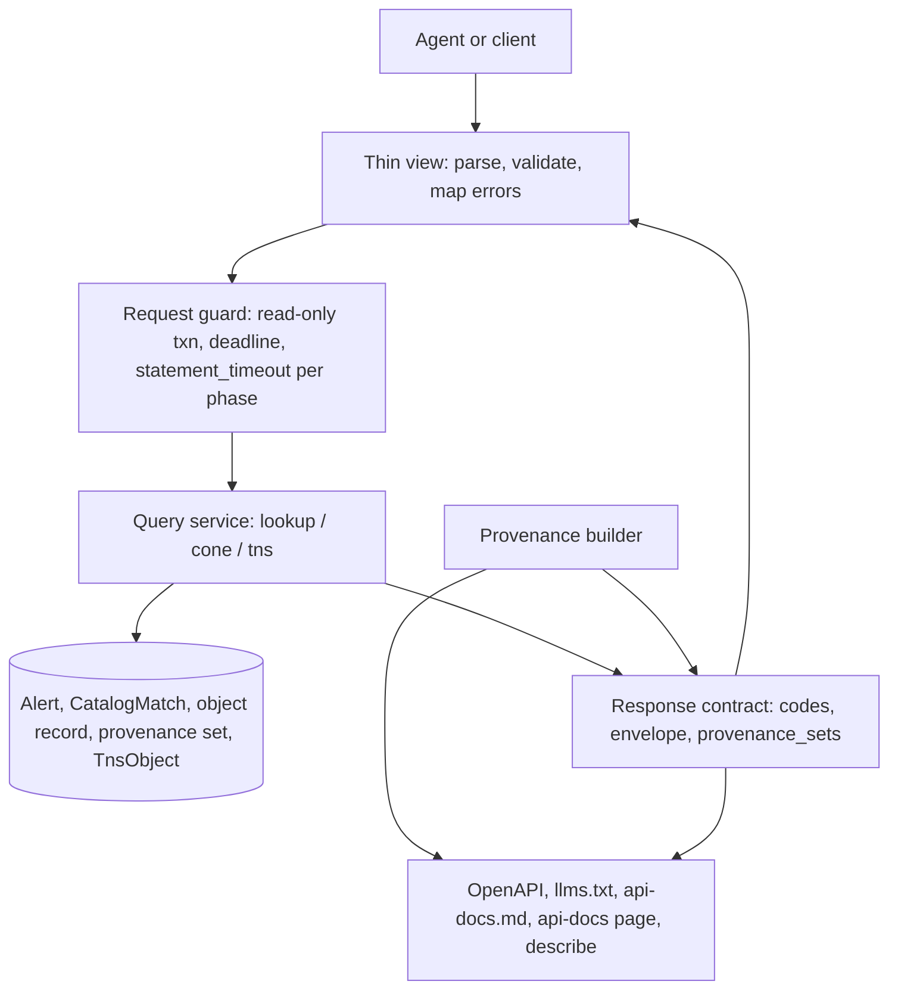
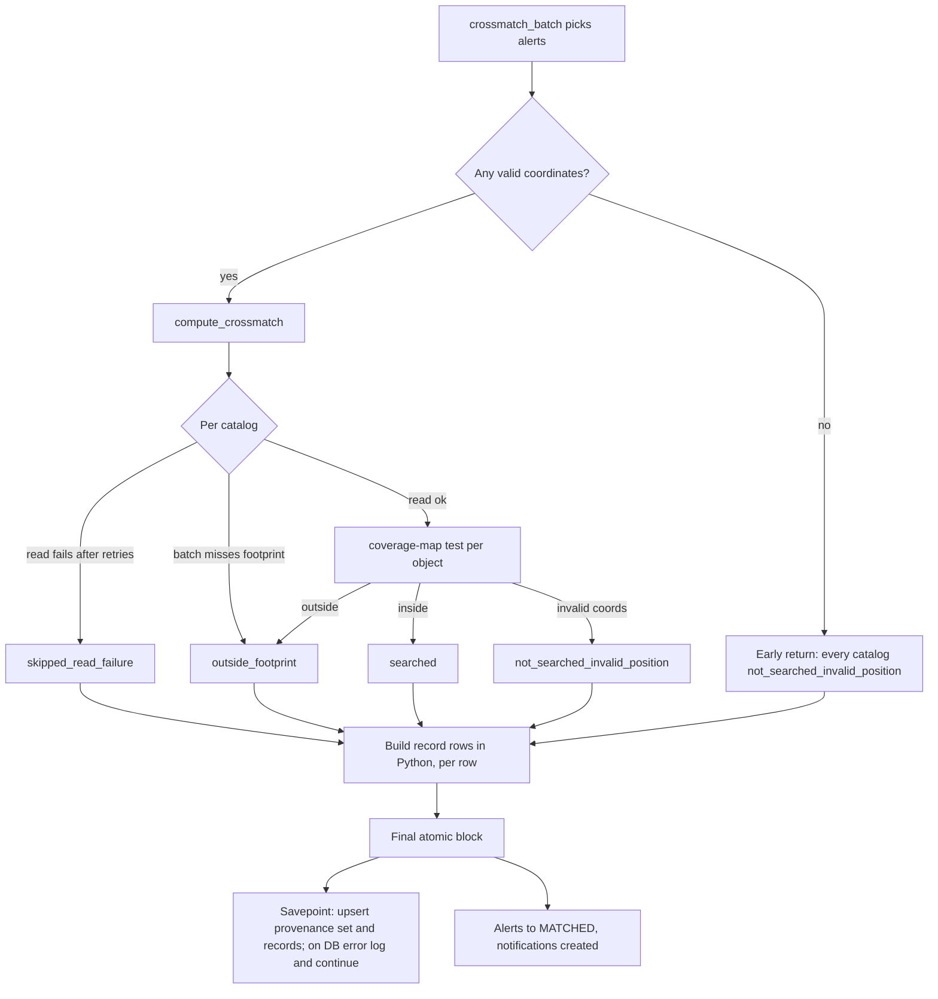
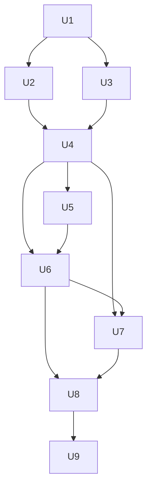

# Agent-Ready Read API Core - Plan

## Goal Capsule

- **Objective:** Researchers in a time-domain astrophysics and cosmology research group, and the AI agents they run, can replace the notebook crossmatch and contamination-vetting step of their SN Ia cosmology workflow with this service; candidate selection from brokers and offset-host association stay with the group. From a list of `diaObjectId`s, a position, a spectroscopic target list, or a TNS name, they learn what the service knows about each object and which catalog sources sit at its position, with enough provenance to cite in a paper.
- **Means:** Purpose-built read queries that share one response contract, all described by a machine-readable OpenAPI document (KTD1, KTD2, KTD14).
- **Product authority:** The Product Contract is authoritative for behavior; Key Technical Decisions are authoritative for mechanism within it. This plan covers only the API core: object and position queries plus the agent-ready contract (areas A and B of the 2026-09-28 breakdown). The MCP server, IVOA TAP/cone search, bulk HATS publication, a Python client or agent skill, and OAuth quotas are not active scope; see How This Work Fits Together.
- **Stop conditions:** Stop and ask if a HATS catalog in service opens with no coverage map (KTD6 cannot hold for it), if the pre-release benchmark (Verification Contract) cannot fit the documented maximums inside the KTD12 budget, or if any change would alter the published Hopskotch payload.
- **Execution profile:** Deep. Nine units, landed in order U1 through U9 on one feature branch; each unit is independently testable.
- **Who finishes:** The implementer lands the code and tests and opens the PR; the maintainer reviews, merges, tags, and applies the gitops follow-ups.
- **Open blockers:** None. TNS-name lookup depends on TNS credentials being provisioned per cluster (see Dependencies / Assumptions).

---

## Product Contract

### Summary

A public, read-only API that answers the questions a supernova researcher or their agent actually starts from: "what do you know about these objects?" and "what is at these positions?".
Every input comes back with an explicit status and the coincident catalog sources at the object's position, with per-match provenance recorded at crossmatch time.
The existing API layer gains new query services and one shared response contract, and the OpenAPI document, `/llms.txt`, and Markdown docs are generated from that contract and live settings.

### Problem Frame

With Rubin, SN Ia candidates will vastly outnumber spectra, so cosmology samples are built photometrically: find candidates, check hosts, get distances, and estimate how many non-Ia contaminants slipped in.
The first user group, a time-domain astrophysics and cosmology research group, does the first steps today by pulling candidates from brokers by hand and crossmatching in Jupyter notebooks, and wants to use this service instead.

The service already computes the relevant evidence.
Every alert is crossmatched at 1.0 arcsec against Gaia DR3, DES Y6 Gold, DELVE DR3 Gold, and SkyMapper DR4.
The stored matches carry Gaia parallax, proper motion, RUWE, and star/galaxy/quasar probabilities, and DES/DELVE photo-z and star/galaxy separation.
The only public query today is a time window (`/api/recent-crossmatches`), which drops objects without a match and carries no provenance.
A researcher starting from an object list, a position, or a TNS name cannot ask their question, and an agent reading an empty result cannot tell "no counterpart" from "never seen".

Agents make those mistakes confidently.
An agent that reads "not in the results" as "no counterpart", a 1 arcsec match as a host galaxy, or today's settings as the conditions of a match made in July will produce wrong methods sections and wrong contamination estimates.

### Actors

- A1. Researcher: a postdoc or graduate student in the first user group, working in Jupyter or a coding agent session.
- A2. Researcher's agent: reads the contract, issues queries, and reports conclusions to A1.
- A3. Maintainer: configures the service, records broker-side filter settings, and cuts releases.
- A4. Existing consumer of the recent-crossmatches endpoint (demo notebooks, early users), who must not be broken.

### Key Decisions

- **Build the API core first; MCP, TAP, and bulk publication follow as separate work.** The MCP server and a Python client become thin wrappers over this surface. (session-settled: user-approved -- chosen over MCP-first, IVOA TAP first, or bulk HATS first: those either depend on these queries or are independent later work.)
- **Serve coincident sources, and state that they are not host association.** A 1.0 arcsec match is evidence of stellar or AGN contamination and of nuclear hosts; offset SN hosts need a wider, galaxy-shape-aware search that this service does not do. Governs R24. (session-settled: user-approved -- chosen over adding DLR-style host association or widening the global radius: widening changes the Hopskotch payload for every consumer and still would not rank hosts.)
- **Return raw catalog values and filter on a documented set; assert no classification.** The group's own thresholds stay visible and citable. Governs R11, R13, R14. (session-settled: user-approved -- chosen over service-derived "likely star / likely QSO" flags or no server-side filtering.)
- **Record provenance per match from this release on; label older matches "not recorded".** Governs R18, R19. (session-settled: user-approved -- chosen over backfilling from deploy history or reporting current settings only: broker-side filter changes were never recorded, so a backfill would be inference presented as fact.)
- **Purpose-built queries sharing one response contract, with every batch input echoed as exactly one result.** Governs R1-R5, R7. (session-settled: user-approved -- chosen over resolve-then-fetch or a constrained query language: those cost agents two calls per question or a new grammar.)
- **OpenAPI on day one, and all four entry points in the first release.** Governs R1-R5, R22. (session-settled: user-directed -- chosen over a smaller first slice of batch ID lookup plus provenance: without an OpenAPI spec the group's agents will not use the service, and the group arrives by position, spectroscopic target, and TNS name as often as by ID.)
- **Position searches cover every Rubin object the service has seen, not only matched ones.** "No coincident source" and "not in this service" become answers, not silence. Governs R4, R8. (session-settled: user-approved -- chosen over searching matched objects only, the recent-crossmatches semantics.)
- **Counts are available before paging.** An agent can size a contamination query without fetching every object. Governs R15. (session-settled: user-approved -- chosen over paging-only results.)
- **The recent-crossmatches endpoint stays matches-only and gains the contract additively.** Governs R6. (session-settled: user-approved -- chosen over changing it to include no-match objects, which would break A4.)
- **A malformed entry in a batch fails only that entry.** One bad ID in a spectroscopic list of hundreds should not discard the rest. Governs R28.

### Requirements

**Entry points**

- R1. A caller can look up one Rubin object by `diaObjectId`.
- R2. A caller can look up a list of `diaObjectId`s in one request, up to a documented per-request maximum.
- R3. A caller can look up an object by TNS name; the service resolves the name through its TNS snapshot and answers as a position search (R4) around the TNS position, echoing the TNS record.
- R4. A caller can search one position (RA, Dec in degrees, radius in arcsec) and get every Rubin object the service has seen within that radius.
- R5. A caller can search a list of positions in one request (for example, a spectroscopic target list), up to a documented per-request maximum, with a shared or per-position radius.
- R6. The existing time-window query keeps its current parameters, paging, and matches-only results, and gains the provenance and contract descriptions of R17 and R22 as additions.

**Results and status**

- R7. Every input in a request (ID, position, or TNS name) produces exactly one result entry that echoes the input, in input order.
- R8. Each result reports exactly one status: "not in this service"; "crossmatch pending" (ingested, not yet crossmatched); "coincident sources"; or "no coincident source" (crossmatched, nothing within the radius). An object crossmatched with no catalog actually searched (every catalog skipped, outside its footprint, or not searched because of invalid coordinates) reports "not searched". A position with no Rubin object within the radius reports "no Rubin object in this service" instead of an empty list. Each crossmatched result also reports every catalog's search outcome (R18), and "no coincident source" applies only to catalogs that were actually searched.
- R9. The contract states that "not in this service" is not evidence that the object failed a reliability cut or does not exist in Rubin, because reliability filtering happens before alerts reach the service.
- R10. Each object returns its position, its stored reliability score, its first ingest and event times, and the broker or brokers that delivered it.
- R11. Coincident sources are returned with their raw catalog values, using the existing cumulative `detail` levels.
- R12. Lookups and position searches reach the whole archive, not a recent window; payload retention does not reduce what they return.

**Filters and counts**

- R13. Queries accept filters on catalog, maximum separation, object reliability, and a documented set of catalog properties. The initial set is Gaia parallax, its error, and parallax significance (parallax divided by its error, Gaia's own `parallax_over_error` computed from the stored values), proper motions, RUWE, and class probabilities, plus DES/DELVE `DNF_Z`, `DNF_ZSIGMA`, and `EXT_MASH`.
- R14. When a match-property filter is present, an object qualifies if at least one of its coincident sources satisfies all match filters; objects with no coincident source do not qualify, and the response says so. Match filters apply within one catalog's source, so a request whose match filters span more than one catalog is rejected with an error naming the conflicting parameters.
- R15. Any query can return counts of qualifying objects, by status, without returning the objects.
- R16. Result sets page with the existing cursor conventions.

**Provenance**

- R17. Every response carries service-level provenance: service version, contract version, the configured crossmatch radius, the reliability cut per broker, and the catalog releases in service.
- R18. From this release on, each match records the radius, the catalog release, and the reliability cut of the delivering broker in effect when it was made, and each crossmatched object records every catalog's search outcome (searched, outside the catalog's footprint, or skipped after a read failure); responses return both.
- R19. Matches and objects crossmatched before recording began report their provenance and per-catalog search outcome as not recorded, naming the release that started recording; current settings may accompany them only when labeled as a best guess.
- R20. The reliability cut is reported per broker along with where it is enforced. Broker-enforced cuts (ANTARES, Lasair) are reported as declared by the maintainer as of a stated date; only the Pitt-Google cut is reported as enforced by this service's setting.
- R21. TNS-derived fields carry the TNS snapshot epoch they came from.

**Contract and discoverability**

- R22. An OpenAPI 3.1 document at a stable URL describes every query, parameter, response field, status value, and error.
- R23. Field descriptions state units (degrees, arcsec), the coordinate frame and epoch conventions, what `catalog_source_id` means for each catalog, the crossmatch radius, and the reliability cut.
- R24. The contract states that a coincident source is not a host association, and that the absence of a coincident source is not evidence of a hostless transient.
- R25. An `/llms.txt` at the site root points agents to the OpenAPI document and the Markdown docs.
- R26. The human-readable API docs are also served as Markdown.
- R27. Configuration-derived facts in the contract and docs (radius, catalogs, cuts, version) are read from live settings, so they cannot drift from the running service. Broker-enforced cuts are the exception: they are declared configuration, not observed from the service (R20).

**Operational behavior**

- R28. Request-level problems return `400` with a JSON error naming the parameter; a malformed entry within a batch is reported in that entry's result and does not fail the others.
- R29. When the service or its database is unavailable, the API returns a structured `503` with `Retry-After` and a machine-readable reason.
- R30. A status endpoint reports service availability, version, and whether TNS-name resolution is available.
- R31. A TNS-name input when resolution is unavailable returns a per-input "resolver unavailable" status, not an error for the whole request.
- R32. Access stays public and unauthenticated, as for the existing endpoint; the contract keeps the notice that authentication may be required in a future release.
  Because the edge limit caps only request rate, each request's database work is bounded server-side: batch-size and cone-radius maximums are set together to bound one request's search, queries run under a statement timeout, and an overrun returns a structured error (R28, R29) instead of holding a worker.

### Key Flows

- F1. Vetting broker candidates for contamination
  - **Trigger:** A1 has a few hundred SN Ia candidate `diaObjectId`s pulled from brokers.
  - **Actors:** A1, A2
  - **Steps:** A2 reads `/llms.txt` and the OpenAPI document; asks for counts of candidates with a Gaia coincident source whose parallax is significant; fetches those objects with `detail` enough to see the Gaia values; fetches the no-match and not-in-service entries separately; reports the contamination estimate with the provenance block.
  - **Outcome:** A1 has an estimate plus a methods sentence (service version, radius, catalog releases, per-broker cut) and knows which candidates the service never saw.
  - **Covered by:** R2, R7, R8, R9, R13, R14, R15, R17, R18, R22, R25
- F2. Checking a spectroscopic target list
  - **Trigger:** A1 has RA/Dec for spectroscopic targets, some with TNS names.
  - **Actors:** A1, A2
  - **Steps:** A2 submits the positions as one batch position search and the TNS names as lookups; reads one result per target, including "no Rubin object in this service" entries; inspects coincident sources for nuclear hosts with DES/DELVE photo-z.
  - **Outcome:** Each target is accounted for, with no silent drops, and nuclear-host redshifts are clearly separated from host association.
  - **Covered by:** R3, R4, R5, R7, R8, R11, R21, R24, R31

### Acceptance Examples

- AE1. **Covers R2, R7, R8.** **Given** a batch of four IDs: one unknown to the service, one ingested but not yet crossmatched, one processed with no match, and one with a Gaia match. **When** A2 looks them up. **Then** four entries return in input order, reporting "not in this service", "crossmatch pending", "no coincident source", and "coincident sources" with the Gaia values.
- AE2. **Covers R4, R7, R8.** **Given** a position with no Rubin object in the service within 2 arcsec. **When** A2 searches it. **Then** one entry returns reporting "no Rubin object in this service", not an empty list.
- AE3. **Covers R13, R14, R15.** **Given** 300 candidate IDs, 12 of which have a Gaia coincident source with significant parallax. **When** A2 asks for a count with that filter. **Then** the response reports 12 qualifying objects and the per-status breakdown of the rest, without returning objects.
- AE4. **Covers R17, R18, R19.** **Given** one match made in July 2026 and one made after this release. **When** both are returned. **Then** the new match carries its recorded radius, catalog release, and broker cut; the July match reports provenance "not recorded" naming the release that started recording, and any current-settings values are labeled as a best guess.
- AE5. **Covers R3, R30, R31.** **Given** a cluster where the TNS snapshot refresh is not running. **When** A2 submits a TNS name in a batch with two IDs. **Then** the TNS entry reports "resolver unavailable", the two IDs resolve normally, and the status endpoint shows TNS resolution as unavailable.
- AE6. **Covers R24.** **Given** a TNS-classified SN Ia whose host galaxy center is 4 arcsec away. **When** A2 looks it up. **Then** the result shows no coincident galaxy (or an unrelated source within 1 arcsec), and the contract text A2 read states that this is not evidence of a hostless event.
- AE7. **Covers R6.** **Given** an existing notebook that calls the time-window query. **When** it runs against the new release. **Then** every field it used before is still present with the same meaning, and only new provenance fields are added.
- AE8. **Covers R8, R18.** **Given** an object crossmatched after this release in a batch where the Gaia read failed after retries and DES was outside the footprint. **When** A2 looks it up. **Then** Gaia is reported as skipped and DES as outside the footprint, and neither catalog is reported as having no coincident source.

### Success Criteria

- A coding agent given only the service URL completes F1 through `/llms.txt` and the OpenAPI document, with no hand-written client code beyond HTTP calls.
- A methods-section sentence (service version, radius, catalog releases, per-broker reliability cut) can be written from a single response.
- No request that supplied inputs returns a result set where an input has silently disappeared.
- The first user group confirms that the service replaces their notebook crossmatch and contamination-vetting step for at least one real candidate sample.

### Scope Boundaries

**Deferred for later**

- Remote MCP server, IVOA TAP/ADQL and Simple Cone Search, bulk Parquet or HATS publication, and a Python client or agent skill.
- OAuth 2.1, per-user quotas, and anything write-like (saved queries, watchlists).
- A citable DOI for releases (Zenodo on the scimma repository), a release-process change rather than API work.
- Adding no-match objects to the time-window query.
- Filtering on arbitrary catalog columns beyond the documented set in R13.

**Outside this product's identity**

- Host-galaxy association (DLR-style ranking of candidate hosts).
- Classifications asserted by the service (star, QSO, SN type).
- Light curves, forced photometry, and image cutouts.

#### Deferred to Follow-Up Work

- Gitops repo (`../crossmatch-service-k8s-gitops/`): revisit the Traefik rate-limit values and the rationale comment in `apps/crossmatch-service/templates/middleware-ratelimit.yaml`, which justify themselves by the old paging caps; add a stricter rate limit for the batch and cone routes (KTD12); add the new catalog `release` labels and declared broker cuts (KTD7, KTD8) to the per-cluster values. Maintainer-only push.
- A `docs/solutions/` learning capturing the response-contract and provenance-recording pattern once it ships.
- Serving `docs/references/<catalog>-columns.md` as Markdown; the docs tree is outside the image build context (`docker/docker-compose.yaml` builds from `crossmatch/`), so the describe endpoint (KTD16) carries the filterable-field vocabulary instead.

<!-- ce-section: work-relationships -->
### How This Work Fits Together

This plan covers the API core: object and position queries plus the agent-ready contract. The breakdown below is the current understanding from the 2026-09-28 brainstorm, not a committed roadmap.

- Remote MCP server (task-shaped read-only tools such as `lookup_object`, `cone_search`, `recent_crossmatches`, `describe_catalog`, `service_status`)
  - Depends on this plan's queries and contract; each tool wraps one query, and KTD1 names operations to match.
- Python client and agent skill (a package or astroquery module, plus a SKILL.md with worked examples)
  - Depends on this plan's OpenAPI document; can be partly generated from it.
- IVOA TAP/ADQL, Simple Cone Search, VOTable, and Registry
  - Can proceed independently of this plan; shares the read model and should reuse R23's field descriptions.
- Bulk Parquet or HATS publication of the crossmatch table
  - Can proceed independently; shares the per-match provenance of R18.
- OAuth 2.1 through CILogon and quotas
  - Still to decide; triggered by the first write-like feature.
- Host-galaxy association
  - Still to decide whether the service should ever do it; this plan's R24 keeps the boundary explicit meanwhile.

### Dependencies / Assumptions

- TNS-name lookup (R3) works only where the TNS snapshot refresh runs; it is disabled until the TNS bot credentials are provisioned as a per-cluster secret.
- The ANTARES and Lasair reliability cuts are defined in broker-side filters that this service does not control. R20 assumes the maintainer records their current values as configuration and updates it when a broker filter changes. The ANTARES topic's threshold is not documented in the repo; until the maintainer declares it, the ANTARES cut reports as not declared.
- The edge rate limit (Traefik, per source IP) stays in place for the public API; it complements, and does not replace, the per-request bound in R32. Traefik's rate limiter sets `Retry-After` on its own `429`s.
- The first user group is willing to try an early build against a real candidate sample and report back.

### Outstanding Questions

**Resolve Before Planning**

- None.

**Deferred to Implementation**

- The KTD12 maximums and budget are starting values; the pre-release benchmark in the Verification Contract confirms or lowers them.
- Confirm every HATS catalog in service opens with a coverage map (KTD6); a catalog without one hits the Goal Capsule stop condition.

### Sources / Research

- `docs/ideation/2026-07-08-scientist-facing-data-products-ideation.md`: the earlier scientist-facing ideation (read model, three-adapter architecture, VO protocols, rejected NL-to-SQL).
- `docs/plans/2026-07-08-001-feat-scientist-read-model-plan.md`: read model with `reliability`, `healpix_ipix` (NESTED order 16), and time indexes.
- `docs/plans/2026-07-13-001-feat-recent-crossmatch-api-plan.md`, `docs/plans/2026-07-14-001-feat-recent-crossmatch-paging-plan.md`, `docs/api/recent-crossmatch-api.md`: the existing endpoint, `detail` levels, cursor paging, and error conventions.
- `crossmatch/api/service.py`: matches-only semantics, `_load_matches` (current match version, per-row defensive), and the current response envelope.
- `crossmatch/core/models.py`: `Alert.Status` (INGESTED, QUEUED, MATCHED, NOTIFIED); a crossmatched alert with no match ends MATCHED with zero `CatalogMatch` rows; `CatalogMatch` stores no radius, cut, or release, only `match_version`; `TnsObject.name` stores the bare designation and is not indexed; `TnsAssociation` is the per-alert side-table precedent.
- `crossmatch/core/healpix.py`: `cone_ipix_ranges` and wraparound-safe `angular_separation_arcsec` at order 16 (about 3.2 arcsec pixels).
- `crossmatch/tasks/crossmatch.py`: `compute_crossmatch` with `on_catalog`/`on_tns` callbacks; per-catalog outcomes (`CATALOG_NO_OVERLAP`, `CATALOG_SKIPPED`) exist only per batch; the final atomic block transitions alerts to MATCHED.
- `crossmatch/matching/catalog.py`: `crossmatch_alerts` uses `n_neighbors=1`, so at most the nearest source per catalog is stored.
- `crossmatch/replay/sample.py`: `read_only_transaction` with a transaction-local `statement_timeout`, the pattern KTD12 reuses; `crossmatch/replay/snapshot.py`: `catalog_identity()` and `SNAPSHOT_FORMAT_VERSION`.
- `crossmatch/tasks/retention.py`: the sweep nulls only raw payloads; `Alert`, `CatalogMatch`, and `Notification` rows persist.
- `crossmatch/project/settings.py`: `CROSSMATCH_RADIUS_ARCSEC`, `MIN_DIASOURCE_RELIABILITY`, `TNS_MATCH_RADIUS_ARCSEC`, `TNS_SNAPSHOT_MAX_AGE_SECONDS`, the recent-crossmatch ceilings block, and per-catalog `payload_columns`.
- `crossmatch/brokers/pittgoogle/consumer.py`, `crossmatch/brokers/lasair/consumer.py`: Pitt-Google enforces the cut from the service setting; Lasair (`latestR > 0.6`) and ANTARES (topic `lsst_scimma_quality_transient`) enforce it broker-side.
- `crossmatch/web/config.py`: the allowlist trust boundary for settings rendered into pages; `crossmatch/web/templates/web/api.html` hardcodes config facts today.
- `crossmatch/entrypoints/run_web.sh`: gunicorn with 2 sync workers and the default 30 s worker timeout.
- `docs/solutions/design-patterns/coerce-numpy-pandas-scalars-to-json.md`, `docs/solutions/conventions/catalog-specific-payload-columns.md`, `docs/solutions/conventions/dependency-pin-upgrade-pattern-2026-05-12.md`, `docs/solutions/integration-issues/create-index-concurrently-deadlocks-under-locked-init.md`, `docs/solutions/design-patterns/wire-deployed-image-tag-into-footer-version.md`: learnings KTD7, KTD9, KTD13, and KTD14 follow.
- External: django-ninja issue #1266 (Django 6.0 converter collision) and its unconfirmed OpenAPI 3.1 output; `openapi-spec-validator` (explicit 3.1 support); llmstxt.org (llms.txt format); Traefik `pkg/middlewares/ratelimiter/rate_limiter.go` (sets `Retry-After`); Postgres expression-cast matching for JSONB numerics.

---

## Planning Contract

### Product Contract Preservation

Changed at the user's request: references to the first user group are generic (Goal Capsule objective, Problem Frame, A1, Success Criteria, Dependencies). Changed: R8 gains a "not searched" status, because R8's own rule that "no coincident source" applies only to searched catalogs leaves an object with no searched catalog without a truthful status. No other product scope change. The planning-time deferred questions were resolved in place by KTD7, KTD12, KTD13, and KTD14; KTD16 adds a describe endpoint and KTD4 adds string IDs, both confirmed in the scoping synthesis as HOW-level support for R22, R23, and R27.

### Key Technical Decisions

- KTD1. **Extend the existing API layer; one service function per query.** Thin function views in `crossmatch/api/views.py` over keyword-only service functions that return JSON-native dicts, as `recent_crossmatches` does today. Each OpenAPI `operationId` matches the planned MCP tool name (`lookup_objects`, `get_object`, `cone_search`, `resolve_tns`, `recent_crossmatches`, `describe_service`, `service_status`), so the MCP work maps one to one.
- KTD2. **Fixed snake_case codes, with stored codes owned by the core models.** Codes the crossmatch task writes to the database (per-catalog outcomes `searched`, `outside_footprint`, `skipped_read_failure`, `not_searched_invalid_position`; broker-cut `enforced_by` values `service`, `broker`) are `TextChoices` in `crossmatch/core/models.py`, like `Alert.Status`, so the Celery worker never imports `api`. Response-only codes live in `crossmatch/api/contract.py`, which reuses the stored ones: object status `not_in_service`, `crossmatch_pending`, `coincident_sources`, `no_coincident_source`, `not_searched`; input status `no_rubin_object`, `objects_found`, `tns_name_not_found`, `resolver_unavailable`, `invalid_input`; per-catalog read-time outcomes `not_recorded` (no record exists) and `not_in_service_at_crossmatch` (the catalog was added after the object's record was written). A position input carries an input-level status and each object inside it carries its own object status. The R8 wording lives in the OpenAPI enum descriptions, not in the values. Error bodies carry `code`, `message`, `param` or `params`, and `retryable`, and keep the existing `error` string for A4. (session-settled: user-approved -- chosen over prose status values: agents branch on codes, and a later rename would break them.)
- KTD3. **Routes.** `GET api/objects/<id>` (R1), `POST api/lookup` with tagged inputs of kind `id`, `position`, or `tns` in one ordered list (R2, R5, R7, AE5), `GET api/cone` (R4, paged), `GET api/tns/<name>` (R3, capped like a batched position per KTD11), `GET api/describe`, `GET api/status`, `GET openapi.json`, `GET llms.txt`, `GET api-docs.md`. The batch `POST` is read-only and idempotent, and needs no CSRF exemption because the project installs no CSRF middleware. Routes stay slashless like `api/recent-crossmatches`.
- KTD4. **64-bit IDs.** New endpoints accept `diaObjectId` as a JSON integer or a decimal string, and emit both `diaObjectId` (integer, unchanged convention) and `diaObjectId_str`. `catalog_source_id` is already a string. `recent-crossmatches` gains `diaObjectId_str` additively. (session-settled: user-approved -- chosen over integers only: JavaScript-based JSON parsers lose precision above 2^53.)
- KTD5. **Two tables: shared provenance sets and a thin per-object record.** Governs R18, R19, R20. (session-settled: user-approved -- chosen over backfilling or reporting current settings: see the Product Contract decision on recorded provenance.)
  1. A provenance-set table stores each distinct combination of radius, catalog releases, and broker-cut table once, keyed by a content hash. Its values are JSON-native: dates as ISO strings, numbers coerced through `matching/payload.py`.
  2. A per-object record table has a ForeignKey to `Alert` with `UniqueConstraint(alert, match_version)`, a reference to its provenance set, the per-catalog outcomes, the brokers that had delivered the object when the MATCHED transition committed, and `crossmatched_at`. It is not a one-to-one table like `TnsAssociation`.
  3. Writes are upserts that update on conflict, so the last committed run wins; a rerun with different outcomes replaces the stale row, and two overlapping runs from stuck-batch recovery leave a readable last-writer row.
  4. A catalog that has current-version `CatalogMatch` rows for the object is recorded as `searched` regardless of the run's outcome, so a revert-and-rerun can never contradict stored matches.
  5. Per-match provenance joins each match to the record on `(alert, match_version)`; `CatalogMatch` gains no columns. Responses return a `provenance_sets` map keyed by set, referenced from each match.
  6. The record's broker list is frozen at crossmatch time; R10's live broker list still comes from `AlertDelivery`, and responses label the two separately so a later broker is never shown as having produced a match.
  7. An object with no record reports `not_recorded` and names the release that started recording, without asserting that the object predates it (a record can also be missing after a failed write or during the rollout window).
- KTD6. **Per-object footprint check against the catalog's coverage map.** The HATS coverage map is `hc_structure.moc` on the catalog object that `matching/catalog.py` already caches for the process; the check runs in the Celery process, not on the Dask cluster. Each alert position (taken from the batch's full alert rows, not the NaN-filtered frame) is classified `searched`, `outside_footprint`, or `not_searched_invalid_position`; a whole-batch no-overlap records `outside_footprint` and a skipped read records `skipped_read_failure` for every object. A catalog whose coverage map is `None` triggers the Goal Capsule stop condition rather than a silent fallback. Outcomes travel in a new optional result field that the replay snapshot does not serialize; the published payload is unchanged, so the replay gate is unaffected. Covers AE8. (session-settled: user-approved -- chosen over reporting "searched (footprint not tested)": that would make "no coincident source" overclaim for out-of-footprint objects.)
- KTD7. **Catalog releases are configured labels.** Each `CROSSMATCH_CATALOGS` entry gains a required `release` string with an in-code default beside its HATS URL default (environment-overridable), validated at settings import like `payload_columns`, and readable by the web tier and API without opening LSDB. HATS build properties from `replay/snapshot.py::catalog_identity()` are not used for provenance.
- KTD8. **One provenance builder, fed from settings.** A single builder in `crossmatch/core/provenance.py` produces service-level provenance (R17) and the per-broker cut table (R20) from settings: `APP_VERSION`, a `CONTRACT_VERSION` constant, `CROSSMATCH_RADIUS_ARCSEC`, catalog releases, the Pitt-Google cut from `MIN_DIASOURCE_RELIABILITY` marked `enforced_by: service`, and new declared settings for the ANTARES and Lasair cuts, each with an as-of date (unset means `not_declared`). The crossmatch task, the API envelope, the OpenAPI text, `/llms.txt`, the Markdown docs, and `web/config.py` all call it. Governs R17, R20, R27.
- KTD9. **Filters come from a declarative registry beside `payload_columns`; new queries only.** Governs R13, R14. (session-settled: user-approved -- chosen over dropping non-qualifying inputs: that would break R7's no-silent-drop rule.)
  1. Each catalog entry gains `filter_columns` (a subset of `payload_columns` with units), plus the derived Gaia `parallax_over_error`.
  2. Public names are catalog-qualified and lowercased (`gaia_dr3.parallax_over_error_min`, `des_y6_gold.dnf_z_max`) with inclusive `_min`/`_max` bounds; a null or non-numeric stored value never qualifies (the SQL checks the JSON type is a number before one canonical `double precision` cast).
  3. Filters run in SQL over the candidate set the inputs already bound; no JSONB expression indexes are added. Filters naming more than one catalog return `400` with code `filters_span_catalogs`.
  4. A filtered request still returns one entry per input, each marked `qualifies: true|false` with a reason.
  5. Matches and filters apply only to MATCHED and NOTIFIED objects, so a reverted batch's partial rows never surface on a pending object.
  6. `recent-crossmatches` does not gain filters in this release: its window can span millions of match rows, which a filter cannot bound (R6 keeps its parameters unchanged). It returns `400` with code `unsupported_parameter` for any parameter matching a filter name or `response=count`, and keeps ignoring every other unknown parameter, so an agent cannot mistake unfiltered results for filtered ones. (session-settled: user-approved -- chosen over continuing to ignore filter parameters silently: an agent would read unfiltered results as filtered.)
- KTD10. **Counts share the query path.** The new queries accept `response=count`, which returns counts by input status, object status, and `qualifies` for the same inputs and filters, without objects. Governs R15.
- KTD11. **Generalized cursor pinned to an object set.** `crossmatch/api/pagination.py` gains a `kind` discriminator and an `as_of` pin (an upper bound on `ingest_time`, which is set once and never changes). A cursor with no `kind` decodes as recent-crossmatches and one with no `as_of` as unpinned, so cursors minted before the upgrade keep working. The pin fixes which objects are in the set; an object's status and `qualifies` can still advance between pages as crossmatching proceeds, and the contract says so. The single cone pages in `(ingest_time, diaObjectId)` order. Batched positions and single TNS lookups are not paged: each lists at most a documented number of objects, with `truncated: true` and a total when capped, and a follow-up single cone pages the rest.
- KTD12. **Per-request cost bound.** Governs R29, R32. (session-settled: user-approved -- chosen over a retryable 503 for overruns: agents would retry a request that always times out.)
  1. API service calls run inside a read-only transaction extracted from `replay/sample.py::read_only_transaction` into `crossmatch/core/db.py`. A monotonic wall-clock deadline covers the whole request; before each SQL phase the transaction-local `statement_timeout` is set to the time remaining. `transaction_timeout` is not used: on overrun Postgres ends the whole session, which surfaces as connection loss and would be misreported as an outage.
  2. The default request budget is 5 s. The web database connection gets a `connect_timeout`, so an unreachable database fails fast into the structured 503 instead of outliving the gunicorn worker.
  3. `crossmatch/entrypoints/run_web.sh` passes an explicit gunicorn `--timeout` and switches to threaded workers, so `/healthz` and HTML pages are not queued behind two slow API requests.
  4. Starting maximums: 1000 IDs, 200 positions, 60 arcsec cone radius, 100 objects per batched position, and 5000 objects per request in total across all inputs; all are settings in the existing API-ceilings block, confirmed or lowered by the pre-release benchmark (Verification Contract).
  5. Cones compute the HEALPix cover at the deepest order that covers the cone in at most 9 pixels, widened to order 16. A batch of positions is one statement joining a list of (input index, low, high) ranges to `core_alert`, and the exact separation filter runs in SQL, so counts and caps count objects inside the radius, not cover candidates.
  6. Errors are classified by the deadline first: a query cancellation (SQLSTATE 57014) or any database error raised after the deadline has passed returns `400` with code `query_too_expensive` and `retryable: false`; only other connection errors return `503` with code `service_unavailable`, `Retry-After`, and `retryable: true`. `api/status` is exempt from the 503 mapping.
  7. Each API request logs its phase timings (SQL, Python, response bytes) through structlog, since no duration metric exists today.
- KTD13. **TNS resolution.** Input names are normalized to the bare designation (strip `SN`/`AT` prefixes and whitespace, lowercase) and compared with the lowercased stored `TnsObject.name`, which keeps IAU uppercase single-letter designations such as `2026A` findable; the comparison is backed by an expression index on the lowercased name, built with `AddIndexConcurrently` in its own non-atomic migration. Resolution is available when the snapshot is current, judged by the same helper crossmatch uses for TNS enrichment, extracted rather than duplicated. The radius defaults to `TNS_MATCH_RADIUS_ARCSEC` and can be overridden per request up to the cone maximum; all Rubin objects within it are returned. A name absent from a current snapshot reports `tns_name_not_found` with the snapshot epoch. There is no fallback to stored `TnsAssociation` rows, so AE5 holds as written.
- KTD14. **Hand-built OpenAPI document, validated in tests; no new runtime dependency.** The OpenAPI 3.1 document is a Python dict built from the contract codes (KTD2) and the provenance builder (KTD8), served at `/openapi.json`. `openapi-spec-validator` and `jsonschema` join `crossmatch/requirements.dev.txt` only, which the image and the lock do not install. A pytest fixture validates every API test response against the served document. Governs R22, R23, R27. (session-settled: user-approved -- chosen over django-ninja: it has an open Django 6.0 compatibility issue and unconfirmed 3.1 output, and any runtime dependency must be pinned across every pin site.)
- KTD15. **Docs generated from the same source.** `/llms.txt` (llmstxt.org format, under about 10 KB) and `/api-docs.md` are rendered from the contract and provenance builders; the HTML `/api-docs` page is refactored to read the same facts through `web/config.py` instead of hardcoding them. Markdown responses carry a `Link: </llms.txt>; rel="describedby"` header. Governs R24, R25, R26, R27.
- KTD16. **Status and describe endpoints.** `api/status` always returns `200` with `database: ok|unavailable`, version, and `tns_resolution: available|unavailable`; `/healthz` is untouched because it is the pod probe. `api/describe` lists catalogs (name, release, meaning of `catalog_source_id`, filterable fields with units), per-request maximums, detail levels, the radius, and the broker cut table. Governs R30, supports R22 and R23. (session-settled: user-approved -- chosen over documenting limits and fields only in prose: agents and the later MCP `describe_catalog` tool need them at runtime.)

### High-Level Technical Design

Request path for every new query:



Where per-object provenance is produced during a crossmatch batch:



Status resolution for one object (directional):

```text
no Alert row                                   -> not_in_service
Alert INGESTED or QUEUED                       -> crossmatch_pending
MATCHED/NOTIFIED with current-version matches  -> coincident_sources
MATCHED/NOTIFIED, no matches, >= 1 searched    -> no_coincident_source
MATCHED/NOTIFIED, no matches, none searched    -> not_searched
MATCHED/NOTIFIED, no record                    -> status from matches as above,
                                                  per-catalog outcomes not_recorded
catalog missing from the object's record       -> not_in_service_at_crossmatch
```

### Sequencing

U1 lands the codes, contract, provenance builder, and conformance fixture that every later unit uses. U2 and U3 are independent of each other and both depend on U1. U4 through U7 build the queries on U1 to U3; U7's describe endpoint also needs U6's filter registry. U8 generates the docs from the finished contract. U9 applies the additive changes to the existing endpoint and records the release.



### System-Wide Impact

- **Crossmatch path:** U2 adds work to `compute_crossmatch` and a savepointed upsert to the final MATCHED transaction of every production batch, including the all-invalid early-return path. The published Hopskotch payload and the replay snapshot stay unchanged. A 100k-alert batch adds a bulk upsert inside the MATCHED transaction, so the benchmark measures it against the batch's soft time limit.
- **Database:** two new tables (migration 0011) and one concurrent index on `tns_objects` (migration 0012, non-atomic). Migrations apply only through the ingest consumers' `locked_init`, which polls the advisory lock, so the known concurrent-index deadlock does not recur. Celery and web pods can start before 0011 is applied, so the record write and the API's record reads tolerate a missing table (log and treat as not recorded) until it exists. No backfill.
- **Web tier:** threaded gunicorn workers with an explicit timeout; KTD12 bounds every API request so `/healthz` and HTML pages keep responding under load.
- **Existing consumers (A4):** `recent-crossmatches` gains fields only; no field is renamed, retyped, or removed, and cursors minted before the upgrade still decode.
- **Configuration:** catalog `release` labels have in-code defaults, so gitops overrides them only when a label differs. Provenance inputs are not shared by every pod today: the web Deployment receives neither `crossmatch.env` (radius, HATS URLs) nor `broker_filter.env` (`MIN_DIASOURCE_RELIABILITY`, injected only into the Pitt-Google consumer), so the web pod and the Celery worker report settings defaults. R27's no-drift guarantee therefore depends on one shared env block for every provenance input reaching the Pitt-Google consumer, Celery worker, beat, and web containers (Operational Notes).

### Risks

| Risk | Mitigation |
|---|---|
| A record-write failure inside the MATCHED transaction reverts the batch and repeats it forever | Rows are built per row before the transaction; the upsert runs in a nested savepoint whose failure is logged and counted, and the MATCHED transition commits (U2 test forces it) |
| A HATS catalog opens with no coverage map | Goal Capsule stop condition; no silent fallback to `searched` |
| Starting maximums are wrong for real data | The pre-release benchmark sets each maximum so p95 is at most half the budget; settings are read at call time |
| Slow API requests starve the web tier and fail the liveness probe | Threaded workers with an explicit thread count, a 5 s budget, and a stricter gitops rate limit for batch routes as a PROD rollout precondition (Operational Notes) |
| An interrupted concurrent index build leaves an INVALID index and ingest consumers crash-loop on the next migrate | Operational note: drop the invalid index and re-run migrations; 0012 is `atomic = False` and holds only the index |
| Overlapping runs from stuck-batch recovery both write records | Update-on-conflict upsert with `crossmatched_at`; last committed run wins |
| The OpenAPI document drifts from real responses | Every API test response is validated against the served document, and a test checks every emitted code appears in it and the reverse |
| Extending `compute_crossmatch` changes replay output | Outcomes travel in a field the snapshot does not serialize; U2 runs the replay tests unchanged |
| Declared broker cuts go stale | Reported with their declaration date and `enforced_by`, never as observed (R20) |

### Operational Notes

- PROD rollout preconditions (gitops, maintainer-only): one shared env block for every provenance input (`MIN_DIASOURCE_RELIABILITY`, `CROSSMATCH_RADIUS_ARCSEC`, HATS URLs, catalog release overrides, declared ANTARES and Lasair cuts) included in the Pitt-Google consumer, Celery worker, beat, and web containers; and a stricter rate limit for `api/lookup`, `api/cone`, and `api/tns`.
- Deploy order: migrations 0011 and 0012 apply when the ingest consumers start; new worker and web pods tolerate the gap (System-Wide Impact).
- After cutover, the count of MATCHED or NOTIFIED alerts crossmatched after the deploy with no record should be zero; a non-zero count means record writes are failing (check the savepoint-failure log).
- If 0012 is interrupted, drop the INVALID index on `tns_objects` and restart one ingest consumer to re-apply it.

---

## Implementation Units

### U1. Codes, response contract, provenance builder, and conformance fixture

- **Goal:** Establish the stored and response codes, envelope, error shape, provenance builder, and OpenAPI skeleton that every query unit uses.
- **Requirements:** R8, R17, R20, R22, R27, R28; KTD2, KTD4, KTD7, KTD8, KTD14.
- **Dependencies:** None.
- **Files:**
  - Create `crossmatch/api/contract.py`, `crossmatch/api/openapi.py`, `crossmatch/core/provenance.py`
  - Modify `crossmatch/core/models.py`, `crossmatch/api/errors.py`, `crossmatch/project/settings.py`, `crossmatch/web/config.py`, `crossmatch/project/urls.py`, `crossmatch/requirements.dev.txt`
  - Test `crossmatch/tests/test_api_contract.py`, `crossmatch/tests/test_provenance_builder.py`, `crossmatch/conftest.py`
- **Approach:**
  1. Add the stored codes as `TextChoices` in `core/models.py` and the response-only codes in `api/contract.py` (KTD2), plus the error type with the legacy `error` key.
  2. Add the `release` key to every `CROSSMATCH_CATALOGS` entry with import-time validation, and the declared ANTARES and Lasair cut settings with as-of dates, in the API-ceilings settings block.
  3. Build the provenance builder (KTD8) with JSON-native output, and have `web/config.py` call it rather than reading those settings itself.
  4. Build the OpenAPI generator with shared components and serve it at `/openapi.json`.
  5. Add a pytest fixture that validates a response body against a named operation and status in the served document.
- **Patterns to follow:** `Alert.Status` `TextChoices`; `web/config.py` allowlist functions; import-time validation of `MIN_DIASOURCE_RELIABILITY`; `APP_VERSION` wiring per `docs/solutions/design-patterns/wire-deployed-image-tag-into-footer-version.md`.
- **Test scenarios:**
  - The served OpenAPI document passes `openapi-spec-validator` as 3.1.
  - A catalog entry without `release` raises `ImproperlyConfigured` at import.
  - Provenance under `override_settings(CROSSMATCH_RADIUS_ARCSEC=2.0)` reports 2.0 with no code change.
  - Pitt-Google's cut reports `enforced_by: service` with the `MIN_DIASOURCE_RELIABILITY` value; ANTARES with no declared value reports `not_declared`; Lasair with a declared value reports it with its ISO as-of date and `enforced_by: broker`.
  - The provenance builder's output round-trips through `json.dumps` with no custom encoder.
  - An error serializes with `code`, `message`, `param`, `retryable`, and the legacy `error` string.
- **Verification:** The document validates, the provenance builder is the only reader of the provenance settings, and the fixture can validate a response.

### U2. Record per-object crossmatch provenance and search outcomes

- **Goal:** Persist, for every object crossmatched from this release on, the conditions and per-catalog outcomes that R18 requires, without ever putting a batch at risk.
- **Requirements:** R8, R18, R19, R20; AE8; KTD5, KTD6.
- **Dependencies:** U1.
- **Files:**
  - Modify `crossmatch/core/models.py`, `crossmatch/tasks/crossmatch.py`, `crossmatch/matching/catalog.py`
  - Create `crossmatch/core/migrations/0011_provenanceset_objectcrossmatchrecord.py`
  - Test `crossmatch/tests/test_crossmatch_provenance.py`, `crossmatch/tests/test_crossmatch_catalog_skip.py`, `crossmatch/tests/test_replay_run.py`
- **Approach:**
  1. Add the provenance-set and per-object record models per KTD5.
  2. In the per-catalog step, classify each alert from the batch's full rows against the cached catalog's coverage map (KTD6), carrying outcomes in a new optional result field.
  3. Before the final atomic block, build record rows per row in Python, catching and logging per-row errors; apply the "current-version matches force `searched`" rule.
  4. Inside the final atomic block, read the delivering brokers, then upsert the provenance set and the records in a nested savepoint; a database error is logged and counted and the MATCHED transition still commits.
  5. Do the same in the all-invalid early-return path, recording `not_searched_invalid_position` for every catalog.
  6. Tolerate a missing table (migration not yet applied) by logging and skipping the write.
- **Execution note:** Start with a failing test that runs a two-catalog batch where one catalog is skipped and one misses some objects' footprint.
- **Patterns to follow:** `_persist_tns_associations` (persist without ever raising); `tests/test_crossmatch_catalog_skip.py` two-seam mocking with `override_settings(CROSSMATCH_CATALOGS=...)`; the per-row defensive rule in the project instructions; `matching/payload.py` coercion.
- **Test scenarios:**
  - Covers AE8. A batch where Gaia's read fails after retries and one object falls outside DES's coverage map records `skipped_read_failure` for Gaia and `outside_footprint` for DES on that object.
  - A whole-batch "Catalogs do not overlap" records `outside_footprint` for every object for that catalog.
  - A mixed batch records `not_searched_invalid_position` for its NaN-coordinate alerts; an all-invalid batch, which takes the early-return path, records it too.
  - An object delivered by ANTARES and Pitt-Google before MATCHED records both brokers with their cuts; a delivery arriving after MATCHED does not change the record.
  - Revert after Gaia matches were persisted, rerun with Gaia skipped: the record says `searched` for Gaia, consistent with the stored matches.
  - Two runs over the same alerts leave exactly one record per `(alert, match_version)`, holding the later run's outcomes.
  - A forced database error from the record upsert leaves the alerts MATCHED and their notifications created.
  - A record round-trips through the database with dates as ISO strings and numbers as JSON numbers.
  - The published payload built by the same batch is byte-identical to one built without this change, and the existing replay tests pass unchanged.
- **Verification:** Records appear exactly when objects become MATCHED, no failure path in the record write can revert a batch, and `makemigrations --check` is clean.

### U3. Request guard, error mapping, and web-tier bounds

- **Goal:** Bound every API request's database and Python work, and turn failures into structured, correctly retryable errors.
- **Requirements:** R28, R29, R32; KTD12.
- **Dependencies:** U1.
- **Files:**
  - Create `crossmatch/core/db.py`
  - Modify `crossmatch/replay/sample.py`, `crossmatch/api/views.py`, `crossmatch/project/settings.py`, `crossmatch/entrypoints/run_web.sh`
  - Test `crossmatch/tests/test_api_guard.py`, `crossmatch/tests/test_replay_sample.py`
- **Approach:**
  1. Move `read_only_transaction` into `crossmatch/core/db.py`, import it from `replay/sample.py`, and add a way to reset `statement_timeout` to the remaining budget before each SQL phase.
  2. Add a view decorator that runs the service call under the guard with the request budget and a monotonic deadline, classifies errors per KTD12 step 6, and logs phase timings.
  3. Add the KTD12 maximums, total object cap, budget, and a web `connect_timeout` to settings, with a comment sizing them against the worker model.
  4. Set gunicorn's `--timeout` explicitly and switch to threaded workers in `run_web.sh`, with an explicit thread count sized against the Postgres connection budget and recorded in the ceilings-block comment.
- **Patterns to follow:** `replay/sample.py::read_only_transaction` and its test; the existing ceilings block comments.
- **Execution note:** Overrun tests cancel queries on the test connection, so run them with `transaction=True`.
- **Test scenarios:**
  - Inside the guard, `SHOW statement_timeout` reports the remaining budget and a write is rejected.
  - A request whose statements are each fast but together exceed a tiny budget returns 400 `query_too_expensive` with `retryable: false`.
  - A request whose Python phase exceeds the deadline returns the same error.
  - A simulated connection-loss `OperationalError` returns 503 JSON with `Retry-After` and `retryable: true`, never the HTML 500 page.
  - The replay sample's timeout test still passes against the moved helper.
- **Verification:** No API view runs outside the guard, the web pages are unaffected, and the web container starts with the new gunicorn flags.

### U4. Object lookup by ID and the batch lookup framework

- **Goal:** Serve single and batch ID lookups with echoed inputs, statuses, raw matches, and provenance.
- **Requirements:** R1, R2, R7, R8, R9, R10, R11, R12, R17, R18, R19, R28; F1; AE1, AE4; KTD1 to KTD5.
- **Dependencies:** U2, U3.
- **Files:**
  - Create `crossmatch/api/lookup.py`
  - Modify `crossmatch/api/service.py`, `crossmatch/api/views.py`, `crossmatch/api/urls.py`, `crossmatch/api/openapi.py`
  - Test `crossmatch/tests/test_object_lookup_service.py`, `crossmatch/tests/test_object_lookup_view.py`, `crossmatch/tests/factories.py`
- **Approach:**
  1. Build the tagged-input batch framework (KTD3): validate each input independently, keep order and duplicates, and mark malformed entries `invalid_input` without failing the request.
  2. Resolve IDs in set-based queries and derive statuses per the status resolution sketch; reuse `_load_matches`, restricted to MATCHED and NOTIFIED objects.
  3. Join matches to records on `(alert, match_version)` and attach per-catalog outcomes and `provenance_sets`, or `not_recorded` with the recording release and a labeled best-guess block.
  4. Return R10's live broker list separately from the record's crossmatch-time list.
  5. Serve `GET api/objects/<id>` and `POST api/lookup`, and add both operations to the OpenAPI document.
- **Patterns to follow:** `service._load_matches` and `_envelope`; `tests/test_recent_crossmatch_service.py` and `_view.py` split; add record and provenance-set factories to `tests/factories.py`.
- **Test scenarios:**
  - `GET api/objects/<id>` for a matched object returns one entry with its status, per-catalog outcomes, provenance, and coincident sources; for an unknown ID it returns `not_in_service`.
  - Covers AE1. Four IDs (unknown, pending, matched with no match, matched with Gaia) return four entries in order with the four statuses.
  - Covers AE4. An object with no record reports `not_recorded` naming the recording release, with a best-guess block labeled as such; a recorded object reports its radius, release, and broker cuts through `provenance_sets`.
  - An object whose every catalog was skipped or outside its footprint reports `not_searched`, not `no_coincident_source`.
  - A record written before a catalog was added reports `not_in_service_at_crossmatch` for that catalog.
  - A mixed batch with malformed, duplicate, unknown, pending, matched, and unmatched IDs returns exactly one entry per input in order; duplicates are echoed twice.
  - An ID above 2^53 sent as a string round-trips unchanged in `diaObjectId_str`.
  - A batch over the ID maximum returns 400 naming the parameter.
  - A pending object with leftover match rows from a reverted batch shows no matches.
  - Every response validates against the served OpenAPI document.
- **Verification:** Both routes are live, documented, and pass the conformance fixture.

### U5. Position and TNS inputs

- **Goal:** Serve single and batch cone searches and TNS-name lookups over every object the service has seen.
- **Requirements:** R3, R4, R5, R7, R8, R12, R16, R21, R31; F2; AE2, AE5, AE6; KTD3, KTD11, KTD12, KTD13.
- **Dependencies:** U4.
- **Files:**
  - Create `crossmatch/api/positions.py`, `crossmatch/core/migrations/0012_tnsobject_name_idx.py`
  - Modify `crossmatch/core/healpix.py`, `crossmatch/api/pagination.py`, `crossmatch/api/views.py`, `crossmatch/api/urls.py`, `crossmatch/api/openapi.py`, `crossmatch/tasks/crossmatch.py`, `crossmatch/core/models.py`
  - Test `crossmatch/tests/test_cone_search_service.py`, `crossmatch/tests/test_cone_search_view.py`, `crossmatch/tests/test_tns_lookup.py`, `crossmatch/tests/test_pagination.py`, `crossmatch/tests/test_healpix.py`
- **Approach:**
  1. Add the coarse-depth cover rule (KTD12) to the cone helper and express single and batched cones as one statement with the separation filter in SQL.
  2. Generalize the cursor with `kind` and `as_of` and backward-compatible decoding (KTD11); page the single cone; cap batched positions and TNS lookups with `truncated` and a total, and enforce the per-request total cap.
  3. Extract the TNS snapshot-currency check into a shared helper used by crossmatch and the resolver; add the concurrent expression index on the lowercased `TnsObject.name` in its own non-atomic migration.
  4. Resolve TNS names per KTD13 and answer as a position input, echoing the TNS record and snapshot epoch.
- **Patterns to follow:** `matching/tns_match.cone_candidates` (as the pattern to replace for batches, not to copy); migrations 0007 and 0009 for `AddIndexConcurrently`; `docs/solutions/integration-issues/create-index-concurrently-deadlocks-under-locked-init.md`.
- **Test scenarios:**
  - Covers AE2. A position with no object within 2 arcsec returns one entry with `no_rubin_object`.
  - A cone containing a pending and a matched object returns `objects_found` with each object's own status.
  - Cones straddling RA 0/360 and near a pole find objects on both sides; a cover candidate just outside the radius is excluded from objects, counts, and caps.
  - An object with null `healpix_ipix` is not returned by position search, and the contract says so.
  - A single cone larger than one page pages to completion under a pinned `as_of`; an object ingested mid-walk does not appear.
  - A batched position exceeding its cap returns `truncated: true` and the total; a batch exceeding the per-request total cap truncates in input order and says so.
  - A radius above the maximum returns 400.
  - A batch of positions returns exactly the objects that the same positions return as single cones.
  - Covers AE5. With a stale snapshot, a batch of one TNS name and two IDs returns `resolver_unavailable` for the name and normal results for the IDs.
  - `SN 2026abc`, `2026ABC`, and `AT2026abc` resolve to the same record, and `2026a` resolves to a stored `2026A`; an unknown name on a current snapshot returns `tns_name_not_found` with the epoch.
  - Covers AE6. A TNS SN whose host is 4 arcsec away returns no coincident galaxy, and the OpenAPI description of the status carries the host-association caveat.
  - Every response validates against the served OpenAPI document.
- **Verification:** Position and TNS inputs work in single and batch forms, and the index migration applies concurrently.

### U6. Filters and counts

- **Goal:** Let callers filter the new queries on the documented catalog properties and ask for counts before fetching.
- **Requirements:** R13, R14, R15; F1; AE3; KTD9, KTD10.
- **Dependencies:** U4, U5.
- **Files:**
  - Create `crossmatch/api/filters.py`
  - Modify `crossmatch/project/settings.py`, `crossmatch/matching/catalog.py`, `crossmatch/api/lookup.py`, `crossmatch/api/positions.py`, `crossmatch/api/openapi.py`
  - Test `crossmatch/tests/test_api_filters.py`, `crossmatch/tests/test_api_counts.py`, `crossmatch/tests/test_catalog_validation.py`
- **Approach:**
  1. Add `filter_columns` with units to each catalog entry, validated as a subset of `payload_columns` where `payload_columns` is validated.
  2. Parse catalog-qualified `_min`/`_max` parameters into typed predicates, reject multi-catalog filters, and compile them to SQL over the bounded candidate set with the numeric-type check and one canonical cast.
  3. Mark each entry `qualifies` with a reason, and implement `response=count` on the new queries.
- **Patterns to follow:** `docs/solutions/conventions/catalog-specific-payload-columns.md`; `api/service.py` allowlist validation before any field reaches the ORM.
- **Test scenarios:**
  - Covers AE3. 300 IDs, 12 with a Gaia source where `parallax_over_error` exceeds 5, counted with `response=count`, report 12 qualifying and the per-status breakdown of the rest, with no objects.
  - A Gaia filter combined with a DES filter returns 400 `filters_span_catalogs` naming both parameters.
  - A stored null or a non-numeric string never qualifies and never raises; a negative parallax gives a negative significance and fails a positive minimum.
  - A filtered batch returns every input, non-qualifying ones marked `qualifies: false` with a reason.
  - An unknown filter name returns 400 naming it; a filter column missing from `payload_columns` raises at import.
  - `recent-crossmatches` returns 400 `unsupported_parameter` for a filter-named parameter or `response=count`, and still ignores any other unknown parameter.
  - Every response validates against the served OpenAPI document.
- **Verification:** Filters and counts behave identically across ID, position, and TNS inputs.

### U7. Status and describe endpoints

- **Goal:** Give agents runtime access to service health and to the vocabulary and limits they must respect.
- **Requirements:** R30, R22, R23; KTD16.
- **Dependencies:** U4, U6.
- **Files:**
  - Create `crossmatch/api/discovery.py`
  - Modify `crossmatch/api/views.py`, `crossmatch/api/urls.py`, `crossmatch/api/openapi.py`
  - Test `crossmatch/tests/test_api_status.py`, `crossmatch/tests/test_api_describe.py`
- **Approach:** Build both responses from the provenance builder, the filter registry, and the settings ceilings; check the database with a short-timeout query and never raise.
- **Patterns to follow:** `project/urls.py` `healthz` (left unchanged); the shared TNS-currency helper from U5.
- **Test scenarios:**
  - With the database reachable, status reports `database: ok`, the version, and TNS availability from snapshot currency.
  - With the database unreachable, status still returns 200 with `database: unavailable` within the connect timeout.
  - Covers AE5. With a stale snapshot, status reports `tns_resolution: unavailable`.
  - Describe lists every configured catalog with its release and filterable fields with units, and the maximums match the settings under `override_settings`.
  - Both responses validate against the served OpenAPI document.
- **Verification:** `/healthz` is unchanged and both endpoints are documented.

### U8. Agent-facing docs: OpenAPI completeness, llms.txt, and Markdown

- **Goal:** Make the whole surface discoverable and self-describing from one source.
- **Requirements:** R9, R22, R23, R24, R25, R26, R27; F1, F2; KTD14, KTD15.
- **Dependencies:** U6, U7.
- **Files:**
  - Create `crossmatch/api/docs.py`, `crossmatch/web/templates/web/llms.txt`, `crossmatch/web/templates/web/api.md`
  - Modify `crossmatch/api/openapi.py`, `crossmatch/web/views.py`, `crossmatch/web/urls.py`, `crossmatch/web/templates/web/api.html`, `crossmatch/web/config.py`
  - Test `crossmatch/tests/test_openapi_completeness.py`, `crossmatch/tests/test_llms_txt.py`, `crossmatch/tests/test_web_pages.py`
- **Approach:**
  1. Fill every field description with units, frames and epochs, the per-catalog meaning of `catalog_source_id`, the nearest-source-per-catalog rule, the radius, the R9 and R24 caveats, and the note that statuses can advance between pages.
  2. Render `/llms.txt` and `/api-docs.md` from the same builders, with the `describedby` link header.
  3. Replace the hardcoded facts in `api.html` with values from `web/config.py`.
- **Patterns to follow:** llmstxt.org structure (H1, blockquote summary, H2 link sections); `web/views.py::_base_context`; `tests/test_web_pages.py`.
- **Test scenarios:**
  - Every code the code base can emit appears in the document, and every documented code is emitted somewhere.
  - Every operation has a description, and every numeric field names its unit.
  - Changing `CROSSMATCH_RADIUS_ARCSEC` or the catalog list under `override_settings` changes the OpenAPI text, `/llms.txt`, `/api-docs.md`, and the HTML page with no code edit.
  - `/llms.txt` links resolve to live routes and the file stays under 10 KB.
  - Covers F1, F2. An agent-parity walk that finds every URL through `/llms.txt` and the OpenAPI document, with no hard-coded paths, reaches the provenance fields needed for a methods sentence in one response.
- **Verification:** The HTML page, Markdown, `/llms.txt`, and OpenAPI document agree on every configured fact.

### U9. Additive changes to recent-crossmatches, docs, and changelog

- **Goal:** Bring the existing endpoint onto the shared contract without breaking current callers, and record the release.
- **Requirements:** R6, R17, R22; AE7; KTD2, KTD4, KTD11.
- **Dependencies:** U8.
- **Files:**
  - Modify `crossmatch/api/service.py`, `crossmatch/api/views.py`, `crossmatch/api/openapi.py`, `docs/api/recent-crossmatch-api.md`, `CHANGELOG.md`
  - Test `crossmatch/tests/test_recent_crossmatch_service.py`, `crossmatch/tests/test_recent_crossmatch_view.py`
- **Approach:** Add the provenance block, `diaObjectId_str`, `as_of`, and the structured error keys; keep every existing key, type, and meaning, and keep old cursors working. Update the endpoint doc and add `[Unreleased]` entries covering the new queries, the recorded provenance, new settings, the gunicorn change, and the gitops follow-up.
- **Patterns to follow:** existing `_envelope` and view error handling; Keep a Changelog style already in `CHANGELOG.md`.
- **Test scenarios:**
  - Covers AE7. A response compared with a fixture captured before this change keeps every existing key with the same type and value.
  - An error still carries the `error` string alongside the new keys.
  - A cursor minted before the upgrade continues the walk correctly.
  - Responses validate against the served OpenAPI document.
- **Verification:** Existing recent-crossmatch tests pass without edits, and the changelog describes the release.

---

## Verification Contract

| Gate | Command or check | Applies to |
|---|---|---|
| Test suite | `docker compose --env-file docker/.env -f docker/docker-compose.yaml run --rm --no-deps celery-worker sh -c 'pip install -q -r requirements.dev.txt && python -m pytest'` | Every unit |
| Migration graph | `python manage.py makemigrations --check --dry-run` inside the same container, re-run after any rebase onto a `main` with new migrations | U2, U5 |
| OpenAPI validity | the U1 test that runs `openapi-spec-validator` on the served document | Every unit that adds an operation |
| Response conformance | the U1 fixture, used by every API test | U4 to U9 |
| Replay unaffected | existing `test_replay_*` tests pass unchanged | U2, U3 |
| Lock drift | `crossmatch/requirements.lock` is unchanged (no runtime dependency added) | All |
| Pre-release benchmark | On DEV with production-sized tables, time these with phase timings and response bytes: 1000 IDs at `detail=full`; 200 positions at 60 arcsec; one 60 arcsec cone in the densest field; a filtered count over 200 positions; concurrent worst-case requests at the per-IP edge limit while `/healthz` is polled; an `EXPLAIN (ANALYZE, BUFFERS)` of the 200-position, 60 arcsec query showing index range scans; and one 100k-alert crossmatch batch with record writes. Set each maximum so p95 is at most half the budget, and confirm the batch stays within its soft time limit | Before release |
| Formatting | `black` on changed Python files only | All |

## Definition of Done

- Every requirement R1 to R32 and acceptance example AE1 to AE8 is covered by a unit test scenario, and all gates in the Verification Contract pass, including the pre-release benchmark.
- `recent-crossmatches` behaves as before for existing callers (AE7), including cursors minted before the upgrade.
- The published Hopskotch payload and the replay snapshot are unchanged.
- No failure path in the record write can revert a crossmatch batch (U2 test).
- `CHANGELOG.md` `[Unreleased]` describes the new queries, recorded provenance, new settings, the gunicorn change, and the gitops follow-up; `docs/api/recent-crossmatch-api.md` is current.
- No abandoned-attempt code, debug output, or unused helpers remain in the diff.
- Per unit: its Verification line holds and its test scenarios exist and pass.
