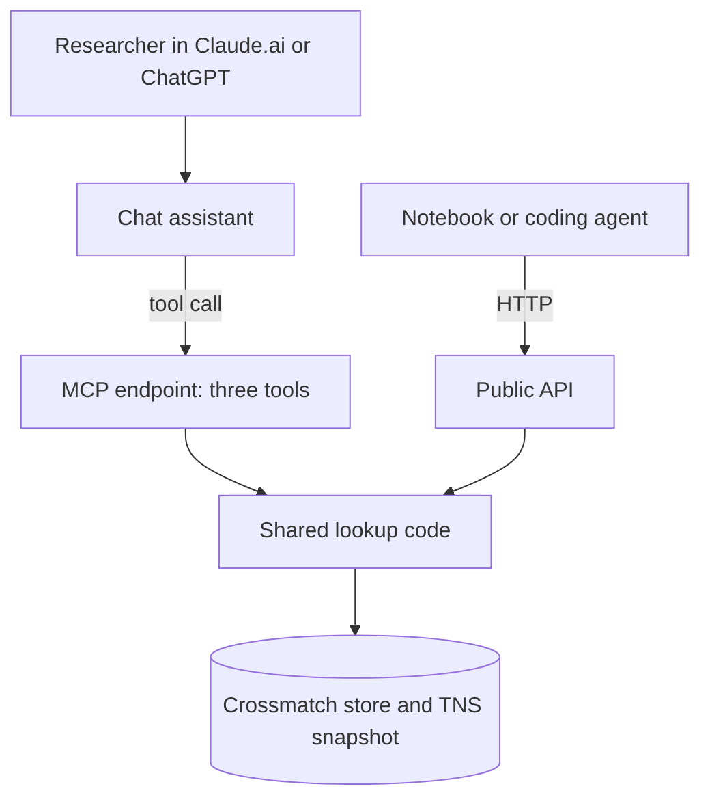
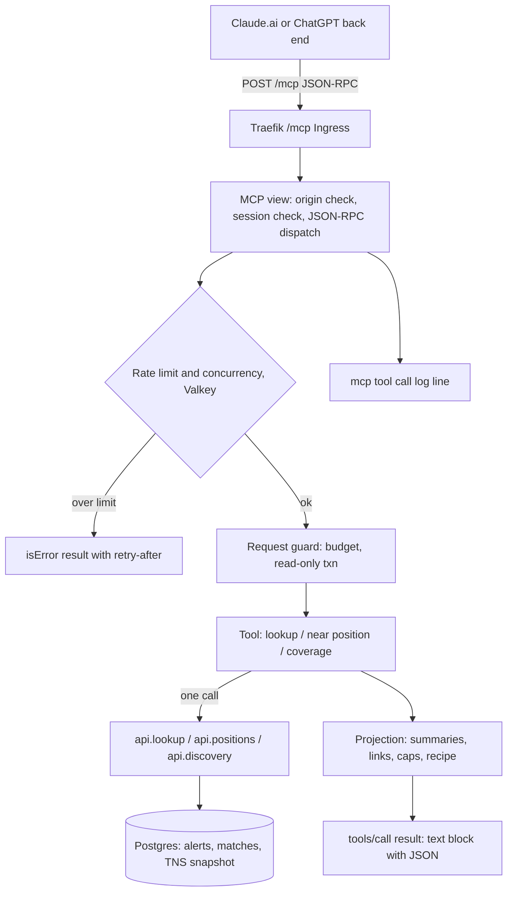
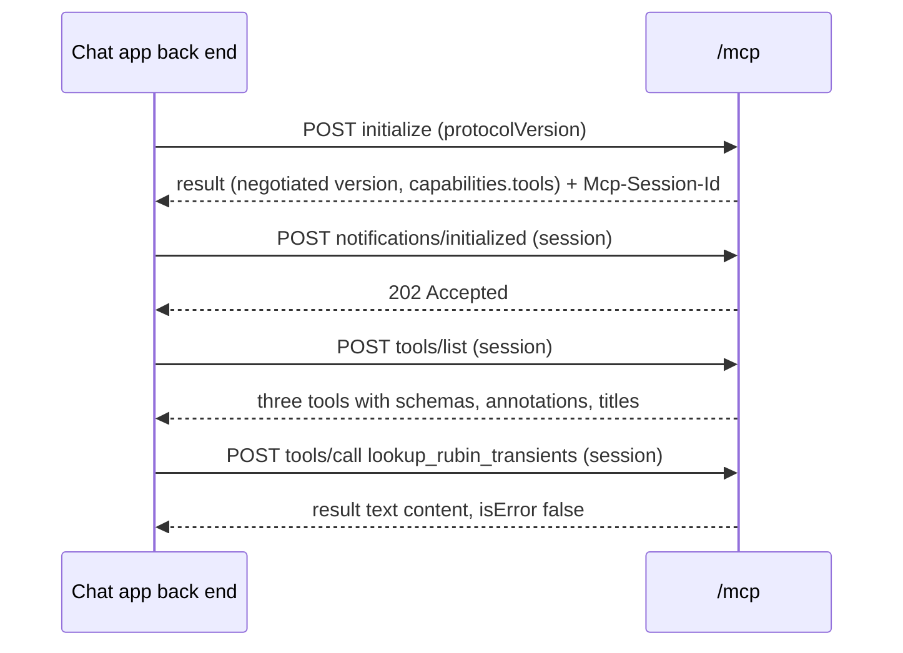

# MCP Chat Connector - Plan

## Goal Capsule

- **Objective:** A graduate student in a time-domain astrophysics and cosmology research group hears about a new Rubin transient, asks Claude.ai or ChatGPT about it by TNS name, `diaObjectId`, a short list, or a position, and gets this service's answer in the chat without writing code.
- **Means:** A public, read-only MCP endpoint with three tools shaped around researchers' questions, answered by the same lookup code the API uses (KTD1, KTD5).
- **Product authority:** The Product Contract below is authoritative for behavior; Key Technical Decisions are authoritative for mechanism within it. Lookup semantics, statuses, and provenance stay as defined by `docs/plans/2026-09-28-0914-feat-agent-ready-api-core-plan.md`; this plan adds chat-shaped access to them and changes none of them, apart from a new nearest-first listing option for cone search (R2) and an additive per-object TNS block in API responses (R5, KTD7).
- **Stop conditions:** Stop and ask if serving the endpoint would need a new Python dependency (KTD1), if any change would alter the published Hopskotch payload or an existing API field's meaning, or if a real Claude.ai or ChatGPT connector cannot connect to an authless endpoint on DEV (R17, Risks).
- **Execution profile:** Deep. App-repo units U1 through U8 land in order on one feature branch, each independently testable; U9 is a separate gitops branch the maintainer pushes.
- **Who finishes:** The implementer lands the app code, tests and docs and opens the PR. The maintainer merges, pushes and merges the gitops branch, seals TNS credentials per cluster, deploys to DEV, runs the R17 live sessions, then promotes to PROD.
- **Open blockers:** None for planning. Launch waits on TNS bot credentials, which the maintainer obtains (R16).

---

## Product Contract

### Summary

A public MCP endpoint that a researcher adds to Claude.ai or ChatGPT by pasting one URL.
It offers three tools: tell me about these transients, what is near this position, and what does this service cover.
Each answer is a compact per-object summary with this service's coincident catalog sources, the TNS association, and links to the object's TNS, Lasair and ANTARES pages.
Requests too large for a chat return the first part and a ready-to-run API request for the rest.

### Problem Frame

When a graduate student hears about an interesting new Rubin transient, they check TNS first, then the broker pages on ANTARES and Lasair.
This service's view of the transient, the catalog sources that sit at its position, is reachable only through the API: someone has to open a notebook or write a request.
The agent-ready API (v0.15.0) made that easy for coding agents, but chat assistants without code execution can fetch only plain GET pages at best and cannot send the batch lookup at all.
For a researcher who asks questions in a chat window, the service is effectively out of reach.

Nobody in the group has asked for this yet.
It is a bet that researchers will start asking chat assistants about transients, so the first version stays small and cheap to change.

### Actors

- A1. Researcher: a graduate student or postdoc in the group, on a paid Claude.ai or ChatGPT plan, asking about transients in a chat.
- A2. Chat assistant: the model in Claude.ai or ChatGPT that decides when to call the tools and relays the answers.
- A3. Maintainer: provisions TNS credentials, deploys, and judges whether the connector earns its keep.

### Key Decisions

- **Build the chat connector now, ahead of observed demand.** The maintainer is anticipating how research is moving rather than responding to a request; R15 and the Success Criteria exist to test the bet. (session-settled: user-directed — chosen over first running a coding-agent usability test and asking the group which assistants they use: anticipating modern research practice rather than waiting for a request.)
- **Question-shaped tools, not a mirror of the API.** One call answers the first-session question, and the assistant has three distinct tools to choose from instead of seven similar ones. Governs R1, R2, R3. (session-settled: user-approved — chosen over one MCP tool per API operation and a no-server approach using the chat apps' web fetch: one call answers the first-session question, and web fetch often refuses URLs the model built itself.)
- **One source of truth for lookups.** The tools reuse the API's lookup code, so a chat answer and an API response about the same object never disagree. Governs R10.
- **No login.** The data is public and the API is already unauthenticated; connecting takes one pasted URL. Governs R11. (session-settled: user-approved — chosen over CILogon sign-in: it needs an OAuth server the chat apps can register with, and the data is public.)
- **Paste-a-URL distribution only.** No directory listing in either app for the first version. Governs R14. (session-settled: user-approved — chosen over also listing in Claude's and OpenAI's directories: no review process, available as soon as it ships.)
- **Truncate with a recipe, not refuse.** An oversized request still gets an answer in the chat, plus a path to the full set. Governs R7. (session-settled: user-approved — chosen over refusing with only an API recipe and over a summary instead of rows: the researcher still gets an answer in chat.)
- **Getting TNS-name lookups working is in scope.** The TNS name is half of the researcher's way in, and today it fails on PROD. Governs R16. (session-settled: user-approved — chosen over a separate prerequisite task and over leaving TNS names out: the TNS name is half of the researcher's way in.)



### Requirements

**Tools and questions**

- R1. A "tell me about these transients" tool accepts TNS names and `diaObjectId`s, one or a short list up to a chat-sized maximum (starting at 20), and returns a summary per object (R5).
- R2. A "what is near this position" tool accepts RA/Dec in degrees and a radius in arcsec, bounded by the API's cone maximum, and returns the transients this service has seen there, nearest first, each with its summary.
  Nearest first is a new listing option in the shared cone-search code; the API's existing order and paging stay unchanged, and a truncated answer says its R7 request returns results in ingest order.
- R3. A "what does this service cover" tool reports the catalogs and releases, crossmatch radius, brokers and their reliability cuts, and service status, so the assistant can explain scope and say why an object is absent.
- R4. Every tool is read-only and declares itself so, which keeps ChatGPT from asking the researcher to confirm each call.

**Answer content**

- R5. Each object summary gives its status in the service, position, delivering brokers, coincident sources grouped by catalog with separation and a short set of key values per catalog, its TNS association if known, and its provenance basis (recorded or best guess).
  The stored TNS association is shown as of the TNS snapshot it came from, never as "no TNS counterpart now"; when the researcher gave a TNS name, the summary carries the name and record it resolved to and uses them for the R6 TNS link.
- R6. Each object summary links to the object's TNS page when a TNS name is known, its Lasair page, and its ANTARES page or an ANTARES search for it.
- R7. When results exceed the chat maximum, the tool returns the first part, states that it is truncated and how many results exist, and includes a ready-to-run API request that retrieves the full set.
- R8. A question the service cannot answer gets an explicit reason the assistant can relay, distinguishing at least: unknown TNS name, TNS name with no matching Rubin object here, object not in the service, crossmatch still pending, TNS unavailable, and service unavailable.
- R9. Every `diaObjectId` in an answer is exact, carried so no client rounds it through a float.
- R10. For the same object, every fact in a chat answer matches the API's response at the same moment.

**Access and limits**

- R11. The endpoint is public and needs no login; a researcher on a plan that supports custom connectors connects with the URL alone.
- R12. Rate limiting does not treat all users of one chat provider as a single client: one busy conversation cannot block other researchers, and the API's existing limits stay as they are.
  The endpoint is never a cheaper path into the crossmatch store than the API: callers other than the chat providers are limited at least as strictly as the API query routes, and an overall concurrency cap keeps MCP traffic from taking every web slot from the API and website.
- R13. Each tool call stays within the API's per-request budget and caps.

**Setup and observability**

- R14. The connector URL and short setup steps for Claude.ai and ChatGPT, including the paid-plan requirement and ChatGPT's Developer Mode, appear on the website and in `/llms.txt`.
- R15. Each tool call is logged with the tool, its inputs, result counts, truncation, outcome, and latency, so usage can be reviewed later.

**TNS and launch**

- R16. TNS-name lookups work on DEV and PROD before launch: TNS bot credentials are provisioned on each cluster and the TNS snapshot is populated and refreshing.
- R17. Before PROD, the connector is exercised end to end on DEV from both Claude.ai and ChatGPT with the AE1 question.

### Key Flows

- F1. First-session lookup
  - **Trigger:** The researcher reads about a new transient and asks the chat assistant what is known about it, giving its TNS name.
  - **Actors:** A1, A2
  - **Steps:** The assistant calls the "tell me about these transients" tool; the tool resolves the name and returns the summary; the assistant answers in prose and offers the links.
  - **Outcome:** The researcher sees the coincident catalog sources and can jump to TNS, Lasair or ANTARES.
  - **Covered by:** R1, R5, R6, R8
- F2. Connecting the assistant
  - **Trigger:** The researcher finds the setup steps on the website or through `/llms.txt`.
  - **Actors:** A1
  - **Steps:** The researcher adds a custom connector with the URL in Claude.ai, or turns on Developer Mode and adds it in ChatGPT; the app lists the three tools.
  - **Outcome:** The tools are available in every new conversation.
  - **Covered by:** R11, R14

### Acceptance Examples

- AE1. **Covers R1, R5, R6.** Given a TNS name associated with a crossmatched Rubin object, when the researcher asks about it, then the answer lists the object's coincident sources by catalog with separations and key values, its brokers, and links to its TNS, Lasair and ANTARES pages.
- AE2. **Covers R7.** Given 25 pasted IDs and a chat maximum of 20, when the tool runs, then it returns 20 summaries, says 25 were requested and 20 returned, and includes an API request that returns all 25.
- AE3. **Covers R8.** Given a TNS name that TNS knows but no Rubin object in the service matches, when the researcher asks, then the answer says so plainly, distinct from the answer for a name TNS does not know.
- AE4. **Covers R2, R8.** Given a position where the service has seen no transients within the radius, when the researcher asks, then the answer says none were found within that radius rather than returning an empty list without explanation.
- AE5. **Covers R5.** Given an object crossmatched before v0.15.0, when it is summarized, then its provenance is labeled a best guess from current settings, not a record.
- AE6. **Covers R12.** Given two researchers using Claude.ai at the same time, when one sends many questions in quick succession, then the other's normal questions are still answered.
- AE7. **Covers R5, R6.** Given an object crossmatched before its TNS name existed, when the researcher asks about it by that name, then the summary shows the name and TNS link and does not claim the object has no TNS association.

### Success Criteria

- Within a month of the later of launch and the resumption of Rubin alerts on PROD, at least one researcher in the group gets an answer in chat to a question that would otherwise have taken a notebook session, confirmed by asking the group and visible in the R15 logs.

### Scope Boundaries

**Deferred for later**

- Sign-in or per-user identity, and per-user quotas.
- Listing in Claude's connector directory or OpenAI's app directory.
- The recent-crossmatches feed as a chat tool.
- Lists larger than the chat maximum and bulk retrieval; those stay with the API.
- Rich in-chat widgets (OpenAI Apps SDK components), MCP prompts or resources, and a local install of the server.
- `structuredContent` and per-tool `outputSchema`; the text block carries the same data (KTD5).
- Storing ANTARES locus IDs to build direct ANTARES links, unless planning finds a search link unworkable.
- A live TNS-snapshot positional match for objects whose stored association was never checked. Until TNS credentials have been in place through a crossmatch, objects looked up by ID or position show "TNS not checked"; a name lookup still carries the resolved name (R5). Adding the match would have to land in the API too, to keep R10.

**Outside this product's identity**

- Light curves, classifications, and host-galaxy association; the service reports coincident catalog sources only, and the assistant should point to TNS and the brokers for the rest.

<!-- ce-section: work-relationships -->
### How This Work Fits Together

This plan covers the remote MCP server, one of the follow-on areas the agent-ready API core plan deferred. The rest of that breakdown is the current understanding, not a committed roadmap.

- IVOA TAP/ADQL and Simple Cone Search: can proceed independently of this work.
- Bulk Parquet or HATS publication: can proceed independently; would give R7's overflow path a bulk destination later.
- Python client or agent skill: shares the API surface with this work; still to decide whether it is wanted.
- OAuth quotas: depends on a decision to add sign-in, deferred here.

### Dependencies / Assumptions

- The maintainer obtains TNS bot credentials (R16); launch waits for them.
- Researchers have Claude.ai Pro, Max, Team or Enterprise, or ChatGPT Plus, Pro, Business, Enterprise or Education; in a ChatGPT workspace an admin must allow Developer Mode.
- Both apps accept an unauthenticated remote MCP server, per their documentation as of 2026-10-05.
- Demand from the group is assumed, not observed.
- Rubin alerts are flowing into the service during the success window; they have been paused since mid-September 2026 while the observatory is offline.
- Claude's requests arrive from Anthropic's published egress range `160.79.104.0/21`, which is why R12 cannot rely on the per-IP limits in `apps/crossmatch-service/templates/middleware-ratelimit.yaml` of the gitops repo.
- The web pods, Celery workers and Dask cluster share one image, so any new dependency follows `docs/solutions/conventions/dependency-pin-upgrade-pattern-2026-05-12.md`.

### Outstanding Questions

**Deferred to Planning**

All six earlier questions are resolved in the Planning Contract: key values (KTD10), deployment shape (KTD1), the R12 mechanism (KTD4), link forms (KTD11), caps (KTD9) and tool names (U6).

**Deferred to Implementation**

- The exact Lasair object URL and ANTARES search URL, confirmed against the live sites (KTD11).
- Whether OpenAI publishes ChatGPT connector egress ranges to add to `MCP_PROVIDER_CIDRS` (Assumptions).

**For the maintainer (does not block implementation)**

- How R15's tool-call logs survive the month-long success window. Pod logs are rotated and lost on every redeploy, and neither cluster ships logs anywhere. The default is to copy the web pods' `mcp tool call` lines before each redeploy during the window; the alternative is a small daily per-tool count kept in Postgres, which needs a migration.

### Sources / Research

- `docs/plans/2026-09-28-0914-feat-agent-ready-api-core-plan.md`: defers the MCP server and assigns operation IDs for one-to-one mapping.
- `crossmatch/api/lookup.py` and `crossmatch/api/positions.py`: lookup, cone and TNS logic, separate from the HTTP views in `crossmatch/api/views.py`.
- `crossmatch/project/settings.py`: `TNS_BOT_*` credentials and `TNS_OBJECT_URL_TEMPLATE`; `crossmatch/tasks/schedule.py` enables the TNS snapshot refresh only when credentials exist.
- `crossmatch/brokers/antares/consumer.py`: the ANTARES locus ID is logged but not stored.
- Claude connector authentication: https://claude.com/docs/connectors/building/authentication
- ChatGPT Developer Mode: https://developers.openai.com/api/docs/guides/developer-mode

---

## Planning Contract

Product Contract preservation: no scope change. The Goal Capsule authority line now names the additive per-object TNS block (KTD7), the settled Key Decisions carry their provenance labels, Outstanding Questions are resolved in place, and Scope Boundaries records two more deferred items (a live TNS positional match, and structured tool output).

### Key Technical Decisions

- KTD1. **A hand-written, stateless MCP endpoint as a Django view in the existing web pods.** One `POST /mcp` route answers JSON-RPC with plain `application/json` (the Streamable HTTP transport without SSE): `initialize`, `notifications/initialized`, `ping`, `tools/list`, `tools/call`. `GET` and `DELETE` return 405, a batch body returns 400, and unknown methods return a JSON-RPC method-not-found error. The official `mcp` SDK was rejected: it is ASGI, so it cannot run under the gunicorn gthread workers, and it would add starlette, uvicorn, sse-starlette, cryptography, PyJWT and jsonschema to the image the Celery workers and Dask cluster share. `django-mcp-server` is stale (last release October 2025). Governs the transport for R1–R4, R11.
- KTD2. **Protocol versions 2025-03-26, 2025-06-18 and 2025-11-25.** These are what Claude's and OpenAI's connector docs cite; neither documents 2026-07-28. `initialize` echoes the client's requested version when supported and otherwise answers with 2025-11-25. A `tools/call` that arrives without `initialize` is answered too (KTD3).
- KTD3. **A signed, storage-free, optional session ID.** `initialize` returns an `Mcp-Session-Id` that is an HMAC (Django `signing`) of a random token and its issue time. The ID exists only to give R12 a per-conversation key; no session state is stored, so any web replica answers any request. A request without a valid ID is still served and is limited by the fallback bucket (KTD4), never refused. That keeps the connector working if a client does not echo the header, or moves to the 2026-07-28 revision, which drops sessions and `initialize`.
- KTD4. **Rate limits and the concurrency cap live in the app, on the shared Valkey cache.** Callers from the configured chat-provider ranges (`MCP_PROVIDER_CIDRS`, default Anthropic's `160.79.104.0/21`) are limited per session ID, and provider callers with no valid session ID share one per-provider aggregate bucket. All other callers are limited per client IP at the API query routes' rate (2 requests/s, burst 10). A cluster-wide cap on in-flight tool calls (`MCP_MAX_CONCURRENT`, default 6 of the 16 PROD web slots) keeps the API and site responsive. The client IP comes from the `X-Real-Ip` header Traefik sets. A request over a limit gets a tool result with `isError` and a retry-after in seconds, never an HTTP 429 the model cannot see. Traefik's per-IP limit cannot do this alone, because it would put every Claude.ai user in one 2 requests/s bucket. Governs R12, R13.
- KTD5. **Tool output is a pure projection of the API's own return values.** Each tool calls `lookup_objects`, `cone_search` or `describe_service` once and transforms the result; it never runs its own queries. This is how R10 holds. The result carries one text block holding the JSON of the compact projection. Every client feeds text to the model, while clients differ on `structuredContent`, so a second serialization would only double the result size; structured output is deferred until an R17 session shows a client needs it.
- KTD6. **Identifiers travel as strings.** The identifier tool takes `identifiers: array of strings` and classifies each one: all digits is a `diaObjectId`, a TNS designation (after `normalize_tns_name`) is a TNS name, anything else is unrecognized. Every `diaObjectId` in output is a string. A bare JSON number above 2^53 is answered with a reason asking for the string form, because a JavaScript client layer may already have rounded it. Governs R9.
- KTD7. **A per-object TNS block in API object responses.** `build_objects` reads `TnsAssociation` in one set-based query and adds `tns` (name, type, redshift, separation, `checked`, `snapshot_epoch`) to every object at `detail=matches` and `full`. The block is additive to the API contract and documented in the OpenAPI. Today the association is copied only into each match at `full`, so objects with no coincident source never show it. A TNS-name input also carries the resolver's `tns` record and `tns_snapshot_epoch`, which the summary echoes (R5). Governs R5, R10.
- KTD8. **Nearest-first is an `order` option on `search_cones`, used only by the MCP tool.** The window and final `ORDER BY` switch to `(separation, diaObjectId)`, and the option is first-page only, with no cursor. The default ingest order, cursors and every API route stay unchanged, so the R7 recipe for a truncated cone is the API cone search for the same position and radius, paged in ingest order. Governs R2.
- KTD9. **Chat-size caps are settings, read at call time.** They are `MCP_MAX_IDENTIFIERS` (100, an input ceiling above the chat maximum so an oversized list is truncated with a recipe rather than refused), `MCP_MAX_OBJECTS` (20, R1's chat maximum, counting objects summarized, since one TNS name can resolve to several Rubin objects; invalid and duplicate inputs do not count toward it), `MCP_MATCHES_PER_CATALOG` (3 nearest, plus a count of the rest) and `MCP_MAX_RESULT_CHARS` (12000, measured on the serialized projection). Whole objects are dropped from the end to meet the character budget, and any drop counts as truncation (R7). Governs R1, R7.
- KTD10. **Key catalog values come from a per-catalog allowlist beside `CROSSMATCH_CATALOGS`.** The allowlist is a subset of each catalog's `payload_columns`, validated at import like `filter_columns`:
  - Gaia DR3: `phot_g_mean_mag`, `parallax`, `parallax_error`, `classprob_dsc_combmod_star`, `classprob_dsc_combmod_galaxy`.
  - DES Y6 Gold and DELVE DR3 Gold: `WAVG_MAG_PSF_G`, `WAVG_MAG_PSF_R`, `WAVG_MAG_PSF_I`, `EXT_MASH`, `DNF_Z`.
  - SkyMapper DR4: `g_psf`, `r_psf`, `class_star`.
  Keys are lowercased as in the published payload. Governs R5.
- KTD11. **Broker links come from settings templates.** The new settings are `LASAIR_OBJECT_URL_TEMPLATE` and `ANTARES_OBJECT_URL_TEMPLATE`, both keyed on `diaObjectId`, next to the existing `TNS_OBJECT_URL_TEMPLATE`. ANTARES identifies objects by its own locus ID, which the service does not store, so its template is a search URL. The implementer confirms both URL forms against the live sites. Governs R6.
- KTD12. **The TNS refresh task is always registered as enabled.** `RefreshTnsSnapshot` stops deriving its enabled flag from `TNS_BOT_API_KEY`; `refresh_snapshot` already skips and logs when credentials are absent. Otherwise every ingest-consumer restart rewrites the flag through `locked_init` from an environment that never carries TNS credentials, and the refresh stays off on DEV and PROD after the secret lands. Governs R16.
- KTD13. **Origin validation and no OAuth metadata.** A request with an `Origin` header outside `MCP_ALLOWED_ORIGINS` gets 403, the transport spec's DNS-rebinding guard; requests with no `Origin`, which is how the provider back ends call, pass. The service serves no `/.well-known/oauth-*` documents, so an authless client finds none. Governs R11.
- KTD14. **One log line per tool call.** It is an `mcp tool call` structlog line carrying the tool, identifier and object counts, outcome, truncation, client class (provider or direct), a short hash of the session ID, and the guard's phase timings. It reuses the request guard's timing fields, so it reads like the existing `api request` line. No Prometheus metrics for now: the web tier has none, and the gunicorn workers would need multiprocess mode. Governs R15.
- KTD15. **The request guard's core moves into a reusable function.** It covers the budget, the read-only transaction, the per-phase `statement_timeout` and the mapping of overruns and connection loss onto `ApiError`. It is extracted from the `api_guard` view decorator into a context manager that both the decorator and the MCP dispatcher use; `api_guard` keeps its exact behavior. An `ApiError` inside a tool call becomes an `isError` tool result with the same code and message. Governs R13.

### High-Level Technical Design





Directional sketch of the identifier tool's projection (not an implementation specification):

```text
classify(identifiers) -> [id | tns | unrecognized | precision_lost], deduplicated in order
lookup_objects(inputs=[id..., tns...], detail='full')     # one call, KTD5
for each input result, in order:
    reason sentence when status is not found / unavailable / unrecognized (R8)
    for each object (stop at MCP_MAX_OBJECTS):
        summary = status + meaning, position, brokers, provenance basis,
                  tns (stored, as of snapshot; plus resolved name for tns inputs),
                  per catalog: nearest MCP_MATCHES_PER_CATALOG matches with key values + count,
                  links (TNS, Lasair, ANTARES)
trim whole objects from the end until serialized size <= MCP_MAX_RESULT_CHARS
if anything was cut: truncated=true, totals, api_request (curl for POST /api/lookup)
```

### Assumptions

- Traefik forwards the real client IP in `X-Real-Ip`. It runs as a hostPort DaemonSet, so it should, but nobody has checked it against live traffic. U9's DEV check confirms it before PROD.
- OpenAI's ChatGPT connector egress ranges are not yet in `MCP_PROVIDER_CIDRS`. Until they are added, ChatGPT users are limited per IP like direct callers. The implementer looks up OpenAI's published range list and adds it if one exists.
- Both chat apps feed the model at least the text block (KTD5). The R17 sessions confirm this.
- A 12,000-character result fits both apps' tool-result limits (Claude's is about 150,000 characters) and keeps a 20-object answer readable.

### Sequencing

U1 (guard), U2 (TNS block) and U3 (nearest-first) are independent foundations. U4 (refresh fix) stands alone. U5 (projection) needs U2 and U3. U6 (protocol and tools) needs U1 and U5. U7 (limits) plugs into U6. U8 (docs) follows U6. U9 (gitops) can be drafted in parallel but merges after the app release is tagged.

---

## Implementation Units

### U1. Reusable request guard

**Goal:** Run any callable under the API's budget, read-only transaction and error classification without being a Django view.

**Requirements:** R13; KTD15.

**Dependencies:** None.

**Files:**
- Modify: `crossmatch/api/guard.py`
- Test: `crossmatch/tests/test_api_guard.py`

**Approach:**
1. Extract the body of `api_guard`'s wrapper into a context manager or function. It returns the result, or raises a classified `ApiError` (`query_too_expensive`, `service_unavailable`) together with the guard's timings.
2. Rebuild `api_guard` on top of it, keeping status codes, `Retry-After`, `map_unavailable` and the `api request` log line identical.
3. Expose the timings (total, SQL, Python, phases) so U6 can log them.

**Patterns to follow:** existing `RequestGuard`, `read_only_transaction` in `crossmatch/core/db.py`, and the throwaway-view test setup in `crossmatch/tests/test_api_guard.py`.

**Test scenarios:**
- Every existing guard test passes unchanged, the characterization proof that `api_guard` behavior did not move.
- A callable that finishes within budget returns its value through the new entry point, and the timings are populated.
- A callable that passes the deadline raises `ApiError` with code `query_too_expensive` and `retryable` false.
- A statement timeout (SQLSTATE 57014) inside the callable is classified the same way.
- A database connection error raises `ApiError` `service_unavailable`.
- Writes inside the callable fail, because the transaction is read-only.

**Verification:** The API's guard tests and the new entry-point tests pass, and no API view changed behavior.

### U2. Per-object TNS block in API responses

**Goal:** Every API object at `detail=matches` or `full` carries its stored TNS association with the snapshot it came from.

**Requirements:** R5, R10; KTD7; AE7.

**Dependencies:** None.

**Files:**
- Modify: `crossmatch/api/lookup.py` (`build_objects`)
- Modify: `crossmatch/api/openapi.py`, `crossmatch/api/docs.py` (object schema and field docs)
- Test: `crossmatch/tests/test_object_lookup_service.py`, `crossmatch/tests/test_tns_lookup.py`, `crossmatch/tests/test_openapi_completeness.py`

**Approach:**
1. Load `TnsAssociation` for the requested IDs in one set-based query inside a `sql_phase()`.
2. Add `tns` to each object: `checked`, `snapshot_epoch`, and when matched `name`, `name_prefix`, `type`, `redshift`, `separation_arcsec`, `url`.
3. "Not checked" has two stored shapes, and both render as not checked: no row (objects crossmatched before the TNS feature) gives `tns: null`, and a row with `checked: false` and null epoch and match fields (written by every crossmatch while no snapshot is current, which today is every object on DEV and PROD) gives `{checked: false}`. Both are distinct from checked with no match.
4. Leave the existing per-match `tns` block at `full` as it is.

**Patterns to follow:** `_load_matches` in `crossmatch/api/service.py` for the association read; `_tns_record` in `crossmatch/api/positions.py` for field shape.

**Test scenarios:**
- An object with a matched association shows its name, type, redshift, separation, URL and `snapshot_epoch`.
- An object checked with no TNS match shows `checked: true` and null name fields.
- An object crossmatched while no snapshot was current (a `checked: false` row) shows `checked: false` with null epoch and match fields.
- An object crossmatched before the TNS feature (no row) shows `tns: null`.
- An object with `no_coincident_source` still shows its association; today it would not.
- At `detail=ids` no `tns` block appears, so the payload size is unchanged there.
- The OpenAPI document validates responses containing the new block (the `openapi_validate` fixture).

**Verification:** Lookup responses carry the block at `matches` and `full`, the OpenAPI completeness tests pass, and no existing field changed.

### U3. Nearest-first cone ordering

**Goal:** `search_cones` can return the nearest objects first, for the MCP tool only.

**Requirements:** R2; KTD8.

**Dependencies:** None.

**Files:**
- Modify: `crossmatch/api/positions.py` (`search_cones`, and a keyword passed through `cone_search`'s internal call path or a thin MCP-facing wrapper)
- Test: `crossmatch/tests/test_cone_search_service.py`

**Approach:**
1. Add an `order` keyword whose default keeps `(ingest_time, diaObjectId)`; `nearest` switches both the window and final `ORDER BY` to `(separation, diaObjectId)`.
2. Reject `after` (a keyset cursor) together with `nearest`, since it is first-page only.
3. Do not add a query parameter to any API route.

**Patterns to follow:** the existing single-statement cone SQL and `ConeHits` rows.

**Test scenarios:**
- Three objects at 30, 5 and 50 arcsec, ingested in that order, come back as 5, 30, 50 with `nearest` and as 30, 5, 50 by default.
- With a limit of 2, `nearest` returns the two closest, and `total` still counts all three.
- Equal separations break ties by `diaObjectId`.
- Passing a cursor with `nearest` raises an `InvalidQuery`.
- The public `cone_search` route's results and cursors are unchanged (existing tests stay green).

**Verification:** The cone tests pass with the new cases, and API cone responses are byte-for-byte unchanged for existing inputs.

### U4. Keep the TNS refresh enabled across restarts

**Goal:** Once credentials reach the worker and beat containers, the TNS snapshot refreshes, whatever environment the ingest consumers start with.

**Requirements:** R16; KTD12.

**Dependencies:** None.

**Files:**
- Modify: `crossmatch/tasks/schedule.py` (`RefreshTnsSnapshot`)
- Test: `crossmatch/tests/test_refresh_tns_snapshot.py`, plus the periodic-task initialization tests if present

**Approach:**
1. Register `RefreshTnsSnapshot` as initially enabled unconditionally.
2. Rely on `refresh_snapshot`'s existing `tns_refresh_skipped_no_credentials` path when credentials are absent.
3. Keep the `SoftTimeLimitExceeded` re-raise ordering the learnings record.

**Patterns to follow:** other entries in `crossmatch/tasks/schedule.py`; `docs/solutions/` learning on the soft-time-limit classifier.

**Test scenarios:**
- Initializing periodic tasks with no `TNS_BOT_API_KEY` leaves the refresh task enabled.
- Re-running initialization (a consumer restart) keeps it enabled.
- Running the task without credentials logs the skip and writes nothing.
- Running it with credentials, against a stubbed TNS client, updates the snapshot epoch.

**Verification:** The task stays enabled across repeated `initialize_periodic_tasks` runs, and the no-credential run is a logged no-op.

### U5. Chat projection

**Goal:** Pure functions turn API results into the compact, capped, linked summaries the tools return.

**Requirements:** R1, R2, R3, R5, R6, R7, R8, R9, R10; KTD5, KTD6, KTD9, KTD10, KTD11; AE1–AE5, AE7.

**Dependencies:** U2, U3.

**Files:**
- Create: `crossmatch/chat_mcp/__init__.py`, `crossmatch/chat_mcp/projection.py`, `crossmatch/chat_mcp/identifiers.py`
- Modify: `crossmatch/project/settings.py` (MCP caps block, per-catalog `key_columns`, Lasair and ANTARES URL templates, import-time validation)
- Test: `crossmatch/tests/test_chat_mcp_projection.py`, `crossmatch/tests/test_chat_mcp_identifiers.py`

**Approach:**
1. `identifiers.py` classifies and deduplicates inputs per KTD6, including the precision-lost case for numbers and an "unrecognized identifier" reason naming the accepted forms.
2. `projection.py` builds one summary per object from a `lookup_objects` or `cone_search` result:
   - a plain-language meaning for each `ObjectStatus`;
   - the provenance basis, read from `provenance_sets`;
   - the `tns` block from U2, plus the resolved TNS record for name inputs;
   - nearest matches per catalog with key values (KTD10);
   - links (KTD11).
3. One reason sentence per non-answer status (R8). The TNS-name wording is "not in the service's TNS snapshot as of <epoch>; names reported in the last hour or two may not be there yet", because a not-found only reflects the hourly snapshot.
4. Apply the caps and character budget (KTD9). When truncating, emit `truncated`, totals, and the API request:
   - a `curl` for `POST /api/lookup` whose single-quoted JSON body lists only the classified identifiers in canonical form (digit-only IDs, names after `normalize_tns_name`), noting how many unrecognized inputs were left out;
   - or the cone GET URL with an explicit `page_size` and a note that it pages in ingest order (R2, R7).
5. The coverage projection comes from `describe_service` and `service_status`, plus one cheap query for the latest alert ingest time: catalogs, releases, radius, declared broker cuts, TNS snapshot freshness, latest ingest (so the assistant can explain a pause in Rubin alerts), and what the service does not answer.
6. Build every URL and recipe from settings and request-independent constants. Pass catalog string values through the existing JSON scalar coercion, and pass no free-text broker or TNS fields beyond the typed allowlist.

**Execution note:** Implement test-first from API-result fixtures; these are pure functions.

**Patterns to follow:** `matching/payload.py` scalar coercion; `api/contract.py` status enums; `dia_object_id_fields`.

**Test scenarios:**
- Covers AE1. A TNS name resolving to one object with a Gaia match yields its status meaning, the match with separation and key values, the brokers, and TNS, Lasair and ANTARES links.
- Covers AE7. A name input whose object's stored block is `{checked: false}`, and another whose block is `null`, both show the resolved name and TNS link and never say "no TNS association".
- Covers AE2. 25 IDs with a maximum of 20 yields 20 summaries, `truncated: true`, 25 requested, and a `curl` whose body lists all 25 IDs.
- One TNS name resolving to three objects counts three against `MCP_MAX_OBJECTS`.
- Covers AE3. An unknown name and a known name with no Rubin object give different reason sentences, the first naming the snapshot epoch.
- Covers AE5. An object with `provenance: not_recorded` is labeled best guess.
- An object with 12 Gaia matches shows the nearest 3 and "9 more".
- A dense 20-object result over 12,000 characters drops whole objects from the end and marks truncation.
- `ZTF26aaabcde` is unrecognized; `2026abc`, `AT 2026abc` and `SN2026abc` are TNS names; a 19-digit string is an ID.
- The number 170666293697970324 (above 2^53) gets the precision reason; the same digits as a string are looked up exactly and returned byte-identical.
- Duplicate identifiers are looked up once.
- An input containing a single quote and `$(...)` is absent from the generated `curl`, which still lists the valid identifiers.
- A catalog value of NaN renders as null, and numpy scalars serialize.
- A TNS name containing markup or instruction-like text is rejected by `normalize_tns_name` and never echoed raw.
- Parity: for fixtures of every `ObjectStatus`, every projected fact equals the corresponding field of the API response it was built from.

**Verification:** The projection tests pass. Each AE named above has a passing scenario, and no projection function touches the database.

### U6. MCP endpoint and tools

**Goal:** `POST /mcp` speaks the protocol and serves the three tools through the guard and the projection.

**Requirements:** R1, R2, R3, R4, R8, R11, R13, R15; KTD1, KTD2, KTD3, KTD13, KTD14, KTD15; F1, F2.

**Dependencies:** U1, U5.

**Files:**
- Create: `crossmatch/chat_mcp/protocol.py` (JSON-RPC envelope, version negotiation, session tokens), `crossmatch/chat_mcp/tools.py` (tool registry: names, titles, descriptions, input and output schemas, annotations), `crossmatch/chat_mcp/views.py`
- Modify: `crossmatch/project/urls.py` (route before the web include)
- Test: `crossmatch/tests/test_chat_mcp_protocol.py`, `crossmatch/tests/test_chat_mcp_tools.py`

**Approach:**
1. Tools are registered as data:
   - `lookup_rubin_transients` (identifiers);
   - `search_rubin_transients_near_position` (`ra_deg`, `dec_deg`, optional `radius_arcsec` with the default and maximum stated);
   - `describe_crossmatch_service`.
2. Each tool has a `title` and the annotations `readOnlyHint` true, `destructiveHint` false, `idempotentHint` true and `openWorldHint` false (R4).
3. Each description says what the tool answers, gives example identifiers, states the limit, and states what it does not answer (light curves, classifications, host association).
4. `initialize` returns server info, the negotiated version, `capabilities.tools`, a short `instructions` string and a session ID (KTD3).
5. Argument validation failures are `isError` results whose message names the limit. Per-input outcomes are normal results (R8). JSON-RPC errors are reserved for protocol faults: parse error, invalid request, unknown method, unknown tool.
6. Each tool call runs inside U1's guard. An `ApiError` becomes an `isError` result.
7. Log one `mcp tool call` line per call (KTD14). Reuse `_json_body`'s NaN rejection for request bodies.

**Patterns to follow:** thin views in `crossmatch/api/views.py`; `api/errors.py` codes; `crossmatch/tests/test_api_guard.py` log capture with `structlog.testing.capture_logs`.

**Test scenarios:**
- Covers F2. `initialize` with 2025-06-18 echoes it, includes `capabilities.tools`, and returns an `Mcp-Session-Id`.
- `initialize` with an unknown future version answers 2025-11-25.
- `notifications/initialized` returns 202 with no body.
- `tools/list` returns three tools, each with a title, all four annotations and an `inputSchema`.
- A `tools/call` with no session ID, or a tampered or expired one, is answered and is limited by the fallback bucket (U7); a `tools/call` with no prior `initialize` is answered.
- `GET /mcp` and `DELETE /mcp` return 405, and a JSON array body returns 400.
- A request whose `Origin` is not allowed returns 403, and one with no `Origin` succeeds.
- Covers F1. `lookup_rubin_transients` with a TNS name returns the projection from U5 as a text block whose JSON parses back to the projection.
- 101 identifiers returns `isError` naming the 100-identifier limit; 25 identifiers is accepted and truncated by U5.
- `radius_arcsec` above the cone maximum returns `isError` naming the maximum; `dec_deg` 91 returns `isError`.
- A position at RA 359.99 finds an object at RA 0.01 (wrap) via the existing cone code.
- A tool call that passes the request budget returns `isError` with `query_too_expensive`, and the guard's read-only transaction is used (`transaction=True` test).
- An unknown tool name gives a JSON-RPC error, not a tool result.
- Each tool call emits exactly one `mcp tool call` log line with tool, counts, outcome, truncation and timings, and no full session ID.
- `ping` returns an empty result.

**Verification:** A scripted client can initialize, list tools and call each tool against the test server, and every protocol-level response matches the transport spec cases above.

### U7. Rate limits and concurrency cap

**Goal:** One busy conversation or direct caller cannot crowd out other researchers, the API or the website.

**Requirements:** R12, R13; KTD4; AE6.

**Dependencies:** U6.

**Files:**
- Create: `crossmatch/chat_mcp/limits.py`
- Modify: `crossmatch/chat_mcp/views.py` (apply before the guard), `crossmatch/project/settings.py` (`MCP_PROVIDER_CIDRS`, `MCP_SESSION_RATE`, `MCP_IP_RATE`, `MCP_MAX_CONCURRENT`, `MCP_CLIENT_IP_HEADER`)
- Test: `crossmatch/tests/test_chat_mcp_limits.py`

**Approach:**
1. Use a token bucket keyed on session ID for provider-range callers and on client IP otherwise. Store it in the Django cache (Valkey) with atomic increments and expiries.
2. Track in-flight calls as `MCP_MAX_CONCURRENT` slot keys. A call claims the first free slot with the cache's atomic `add` (timeout = request budget plus a margin), and in a `finally` deletes the slot only if it still holds its own token. A worker killed mid-call (gunicorn's 30 s timeout skips `finally`) frees its slot when that slot expires; a single shared counter with a TTL cannot both recover leaks and stay accurate.
3. Only `tools/call` is limited. `initialize`, `tools/list` and `ping` are cheap.
4. When the cache is unreachable, fail open for both the rate limit and the concurrency cap and log a warning; the request guard's budget still bounds each call.

**Patterns to follow:** settings read at call time with `override_settings` in tests. Tests use `CACHES` set to locmem, because the documented test run has no Valkey.

**Test scenarios:**
- Covers AE6. Two sessions from `160.79.104.10` each get their own allowance; exhausting one does not limit the other.
- A direct caller at a non-provider IP is limited at 2/s burst 10, while a provider-range session is limited on its own key.
- A direct caller minting new session IDs is still limited by IP.
- The seventh concurrent call with `MCP_MAX_CONCURRENT` 6 returns `isError` "busy" with a retry-after, and every slot is free again after calls finish, including one that raised.
- A slot claimed and never released (a simulated killed worker) is free again once its timeout passes, while other calls continue.
- Provider-range calls with no session ID share one bucket; exhausting it does not affect a provider call that carries a valid session ID.
- An over-limit call returns a tool result with `isError` and retry-after seconds, never an HTTP 429.
- A missing `X-Real-Ip` falls back to `REMOTE_ADDR`.

**Verification:** The limit tests pass under locmem, and the AE6 scenario passes.

### U8. Discovery docs and changelog

**Goal:** Researchers find the connector URL and setup steps in the places agents and people already look.

**Requirements:** R14, R3; F2.

**Dependencies:** U6.

**Files:**
- Modify: `crossmatch/api/docs.py` (MCP URL in `doc_urls`, setup steps in the reference builder), `crossmatch/web/templates/web/llms.txt`, `crossmatch/web/templates/web/api.md`, `crossmatch/web/templates/web/api.html`, `crossmatch/api/discovery.py` (`describe_service` names the MCP endpoint)
- Modify: `CHANGELOG.md` (`[Unreleased]`, including a deploy note for U9 and TNS credentials)
- Test: `crossmatch/tests/test_llms_txt.py`, `crossmatch/tests/test_web_pages.py`, `crossmatch/tests/test_api_describe.py`

**Approach:**
1. Add one "Connect from a chat assistant" section built by the shared reference builder: the URL, the paid-plan requirement, Claude.ai custom-connector steps, and ChatGPT Developer Mode steps including the workspace-admin note.
2. All three renderings and `/api/describe` read from that builder, so they agree.

**Patterns to follow:** existing `## Docs` and `## Discovery` sections in `llms.txt`; the KTD15 single-builder rule from the API core plan.

**Test scenarios:**
- `/llms.txt` contains the absolute https MCP URL when the request is forwarded as https.
- `/api-docs.md` and the API reference page contain the same setup section.
- `/api/describe` names the MCP endpoint.

**Verification:** The docs tests pass, and the three renderings show the same section.

### U9. Gitops: route, limits and TNS credentials (maintainer pushes)

**Goal:** DEV and PROD route `/mcp` to the web pods without the strict per-IP query limit, pass the MCP settings, and deliver TNS credentials to the worker and beat.

**Requirements:** R12, R16, R17.

**Dependencies:** U4, U6, U7 (merged and tagged).

**Target repo:** `crossmatch-service-k8s-gitops` (local branch; the maintainer pushes, merges and seals secrets).

**Files:**
- Modify: `apps/crossmatch-service/templates/ingress.yaml` (a `crossmatch-mcp` Ingress for `/mcp` with a generous per-IP aggregate ceiling)
- Modify: `apps/crossmatch-service/templates/middleware-ratelimit.yaml`
- Modify: `apps/crossmatch-service/templates/_helpers.yaml` (`web.env` MCP settings; a `tns.env` secretKeyRef block included in celery-worker and celery-beat)
- Modify: `apps/crossmatch-service/templates/statefulset.yaml`, `apps/crossmatch-service/values.yaml`, `apps/crossmatch-service/values-dev.yaml`, `apps/crossmatch-service/values-prod.yaml`
- Modify: `apps/crossmatch-service/templates/sealedsecret-dev.yaml`, `apps/crossmatch-service/templates/sealedsecret-prod.yaml` (a `tns` secret entry, sealed by the maintainer per cluster)

**Approach:**
1. Give the `/mcp` Ingress its own middleware: a per-IP ceiling sized for one provider egress IP's share of traffic (for example 20/s, burst 40). The fine-grained limits are U7's. Render the Ingress and middleware only when `web.auth.enabled` is false, mirroring the public-API conditional, so an environment that keeps the API gated never gets an open `/mcp`.
2. TNS credentials stay out of web and the consumers (KTD12 removes the consumer dependency).
3. Copy the app chart's `tns.env` helper with `optional: true` on each secretKeyRef, so this branch can merge and deploy before the TNS SealedSecret exists; the refresh task skips cleanly without credentials (KTD12). The authless-connect part of R17 then runs as soon as DEV is deployed, and only the TNS-name checks and the PROD launch wait for sealed credentials (R16).
4. Run the gitops env-contract check against the app's `deploy-contract.yaml`.

**Patterns to follow:** the `crossmatch-api-query` Ingress and middleware added 2026-10-05; the `hopskotch.env` secretKeyRef block.

**Test expectation:** none, because this is a config change. Verify with `helm template` renders for DEV and PROD (and that the default auth-enabled values render no `/mcp` Ingress) and the env-contract check, then on DEV:
- `/mcp` reaches the web pod;
- `X-Real-Ip` carries the real client IP in the `mcp tool call` logs;
- the TNS snapshot epoch advances after the first refresh.

**Verification:** Renders and the contract check pass. After deploy, the DEV checks above hold.

---

## Verification Contract

| Gate | Command or check | Proves |
|---|---|---|
| Unit and integration tests | `docker compose --env-file docker/.env -f docker/docker-compose.yaml run --rm --no-deps celery-worker sh -c 'pip install -q -r requirements.dev.txt && python -m pytest'` | U1–U8 scenarios; existing suite unchanged |
| Migration graph | `python manage.py makemigrations --check --dry-run` in the same container | No migration is needed (none is planned); any unexpected model drift is caught |
| Lock drift | `requirements.lock` unchanged in the diff | KTD1 added no dependency |
| Protocol smoke | Scripted `curl` sequence against a local `runserver` or the compose web service: initialize, initialized, tools/list, three tools/call | F2 handshake and tool shapes on a live server |
| Gitops render | `helm template` for DEV and PROD plus `ci/check_env_contract.py` in the gitops repo | U9 renders and keeps the env contract |
| DEV live sessions (maintainer, after deploy) | Connect from Claude.ai and ChatGPT Developer Mode with no auth; ask the AE1 question; check no confirmation prompt; ask AE2, AE3, AE4, AE7 cases; in the `mcp tool call` logs, check the negotiated protocol version, that a conversation keeps one session hash, and that both apps' calls log client class `provider` | R17, R4, R11, R12 |

---

## Definition of Done

- Every unit's Verification holds, and the full test suite passes in-container.
- `requirements.lock` and `requirements.base.txt` are unchanged.
- No existing API field, status code or Hopskotch payload changed. The only API change is the additive per-object `tns` block, documented in the OpenAPI.
- `CHANGELOG.md` `[Unreleased]` describes the MCP endpoint, the new settings with defaults, the TNS block, the refresh-task fix, and a deploy note naming U9 and the TNS credentials.
- The gitops branch for U9 exists locally with passing renders and the contract check, ready for the maintainer.
- Code from abandoned approaches is removed from the diff.
- Launch, after merge, belongs to the maintainer: TNS credentials sealed on both clusters, U9 merged, DEV deployed, R17 sessions pass, then PROD.

---

## Risks

| Risk | Mitigation |
|---|---|
| Claude.ai's authless connect flow fails when OAuth discovery returns 404 (open claude-ai-mcp issue #854) | R17 on DEV before PROD; if it fails, stop per the Goal Capsule and choose between a minimal metadata response and waiting on the fix |
| ChatGPT still asks for confirmation despite `readOnlyHint` (forum reports) | Checked in R17; cosmetic, does not block answers |
| `X-Real-Ip` is not the real client, so provider callers are misclassified | U9 DEV check reads it from logs before PROD; until fixed, all callers fall back to per-IP limits, which is safe but strict |
| Session IDs are client-echoed, so a provider-range user can mint many sessions | Bounded by the concurrency cap and the Traefik per-IP ceiling on each provider egress IP (KTD4, U9) |
| A chat app moves to the 2026-07-28 protocol revision, which has no `initialize` or sessions | Session-less calls are answered and fall into the per-provider bucket (KTD3, KTD4); each R17 run notes the negotiated version |
| TNS credentials take time to obtain | TNS-name lookups answer "TNS unavailable" until then (R8); IDs and positions work; launch waits per R16 |
| Rubin alerts stay paused | Success window starts on resumption (Success Criteria); the connector works on existing data meanwhile |

---

## Sources & Research

- Repo research: `crossmatch/api/guard.py` (`api_guard`, `RequestGuard`), `crossmatch/api/lookup.py` (`lookup_objects`, `build_objects`), `crossmatch/api/positions.py` (`search_cones`, `resolve_tns`), `crossmatch/api/service.py` (`_load_matches`), `crossmatch/tasks/schedule.py` (`RefreshTnsSnapshot`), `crossmatch/core/models.py` (`TnsAssociation`, `TnsSnapshotMeta`).
- `docs/solutions/conventions/dependency-pin-upgrade-pattern-2026-05-12.md`: why KTD1 avoids a new dependency.
- MCP transport and lifecycle spec, revisions 2025-03-26 through 2025-11-25 (modelcontextprotocol.io): stateless POST JSON responses, session header semantics, Origin validation.
- Claude connector authentication: https://claude.com/docs/connectors/building/authentication (authless `none` supported; provider egress `160.79.104.0/21`).
- ChatGPT Developer Mode: https://developers.openai.com/api/docs/guides/developer-mode (No Authentication supported; `readOnlyHint` respected).
- `mcp` Python SDK 2.3.0 and 1.30.0 dependency check against this repo's pins (rejected in KTD1).
